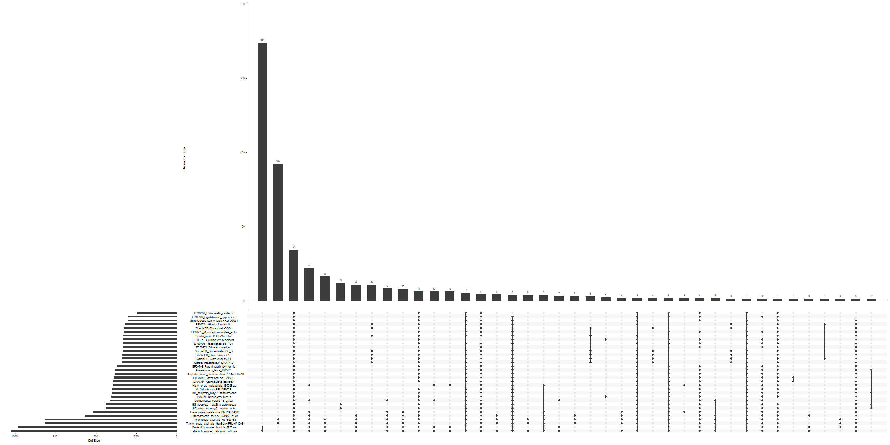

# TrichoCompare README

Author: Vi Varga

Posted: 29.09.2022

GitHub: https://github.com/V-Varga/TrichoCompare


## Program Installation

### General Environment

Creating a generalized `conda` environment to contain installations of programs that don't require specific dependencies (ex. old Python distributions):

```bash
conda create -n trich_thesis
conda activate trich_thesis
###
#the pandas python module was not automatically installed
#it can easily be installed via anaconda
conda install pandas

```

If `conda` is not installed on your device, please see the Anaconda installation instructions here: https://docs.anaconda.com/anaconda/install/

Versions 4.10.3 (Lund University Bioinformatics course server) and 4.13.0 (local Windows computer) were used for this project. 


### Functional Annotation & Targeting Prediction

#### EggNOG

The EggNOG database is used for orthology prediction and functional annotation. The website is available here: http://eggnog5.embl.de/#/app/home

Download information for emapper, which is the associated tool used for annotation of a collection of proteins, is available here: http://eggnog5.embl.de/#/app/downloads

Installed on the Lund University Bioinformatics course server at: /usr/local/bin/emapper.py

```bash
#while EggNOG is installed on the bioinformatics server, some dependencies are missing
conda create -n eggNOG-NEW-env
conda activate eggNOG-NEW-env
conda install psutil
conda install -c conda-forge biopython

```

Version 2.0.2 of emapper and version 5.0.1 of the local EggNOG database was used for this project. 

#### InterProScan

To quote the official site: "InterPro provides functional analysis of proteins by classifying them into families and predicting domains and important sites." Source: https://www.ebi.ac.uk/interpro/

This program is installed on the SNIC Kebnekaise HPC. Running it requires batch scripts, since Kebnekaise does not allow for front-end computation. 

The program can be installed by following the directions provided here: https://interproscan-docs.readthedocs.io/en/latest/UserDocs.html

```bash
#copying the documentation from the site linked above: 

mkdir my_interproscan
cd my_interproscan
wget https://ftp.ebi.ac.uk/pub/software/unix/iprscan/5/5.57-90.0/interproscan-5.57-90.0-64-bit.tar.gz
wget https://ftp.ebi.ac.uk/pub/software/unix/iprscan/5/5.57-90.0/interproscan-5.57-90.0-64-bit.tar.gz.md5
# Recommended checksum to confirm the download was successful:
md5sum -c interproscan-5.57-90.0-64-bit.tar.gz.md5
# Must return *interproscan-5.57-90.0-64-bit.tar.gz: OK*
# If not - try downloading the file again as it may be a corrupted copy.

#extract the tar ball
tar -pxvzf interproscan-5.57-90.0-*-bit.tar.gz
# where:
#     p = preserve the file permissions
#     x = extract files from an archive
#     v = verbosely list the files processed
#     z = filter the archive through gzip
#     f = use archive file

#index HMM models
python3 initial_setup.py

```

InterProScan requires the following in order to run correctly: 
 - Linux 64-bit system
 - Perl 5
 - Python 3
 - Java 11

Information on running the program can be found here: https://interproscan-docs.readthedocs.io/en/latest/HowToRun.html

Version 5.54-87.0 of InterProScan was used for this project. 

#### DeepLoc

Not on the server, so needs to be installed:

Files obtained from DeepLoc website: https://services.healthtech.dtu.dk/service.php?DeepLoc-1.0

A license is necessary in order to install the program, but it is free for academic use.

Tool can be used online at: http://www.cbs.dtu.dk/services/DeepLoc/

```bash
#unpack tar file
tar -xvf deeploc-1.0.All.tar.gz
#installing dependencies
#some of these dependencies are quite old
#so need an environment with an older version of python
conda create -n DeepLoc_usage python=3.5.1
conda activate DeepLoc_usage
#Lasagne==0.2.dev1
pip install -r https://raw.githubusercontent.com/Lasagne/Lasagne/master/requirements.txt
pip install https://github.com/Lasagne/Lasagne/archive/master.zip
#installing theano generally installs the other requirements, too:
#Numpy
conda install -c anaconda numpy
#Scipy
conda install -c anaconda scipy
#Theano==1.0.1
conda install -c conda-forge theano=1.0.1
#six==1.11.0
conda install -c conda-forge six=1.11.0
#also need to install the following:
#mkl-service
conda install mkl-service
#the above isn't mentioned in the installation instructions,
#but an error code informed me it needed to be installed
#add deeploc to the .bashrc file, like so:
#export PATH="$PATH:/home/inf-47-2020/bin/DeepLoc/deeploc-1.0/bin"
#and then source it:
source ~/.bashrc

```

Version 1.0 of the DeepLoc program was used for this project, and the program was installed on the Lund University Bioinformatics course server. 

#### MitoFates

MitoFates is a protein targeting prediction software designed to predict mitochondrial targeting sequences and their cleavage sites. 

The program website can be found here: http://mitf.cbrc.jp/MitoFates/cgi-bin/top.cgi

The tar ball for the program can be found here: http://mitf.cbrc.jp/MitoFates/program.html

```bash
#working from the bin/ 
tar -xvf MitoFates_1.2.tar.gz
#and it looks like this one has old dependencies, too
#so new conda environment it is
conda create -n MitoFates-env
conda activate MitoFates-env
#installing dependencies, as per the README
#The program README recommends libsvm==3.0
#however, conda doesn't go that far back
#the oldest conda can do is
conda install -c conda-forge libsvm==3.16
#install necessary perl libraries
#have to do some installation of perl stuff first
#ref: https://www.cpan.org/modules/INSTALL.html
cpan App::cpanminus
#now install libraries
cpanm Math::Cephes
cpanm Perl6::Slurp
cpanm Inline::C
#this appears to have worked
#so now add the folder to the .bashrc file
#like so:
#export PATH="$PATH:/home/inf-47-2020/bin/MitoFates"
#then activate the .bashrc
source ~/.bashrc

```

Version 1.2 of MitoFates was used for this project, and the program was installed on the Lund University Bioinformatics course server. 

Please note that as of the writing of this section on 16.09.2022, the MitoFates website was not accessible. It is unclear whether this is a temporary error. 

#### SignalP

SignalP is a signal peptide detection software that predicts protein targeting for secretion. The program homepage is available here: http://www.cbs.dtu.dk/services/SignalP/

The executable file download link is available for academic use from here: https://services.healthtech.dtu.dk/software.php

A license is necessary in order to install the program, but it is free for academic use.

Installed on the Lund University Bioinformatics course server at: /usr/local/bin/signalp

Version 5.0b of SignalP was used for this project. 

#### TargetP

TargetP "predicts the present of N-terminal presenquences" for signal peptides, mitochondrial transit peptides, chloroplast transit peptides and thykaloid luminal transit peptides. The program homepage is available here: https://services.healthtech.dtu.dk/service.php?TargetP-2.0

The executable file download link is available for academic use from here: https://services.healthtech.dtu.dk/service.php?TargetP-2.0

A license is necessary in order to install the program, but it is free for academic use.

Installed on the Lund University Bioinformatics course server at: /usr/local/bin/targetp

Version 2.0 of TargetP was used for this project. 

#### YLoc

YLoc predicts subcellular localization of proteins, and provides reasoning for its conclusions based on the biological properties of the protein sequence. 

The program website with a web server is available here: https://abi-services.informatik.uni-tuebingen.de/yloc/webloc.cgi 

The GitHub page for the program can be found here: https://github.com/KohlbacherLab/YLoc

YLoc is best run locally via the Docker image, available on the GitHub linked above. 

```bash
#YLoc is best run using Docker
#first, clone the YLoc directory locally
git clone https://github.com/KohlbacherLab/YLoc
#then build the docker image
docker build /home/vi_varga/bin/YLoc
#find the Docker Image ID with: 
docker image ls
#and run the container with, for example: 
docker run -it f8ff9f3b1898 /bin/bash
#in order to use files from the local computer, they have to be mounted when the Docker image is built: 
docker run --mount type=bind,source=/home/inf-47-2020/ThesisTrich/DataFiles/InProgressEncoding,target=/YLoc/Vi_hostDataNEW,readonly --mount type=bind,source=/home/inf-47-2020/Trich_Parab/Data_Files/DataEncoding,target=/YLoc/Vi_hostDataOG,readonly -it f8ff9f3b1898 /bin/bash
#above, the Docker command to create a Docker container 
#opening the YLoc Docker image
#with the proteome FASTA files copied into the image
#since Docker containers are separate from the computer they are run on, 
#files cannot be copied in later - files need to be copied in during container creation
#need to mount two folder because Docker can't follow symlinks 
#so need to mount the original folders containing the necessary files

```

Version 1.0 of YLoc was used for this project, and was installed on Ubuntu on a local Windows machine. 

One benefit of using the desktop version of Docker, rather than the command-line version, is that with Docker Desktop, it is possible to restart containers that have been shut down, making them accessible again. This way, new containers do not have to be made each time, and created files can be accessed later, should some issue occur.


### Orthologous Clustering 

#### Broccoli

Broccoli infers orthologous groups using a mixed phylogeny-network approach. The program can be downloaded from the GitHub page, here: https://github.com/rderelle/Broccoli

The manual can be found here: https://github.com/rderelle/Broccoli/blob/master/manual_Broccoli_v1.2.pdf

Broccoli has 3 main dependencies:
  - ete3 library
  - Diamond version 0.9.30 or above (https://github.com/bbuchfink/diamond)
  - FastTree version 2.1.11 or above (single-thread version) (http://www.microbesonline.org/fasttree/)

```bash
#clone the repository into the bin/
git clone https://github.com/rderelle/Broccoli
#now add the folder to the .bashrc
#like so:
#export PATH="$PATH:/home/inf-47-2020/bin/Broccoli"
#and source it
source ~/.bashrc
#going to create an environment for it, as per the instructions
conda create -n env-broccoli python=3.6 ete3
conda activate env-broccoli
#next install Diamond
#in the manual Diamond & FastTree are installed before the environment is made
#but as I'm installing them via conda...
conda install -c bioconda diamond
#next install FastTree
conda install -c bioconda fasttree

```

Version 1.1 of Broccoli was used for this project, and the program was installed on the Lund University Bioinformatics course server. 

#### OrthoFinder

OrthoFinder is an orthologous clustering software that uses score-based heuristic methods. The program can be installed from the source on GitHub (https://github.com/davidemms/OrthoFinder), or via `conda`:

```bash
#in the thesis_trich conda environment
conda install orthofinder
conda update orthofinder

```

Version 2.5.4 of OrthoFinder was used in this project, and the program was installed on the Lund University Bioinformatics course server. 

#### ProteinOrtho

ProteinOrtho is an orthology detection tool. The program code can be obatianed from the GitLab, here: https://gitlab.com/paulklemm_PHD/proteinortho#readme

More information can be found on the website, here: https://www.bioinf.uni-leipzig.de/Software/proteinortho/

The manual can be found here: https://www.bioinf.uni-leipzig.de/Software/proteinortho/manual.html

```bash
#installation with conda
conda create -n env-protOrtho
conda activate env-protOrtho
conda install proteinortho

```

Version 6.0.33 of ProteinOrtho was used for this project, and the program was installed on the Lund University Bioinformatics course server. 

#### SonicParanoid

SonicParanoid is an orthologous clustering program that follows in the path of the InParanoid program. The program website, including both installation instructions and the manual, can be found here: http://iwasakilab.k.u-tokyo.ac.jp/sonicparanoid/

```bash
#install in a conda environment
conda create -n sonicparanoid python=3.8
conda activate sonicparanoid
conda install numpy filetype pandas scipy biopython mypy psutil scikit-learn
conda install -c bioconda sonicparanoid
#now test installation
sonicparanoid-get-test-data -o .
# /home/inf-47-2020/sonicparanoid_test/
# INFO: all test files were succesfully copied to
# /home/inf-47-2020/sonicparanoid_test/
# Go inside the directory
# /home/inf-47-2020/sonicparanoid_test/
# and type
# sonicparanoid -i ./test_input -o ./test_output -m fast -t 4
cd sonicparanoid_test
sonicparanoid -i ./test_input -o ./test_output -p my_first_run -t 4

```

Version 1.3.8 of SonicParanoid was used for this project, and the program was installed on the Lund University Bioinformatics course server. 


### Ancestral State Reconstruction

#### COUNT

From the website (here: http://www.iro.umontreal.ca/~csuros/gene_content/count.html): Count is a software package for the evolutionary analysis of homolog family sizes (phylogenetic profiles), or other numerical census-type characters along a phylogeny.

Note that this program requires Java to be installed in order for it to run.

```bash
#program installation
#following directions on the program website: http://www.iro.umontreal.ca/~csuros/gene_content/count.html
#placed the .tgz file into the bin/ directory on the server
tar -zxvf Count.tgz
#need to add the new ~/bin/Count/ directory to the .bashrc file
#then can use program like so:
java -jar Count.jar
###
#the program runs on Java, and has an interactive window
#which can be accessed remotely using Xming & PuTTY to do X-11 forwarding
#however, it is much simpler to install and use the program from my local Windows computer
#in that case, I merely unpacked the download Count.zip file
#this created a folder from which the program can be opened by clicking on an icon

```

The version number of the Count program is unclear, but is likely 1.0.

#### MAFFT

MAFFT is a multiple sequence alignment program. The website can be found here: https://mafft.cbrc.jp/alignment/software/

The manual can be found here: https://mafft.cbrc.jp/alignment/software/manual/manual.html

Additional usage tips are available here: https://mafft.cbrc.jp/alignment/software/tips0.html

```bash
#creating a new environment for the program
conda create -n env-MAFFT
conda activate env-MAFFT
conda install -c bioconda mafft
#and just to be safe: 
conda update mafft

```

Version 7.505 of MAFFT was used for this project, and the program was installed on the Lund University Bioinformatics course server. 

#### trimAl

TrimAl is an alignment trimming tool that automatically detects and removes "spurious sequences or poorly aligned regions" of MSAs. The program website can be found here: http://trimal.cgenomics.org/

The GitHub can be found here: https://github.com/inab/trimal

Instructions on command line usage can be found here: http://trimal.cgenomics.org/use_of_the_command_line_trimal_v1.2

Supplementary material can be found here: http://trimal.cgenomics.org/_media/manual.b.pdf

```bash
#installation via conda
conda create -n env-trimAl
conda activate env-trimAl
conda install trimal

```

Version 1.4.1 of TrimAl was used for this project, and the program was installed on the Lund University Bioinformatics course server. 

#### IQ-TREE

IQ-TREE reconstructs evolutionary trees for aligned sequences. The program website can be found here: http://www.iqtree.org/

The manual can be found here: http://www.iqtree.org/doc/iqtree-doc.pdf

```bash
#installation can be done using conda
conda create -n env-IQ-TREE
conda activate env-IQ-TREE
conda install -c bioconda iqtree

```

Version 2.2.0.3 of IQ-TREE was used for this project, and the program was installed on the Lund University Bioinformatics course server. 

#### ALE 

The Amalgamated Likelihood Estimation (ALE) method for the reconstruction of gene trees and estimation of Duplication-Transfer-Loss (DTL) events along a rooted species tree. The program can be installed from the GitHub page: https://github.com/ssolo/ALE

The program is also available on the Docker registry, here: https://hub.docker.com/r/boussau/alesuite

```bash
#on my local computer: 
singularity pull ale.sif docker://boussau/alesuite:latest
#transferred over with FileZilla
#using the Singularity image created locally & transferred to the HPC
#need to make it executable
chmod +x ale.sif

```

Version 0.4 of ALE was used for this project. This program was used on the Uppmax HPC. 

### Other

#### BUSCO

BUSCO is a program used to evaluate the completeness of genomic datasets, based on the number of near-universal single-copy orthologs present. THe website can be found here: https://busco.ezlab.org/

The manual can be found here: https://busco.ezlab.org/busco_userguide.html


```bash
#installation
conda create -n env-BUSCO -c conda-forge -c bioconda busco=5.3.0
conda activate env-BUSCO

```

Version 5.3.0 of BUSCO was used for this project, and the program was installed on the Lund University Bioinformatics course server. 

#### Seqkit

Seqkit is a program that allows the manipulation and filtration of FASTA and FASTQ files. Information on the program can be found here: https://bioinf.shenwei.me/seqkit/

```bash
#can be installed via conda
conda install seqkit

```

Version 2.1.0 of Seqkit was used for this project, and the program was installed on the Lund University Bioinformatics course server. 

#### Transdecoder

According to their own description on GitHub, "TransDecoder identifies candidate coding regions within transcript sequences" (source: https://github.com/TransDecoder/TransDecoder/wiki).

The program's GitHub page can be found here: https://github.com/TransDecoder/TransDecoder

```bash
#there is a conda package for the program
#install within the trich_thesis conda environment
conda install -c bioconda transdecoder

```

Version 5.5.0 of Transdecoder was used for this project, and the program was installed on the Lund University Bioinformatics course server. 

#### Docker

Docker is a program for the building and running of containers. Running Docker requires root priveleges, so it is generally not used on servers and HPCs. Docker has a desktop version, as well as command-line use. The Docker hub is a resource for publicly available Docker images. 

The website can be found here: https://www.docker.com/

An executable file to install the desktop app can be found here: https://www.docker.com/products/docker-desktop/

This program was installed on a local Windows computer and utilized via Ubuntu. 

#### Singularity

Docker is another program for the building and running of containers. Unlike Docker, Singularity does not require root priveleges, so it is often used on servers and HPCs. Singularity can only be run from the command line, and it is generally capable of building and running Docker images. The documentation can be found here: https://docs.sylabs.io/guides/3.5/user-guide/introduction.html

The program can be downloaded from here: https://sylabs.io/singularity/

Installation instructions can be found here: https://docs.sylabs.io/guides/3.0/user-guide/installation.html

```bash
#installing dependencies
sudo apt-get update && sudo apt-get install -y \
    build-essential \
    libssl-dev \
    uuid-dev \
    libgpgme11-dev \
    squashfs-tools \
    libseccomp-dev \
    pkg-config
sudo yum update -y && \
    sudo yum groupinstall -y 'Development Tools' && \
    sudo yum install -y \
    openssl-devel \
    libuuid-devel \
    libseccomp-devel \
    wget \
    squashfs-tools
export VERSION=1.11 OS=linux ARCH=amd64 && \
    wget https://dl.google.com/go/go$VERSION.$OS-$ARCH.tar.gz && \
    sudo tar -C /usr/local -xzvf go$VERSION.$OS-$ARCH.tar.gz && \
    rm go$VERSION.$OS-$ARCH.tar.gz
echo 'export GOPATH=${HOME}/go' >> ~/.bashrc && \
    echo 'export PATH=/usr/local/go/bin:${PATH}:${GOPATH}/bin' >> ~/.bashrc && \
    source ~/.bashrc

#grab the source code 
go get -d github.com/sylabs/singularity
export VERSION=3.0.3 && # adjust this as necessary \
    mkdir -p $GOPATH/src/github.com/sylabs && \
    cd $GOPATH/src/github.com/sylabs && \
    wget https://github.com/sylabs/singularity/releases/download/v${VERSION}/singularity-${VERSION}.tar.gz && \
    tar -xzf singularity-${VERSION}.tar.gz && \
    cd ./singularity && \
    ./mconfig
./mconfig && \
    make -C ./builddir && \
    sudo make -C ./builddir install
./mconfig --prefix=/opt/singularity

```

This program was installed on a local Windows computer in order to generate a .sif file, and then utilized on the Uppmax HPC to run ALE. 

#### Python & Spyder

The Spyder IDE was used on a local Windows computer for testing Python scripts.

Two non-standard Python modules were utilized in this research process.

The numpy library aids in manipulation of arrays. More information can be found at their website, here: https://numpy.org/

The pandas library facilitates the manipulation of dataframes in Python. More information is available on their website, here: https://pandas.pydata.org/

Both libraries can be installed with `conda`, like so:

```bash
#install pandas
conda install -c anaconda pandas
#install numpy
conda install -c anaconda numpy

```

#### R & RStudio

The RStudio IDE was used on a local Windows computer for analysis of data.

The UpSetR package was used to create an UpSet plot. The package is distributed by CRAN; more information is available here: https://cran.r-project.org/web/packages/UpSetR/index.html

It can be installed as follows:

```R
#package installation
install.packages("upsetr")

```

#### FigTree

This is a phylogenetic tree visualization and analysis software. The program code can be downloaded from here: https://github.com/rambaut/figtree/releases

**Note**: FigTree requires at least Java 1.5 to run. Java can be downloaded from the website, here: https://www.oracle.com/java/technologies/javase-downloads.html

```bash
#in the bin/ in the fistulina environment on the server
tar -zxvf FigTree_v1.4.4.tgz
#adding the program to the PATH:
#export PATH="$PATH:/home/inf-47-2020/bin/FigTree_v1.4.4/bin"
#source the .bashrc
source ~/.bashrc
###
#for installation on Windows 10:
#download the FigTree_v1.4.4.zip file from the GitHub site above
#extract the files from the archive
#copy the FigTree_v1.4.4/ directory to a desired Program storage directory
#run the application by double-clicking the application icon
#which is in the unzipped folder

```

Version 1.4.4 of FigTree was used for this project, and was used on a local Windows computer. 

#### Inkscape

Inkscape is a vector graphics editor that was used in order to edit SVG output files into the finalized figures that were used in the report. The GUI can be downloaded from here: https://inkscape.org/release/inkscape-1.1/

This program was used on a local Windows computer. 

#### draw.io/diagrams.net

The draw.io software is a freely available software usable for creating simple diagrams. Both an online-only and desktop version of the tool are available from the website, here: https://drawio-app.com/

This program was used on a local Windows computer. 


## Version Summary

LU Bioinformatics Server:
  - conda 4.10.3
  - Functional annotation: 
    - DeepLoc 1.0
    - EggNOG: emapper-2.0.2 & eggNOG DB version: 5.0.1 
    - MitoFates 1.2
    - SignalP 5.0b
    - TargetP 2.0
    - YLoc 1.0
  - Orthologous clustering: 
    - Broccoli 1.1
    - OrthoFinder 2.5.4
    - ProteinOrtho 6.0.33
    - SonicParanoid 1.3.8
  - Other: 
    - BUSCO 5.3.0
    - MAFFT 7.505
    - IQ-TREE 2.2.0.3
    - Seqkit 2.1.0
    - Transdecoder 5.5.0
    - TrimAl 1.4.1

HPCs: 
  - InterProScan 5.54-87.0
  - ALE 0.4

Local computer: 
  - conda 4.13.0
  - Count: version number unclear, likely 1.0
  - Python 3.8.12
  - Spyder 5.1.5 & 5.2.2
  - R 4.2.1
  - RStudio RStudio 2022.07.1+554 
  - UpSetR 1.4.0
  - FigTree 1.4.4


## Data Collection

Data for this project obtained from the NCBI database, GiardiaDB, EukProt and in-house sources.

Protein datasets were downloaded from the NCBI as follows:
  - Accessed BioProject page for organismal proteome
  - Accessed protein list
  - Downloaded proteins using "Send to:" option at top of page
    - Choose Destination: File
    - Format: FASTA
    - Sort by: Default order
    - Create File
  - This creates generates a FASTA file of the protein sequences in multiline FASTA format, with the default name "sequence.fasta"
  - Files were renamed according to the name of the organism before being transferred to the server

Proteome and transcriptome datasets from GiardiaDB (https://giardiadb.org/giardiadb/app) and EukProt (https://figshare.com/articles/dataset/EukProt_a_database_of_genome-scale_predicted_proteins_across_the_diversity_of_eukaryotic_life/12417881) were downloaded directly from the databases. 

Below, a table summarizing the sources of data and the format that data was obtained in: 

| **Species/Strain** | **Phylum** | **Accession Information** | **Database** | **Data Format** |
| ------------ | ------------- | ------------- | ------------ | --------- |
| _Aduncisulcus paluster_ | Fornicata | EP00764 | EukProt | Proteome |
| _Anaeramoeba flamelloides_ (BS) | Anaeramobidae | _obtained in-house_ | _In-House_ | Proteome |
| _Anaeramoeba flamelloides_ (SC) | Anaeramobidae | _obtained in-house_ | _In-House_ | Proteome |
| _Anaeramoeba ignava (BM)_ | Anaeramobidae | _obtained in-house_ | _In-House_ | Proteome |
| _Anaeramoeba lanta_ | Anaeramobidae | _obtained in-house_ | _In-House_ | Proteome |
| _Barthelona_ sp. PAP020 | Barthelona | EP00792 | EukProt | Transcriptome |
| _Carpediemonas membranifera_ | Fornicata | PRJNA719540 | NCBI | Proteome |
| _Chilomastix caulleryi_ | Fornicata | EP00766 | EukProt | Proteome |
| _Chilomastix cuspidata_ | Fornicata | EP00767 | EukProt | Proteome |
| _Dientamoeba fragilis_ | Parabasalia | PRJNA284312 | NCBI | Transcriptome (predicted by Stairs) |
| _Dysnectes brevis_ | Fornicata | EP00768 | EukProt | Proteome |
| _Ergobibamus cyprinoides_ | Fornicata | EP00769 | EukProt | Proteome |
| _Giardia intestinalis_ - EukProt version | Fornicata | EP00701 | EukProt | Proteome |
| _Giardia intestinalis_ - NCBI version | Fornicata | PRJNA1439 | NCBI | Proteome |
| _Giardia intestinalis_ ADH | Fornicata | PRJNA77981 | GiardiaDB | Proteome |
| _Giardia intestinalis_ BGS | Fornicata | PRJNA33815 | GiardiaDB | Proteome |
| _Giardia intestinalis_ BGS B | Fornicata | PRJNA77979 | GiardiaDB | Proteome |
| _Giardia intestinalis_ EP15 | Fornicata | PRJNA39315 | GiardiaDB | Proteome |
| _Giardia muris_ | Fornicata | PRJNA524057 | NCBI | Proteome |
| _Histomonas meleagridis_ 2021 version | Parabasalia | PRJNA594289 | NCBI | Proteome |
| _Histomonas meleagridis_ 2018 version | Parabasalia | PRJEB19109 | NCBI | Transcriptome (predicted by Stairs) |
| _Monocercomonoides exilis_ | Preaxostyla | PRJNA304271 | GiardiaDB | Proteome |
| _Kipferlia bialata_ | Fornicata | PRJDB5223 | NCBI | Proteome |
| _Paratrimastix pyriformis_ | Preaxostyla | EP00708 | EukProt | Proteome |
| _Pentatrichomonas hominis_ | Parabasalia | PRJNA341413 | NCBI | Transcriptome (predicted by Stairs) |
| _Spironucleus salmonicida_ | Fornicata | PRJNA60811 | NCBI | Proteome |
| _Tetratrichomonas gallinarum_ | Parabasalia | PRJNA305708 | NCBI | Transcriptome (predicted by Stairs) |
| _Trepomonas_ sp. PC1 | Fornicata | EP00703 | EukProt | Proteome |
| _Trichomonas vaginalis_ - GenBank version | Parabasalia | PRJNA343635 | NCBI | Proteome |
| _Trichomonas vaginalis_ - RefSeq version | Parabasalia | PRJNA16084 | NCBI | Proteome |
| _Trimastix marina_ | Preaxostyla | EP00771 | EukProt | Proteome |
| _Tritrichomonas foetus_ | Parabasalia | PRJNA345179 | NCBI | Proteome |

Note that datasets indicated to be "Transcriptome (predicted by Stairs)" are transcriptomic datasets predicted into proteomes by Dr. Courtney Stairs, prior to this project. The gene prediction process for these proteomes is therefore not included in this workflow. 

In total, the dataset utilized in this project included 32 proteomes.

The protein prediction from the transcriptome for the Barthelona species was accomplished with the Transdecoder software: 

```bash
#need this program to translate the Barthelona transcriptome to proteome form
#the instructions in the manual:
TransDecoder.LongOrfs -t target_transcripts.fasta
# extract the long open reading frames
TransDecoder.Predict -t target_transcripts.fasta
# predict the likely coding regions
#now applying it:
TransDecoder.LongOrfs -t Trinity_BarthelonaPAP020_Hiseq.fasta
TransDecoder.Predict -t Trinity_BarthelonaPAP020_Hiseq.fasta
#this software creates the following files: 
# pipeliner.1569480.cmds
# pipeliner.1569691.cmds
# pipeliner.1569738.cmds
# Trinity_BarthelonaPAP020_Hiseq.fasta
# Trinity_BarthelonaPAP020_Hiseq.fasta.transdecoder.bed
# Trinity_BarthelonaPAP020_Hiseq.fasta.transdecoder.cds
# Trinity_BarthelonaPAP020_Hiseq.fasta.transdecoder_dir/
# Trinity_BarthelonaPAP020_Hiseq.fasta.transdecoder_dir.__checkpoints/
# Trinity_BarthelonaPAP020_Hiseq.fasta.transdecoder_dir.__checkpoints_longorfs/
# Trinity_BarthelonaPAP020_Hiseq.fasta.transdecoder.gff3
# Trinity_BarthelonaPAP020_Hiseq.fasta.transdecoder.pep
#Of these, the .pep file is the one we need
#Quoting the wiki: "transcripts.fasta.transdecoder.pep : peptide sequences for the final candidate ORFs; all shorter candidates within longer ORFs were removed."
#for ease of use, making a copy of the file with a new name
cp Trinity_BarthelonaPAP020_Hiseq.fasta.transdecoder.pep EP00792_Barthelona_sp_PAP020.fasta

```

### File Restructuring

The amino acid FASTA files needed to be set up in the same format, in order to streamline the analysis. Therefore, each FASTA file was converted to single-line FASTA format using `awk`, as shown below: 

Please note that throughout this README, references will occasionally be made to a "preliminary project." That smaller, exploratory project was undertaken June-November 2021. The README prepared for that project is made available in the TrichoCompare/ReferenceFiles/ directory of the TrichoCompare project's GitHub repository, in the file named README_TrichParab.pdf. 

```bash
#The following are copied from the preliminary project's file preparation
#I don't like multi-line, so I'll convert them to 1-line FASTAs
#not possible to overwrite the files, so saving to new files
awk '/^>/ {printf("\n%s\n",$0);next; } { printf("%s",$0);}  END {printf("\n");}' \
  < GCA_000002825.1_ASM282v1_protein.faa \
  > Trichomonas_vaginalis_GenBank_start.PRJNA16084.fasta
awk '{if (NR==1 && NF==0) next};1' Trichomonas_vaginalis_GenBank_start.PRJNA16084.fasta \
  > Trichomonas_vaginalis_GenBank.PRJNA16084.fasta
#note that the above awk code converts multi-line fast to single-line
#however, a blank line is included at the start of the files,
#which is removed with the following line of awk code
#also note that awk doesn't overwrite files easily,
#which is why multiple files are created here
awk '/^>/ {printf("\n%s\n",$0);next; } { printf("%s",$0);}  END {printf("\n");}' \
  < GCF_000002825.2_ASM282v1_protein.faa \
  > Trichomonas_vaginalis_RefSeq_start.G3.fasta
awk '{if (NR==1 && NF==0) next};1' Trichomonas_vaginalis_RefSeq_start.G3.fasta \
  > Trichomonas_vaginalis_RefSeq.G3.fasta
awk '/^>/ {printf("\n%s\n",$0);next; } { printf("%s",$0);}  END {printf("\n");}' \
  < GCA_001839685.1_ASM183968v1_protein.faa \
  > Trichomonas_foetus_start.PRJNA345179.fasta
awk '{if (NR==1 && NF==0) next};1' Trichomonas_foetus_start.PRJNA345179.fasta \
  > Trichomonas_foetus.PRJNA345179.fasta
#next, turning the Anearamoeba files into 1-line FASTAs
awk '/^>/ {printf("\n%s\n",$0);next; } { printf("%s",$0);}  END {printf("\n");}' < SC_newprots_may21.fasta \
  > SC_newprots_may21.anaeramoeba_start.fasta
awk '{if (NR==1 && NF==0) next};1' SC_newprots_may21.anaeromoeba_start.fasta > SC_newprots_may21.anaeromoeba.fasta
awk '/^>/ {printf("\n%s\n",$0);next; } { printf("%s",$0);}  END {printf("\n");}' < BM_newprots_may21.fasta \
  > BM_newprots_may21.anaeromoeba_start.fasta
awk '{if (NR==1 && NF==0) next};1' BM_newprots_may21.anaeromoeba_start.fasta > BM_newprots_may21.anaeromoeba.fasta
awk '/^>/ {printf("\n%s\n",$0);next; } { printf("%s",$0);}  END {printf("\n");}' < BS_newprot_may21.fasta \
  > BS_newprots_may21.anaeromoeba_start.fasta
awk '{if (NR==1 && NF==0) next};1' BS_newprots_may21.anaeromoeba_start.fasta > BS_newprots_may21.anaeromoeba.fasta
###
#The following are the file prep steps for the new files
#starting with the new NCBI files
awk '/^>/ {printf("\n%s\n",$0);next; } { printf("%s",$0);}  END {printf("\n");}' \
  < Carpediemonas_membranifera.PRJNA719540.fasta \
  > Carpediemonas_membranifera_start.PRJNA719540.fasta
awk '{if (NR==1 && NF==0) next};1' RawData/Carpediemonas_membranifera_start.PRJNA719540.fasta \
  > DataReformatted/Carpediemonas_membranifera.PRJNA719540.fasta
awk '/^>/ {printf("\n%s\n",$0);next; } { printf("%s",$0);}  END {printf("\n");}' \
  < Histomonas_meleagridis.PRJNA594289.fasta \
  > Histomonas_meleagridis_start.PRJNA594289.fasta
awk '{if (NR==1 && NF==0) next};1' RawData/Histomonas_meleagridis_start.PRJNA594289.fasta \
  > DataReformatted/Histomonas_meleagridis.PRJNA594289.fasta
awk '/^>/ {printf("\n%s\n",$0);next; } { printf("%s",$0);}  END {printf("\n");}' \
  < Giardia_intestinalis.PRJNA1439.fasta \
  > Giardia_intestinalis_start.PRJNA1439.fasta
awk '{if (NR==1 && NF==0) next};1' RawData/Giardia_intestinalis_start.PRJNA1439.fasta \
  > DataReformatted/Giardia_intestinalis.PRJNA1439.fasta
awk '/^>/ {printf("\n%s\n",$0);next; } { printf("%s",$0);}  END {printf("\n");}' \
  < Giardia_muris.PRJNA524057.fasta \
  > Giardia_muris_start.PRJNA524057.fasta
awk '{if (NR==1 && NF==0) next};1' RawData/Giardia_muris_start.PRJNA524057.fasta \
  > DataReformatted/Giardia_muris.PRJNA524057.fasta
awk '/^>/ {printf("\n%s\n",$0);next; } { printf("%s",$0);}  END {printf("\n");}' \
  < Kipferlia_bialata.PRJDB5223.fasta \
  > Kipferlia_bialata_start.PRJDB5223.fasta
awk '{if (NR==1 && NF==0) next};1' RawData/Kipferlia_bialata_start.PRJDB5223.fasta \
  > DataReformatted/Kipferlia_bialata.PRJDB5223.fasta
awk '/^>/ {printf("\n%s\n",$0);next; } { printf("%s",$0);}  END {printf("\n");}' \
  < Spironucleus_salmonicida.PRJNA60811.fasta \
  > Spironucleus_salmonicida_start.PRJNA60811.fasta
awk '{if (NR==1 && NF==0) next};1' RawData/Spironucleus_salmonicida_start.PRJNA60811.fasta \
  > DataReformatted/Spironucleus_salmonicida.PRJNA60811.fasta
#the EukProt files are also multi-line, so need to do the same as above
awk '/^>/ {printf("\n%s\n",$0);next; } { printf("%s",$0);}  END {printf("\n");}' \
  < EP00701_Giardia_intestinalis.fasta \
  > EP00701_Giardia_intestinalis_start.fasta
awk '{if (NR==1 && NF==0) next};1' RawData/Source_EukProt/EP00701_Giardia_intestinalis_start.fasta \
  > DataReformatted/EP00701_Giardia_intestinalis.fasta
awk '/^>/ {printf("\n%s\n",$0);next; } { printf("%s",$0);}  END {printf("\n");}' \
  < EP00708_Paratrimastix_pyriformis.fasta \
  > EP00708_Paratrimastix_pyriformis_start.fasta
awk '{if (NR==1 && NF==0) next};1' RawData/Source_EukProt/EP00708_Paratrimastix_pyriformis_start.fasta \
  > DataReformatted/EP00708_Paratrimastix_pyriformis.fasta
awk '/^>/ {printf("\n%s\n",$0);next; } { printf("%s",$0);}  END {printf("\n");}' \
  < EP00764_Aduncisulcus_paluster.fasta \
  > EP00764_Aduncisulcus_paluster_start.fasta
awk '{if (NR==1 && NF==0) next};1' RawData/Source_EukProt/EP00764_Aduncisulcus_paluster_start.fasta \
  > DataReformatted/EP00764_Aduncisulcus_paluster.fasta
awk '/^>/ {printf("\n%s\n",$0);next; } { printf("%s",$0);}  END {printf("\n");}' \
  < EP00766_Chilomastix_caulleryi.fasta \
  > EP00766_Chilomastix_caulleryi_start.fasta
awk '{if (NR==1 && NF==0) next};1' RawData/Source_EukProt/EP00766_Chilomastix_caulleryi_start.fasta \
  > DataReformatted/EP00766_Chilomastix_caulleryi.fasta
awk '/^>/ {printf("\n%s\n",$0);next; } { printf("%s",$0);}  END {printf("\n");}' \
  < EP00767_Chilomastix_cuspidata.fasta \
  > EP00767_Chilomastix_cuspidata_start.fasta
awk '{if (NR==1 && NF==0) next};1' RawData/Source_EukProt/EP00767_Chilomastix_cuspidata_start.fasta \
  > DataReformatted/EP00767_Chilomastix_cuspidata.fasta
awk '/^>/ {printf("\n%s\n",$0);next; } { printf("%s",$0);}  END {printf("\n");}' \
  < EP00768_Dysnectes_brevis.fasta \
  > EP00768_Dysnectes_brevis_start.fasta
awk '{if (NR==1 && NF==0) next};1' RawData/Source_EukProt/EP00768_Dysnectes_brevis_start.fasta \
  > DataReformatted/EP00768_Dysnectes_brevis.fasta
awk '/^>/ {printf("\n%s\n",$0);next; } { printf("%s",$0);}  END {printf("\n");}' \
  < EP00769_Ergobibamus_cyprinoides.fasta \
  > EP00769_Ergobibamus_cyprinoides_start.fasta
awk '{if (NR==1 && NF==0) next};1' RawData/Source_EukProt/EP00769_Ergobibamus_cyprinoides_start.fasta \
  > DataReformatted/EP00769_Ergobibamus_cyprinoides.fasta
awk '/^>/ {printf("\n%s\n",$0);next; } { printf("%s",$0);}  END {printf("\n");}' \
  < EP00770_Monocercomonoides_exilis.fasta \
  > EP00770_Monocercomonoides_exilis_start.fasta
awk '{if (NR==1 && NF==0) next};1' RawData/Source_EukProt/EP00770_Monocercomonoides_exilis_start.fasta \
  > DataReformatted/EP00770_Monocercomonoides_exilis.fasta
awk '/^>/ {printf("\n%s\n",$0);next; } { printf("%s",$0);}  END {printf("\n");}' \
  < EP00771_Trimastix_marina.fasta \
  > EP00771_Trimastix_marina_start.fasta
awk '{if (NR==1 && NF==0) next};1' RawData/Source_EukProt/EP00771_Trimastix_marina_start.fasta \
  > DataReformatted/EP00771_Trimastix_marina.fasta
#GiardiaDB files
awk '/^>/ {printf("\n%s\n",$0);next; } { printf("%s",$0);}  END {printf("\n");}' \
  < GiardiaDB-55_GintestinalisAssemblageBGS_AnnotatedProteins.fasta \
  > GiardiaDB_GintestinalisBGS_start.fasta
awk '{if (NR==1 && NF==0) next};1' RawData/Source_GiardiaDB/GiardiaDB_GintestinalisBGS_start.fasta \
  > DataReformatted/GiardiaDB_GintestinalisBGS.fasta
awk '/^>/ {printf("\n%s\n",$0);next; } { printf("%s",$0);}  END {printf("\n");}' \
  < GiardiaDB-55_GintestinalisAssemblageBGS_B_AnnotatedProteins.fasta \
  > GiardiaDB_GintestinalisBGS_B_start.fasta
awk '{if (NR==1 && NF==0) next};1' RawData/Source_GiardiaDB/GiardiaDB_GintestinalisBGS_B_start.fasta \
  > DataReformatted/GiardiaDB_GintestinalisBGS_B.fasta
awk '/^>/ {printf("\n%s\n",$0);next; } { printf("%s",$0);}  END {printf("\n");}' \
  < GiardiaDB-55_GintestinalisAssemblageADH_AnnotatedProteins.fasta \
  > GiardiaDB_GintestinalisADH_start.fasta
awk '{if (NR==1 && NF==0) next};1' RawData/Source_GiardiaDB/GiardiaDB_GintestinalisADH_start.fasta \
  > DataReformatted/GiardiaDB_GintestinalisADH.fasta
awk '/^>/ {printf("\n%s\n",$0);next; } { printf("%s",$0);}  END {printf("\n");}' \
  < GiardiaDB-55_GintestinalisAssemblageEP15_AnnotatedProteins.fasta \
  > GiardiaDB_GintestinalisEP15_start.fasta
awk '{if (NR==1 && NF==0) next};1' RawData/Source_GiardiaDB/GiardiaDB_GintestinalisEP15_start.fasta \
  > DataReformatted/GiardiaDB_GintestinalisEP15.fasta
###
#Proteomes added later
#Trepomonas
awk '/^>/ {printf("\n%s\n",$0);next; } { printf("%s",$0);}  END {printf("\n");}' \
  < EP00703_Trepomonas_sp_PC1.fasta \
  > EP00703_Trepomonas_sp_PC1_start.fasta
awk '{if (NR==1 && NF==0) next};1' RawData/Source_EukProt/EP00703_Trepomonas_sp_PC1_start.fasta \
  > DataReformatted/EP00703_Trepomonas_sp_PC1.fasta
#Barthelona strain
awk '/^>/ {printf("\n%s\n",$0);next; } { printf("%s",$0);}  END {printf("\n");}' \
  < EP00792_Barthelona_sp_PAP020.fasta \
  > EP00792_Barthelona_sp_PAP020_start.fasta
awk '{if (NR==1 && NF==0) next};1' RawData/Barthelona/EP00792_Barthelona_sp_PAP020_start.fasta \
  > DataReformatted/EP00792_Barthelona_sp_PAP020.fasta
#Anaeramoba lanta
awk '/^>/ {printf("\n%s\n",$0);next; } { printf("%s",$0);}  END {printf("\n");}' \
  < LANTA_protein.fas \
  > Anaeramoeba_lanta_160522_start.fasta
awk '{if (NR==1 && NF==0) next};1' RawData/LANTA/Anaeramoeba_lanta_160522_start.fasta \
  > DataReformatted/Anaeramoeba_lanta_160522.fasta
#it turns out there's a protein that has "#" characters in it
#so I will replace these with "*" characters
cat Anaeramoeba_lanta_160522_start.fasta | tr "\#" "\*" > Anaeramoeba_lanta_160522_start_correct.fasta
awk '{if (NR==1 && NF==0) next};1' RawData/LANTA/Anaeramoeba_lanta_160522_start_correct.fasta \
  > DataReformatted/Anaeramoeba_lanta_160522.fasta

```

### Protein Encoding

For ease of program usage and consistency, all FASTA headers were renamed to a randomly-assigned alphanumeric code. The following Python script, named `assignFASTAheaders_v2.py`, was used to accomplish this task. This script is a development of the assignFASTAheaders.py written for the preliminary project. That earlier script assigned the alphanumeric headers independently for each FASTA file; as a result, there was no built-in safeguard to prevent an alphanumeric code from being repeated, and manual checks had to be performed subsequent to file creation to ensure that this had not occurred. The new version of the script uses and builds upon a large reference file to ensure that alphanumeric codes are not repeated.

The `assignFASTAheaders_v2.py` script can be found in the TrichoCompare/FastaManipEtc/ directory of the GitHub. 

Note that the files from the preliminary project are already encoded, and that encoding was not re-done.

```bash
#copied from the README of the preliminary project: 
ls MainData/*.fasta | while read file; do
  python assignFASTAheaders.py $file
done
#note that the script used above is the initial FASTA heading encoder script
###
#model:
python assignFASTAheaders_v2.py input_fasta ref_file
#adapting it
#within the DataFiles/ directory
#NCBI files
python assignFASTAheaders_v2.py DataReformatted/Carpediemonas_membranifera.PRJNA719540.fasta encoding_summary_ref.txt
python assignFASTAheaders_v2.py DataReformatted/Giardia_intestinalis.PRJNA1439.fasta encoding_summary_ref.txt
python assignFASTAheaders_v2.py DataReformatted/Giardia_muris.PRJNA524057.fasta encoding_summary_ref.txt
python assignFASTAheaders_v2.py DataReformatted/Histomonas_meleagridis.PRJNA594289.fasta encoding_summary_ref.txt
python assignFASTAheaders_v2.py DataReformatted/Kipferlia_bialata.PRJDB5223.fasta encoding_summary_ref.txt
python assignFASTAheaders_v2.py DataReformatted/Spironucleus_salmonicida.PRJNA60811.fasta encoding_summary_ref.txt
#EukProt
python assignFASTAheaders_v2.py DataReformatted/EP00701_Giardia_intestinalis.fasta encoding_summary_ref.txt
python assignFASTAheaders_v2.py DataReformatted/EP00708_Paratrimastix_pyriformis.fasta encoding_summary_ref.txt
python assignFASTAheaders_v2.py DataReformatted/EP00764_Aduncisulcus_paluster.fasta encoding_summary_ref.txt
python assignFASTAheaders_v2.py DataReformatted/EP00766_Chilomastix_caulleryi.fasta encoding_summary_ref.txt
python assignFASTAheaders_v2.py DataReformatted/EP00767_Chilomastix_cuspidata.fasta encoding_summary_ref.txt
python assignFASTAheaders_v2.py DataReformatted/EP00768_Dysnectes_brevis.fasta encoding_summary_ref.txt
python assignFASTAheaders_v2.py DataReformatted/EP00769_Ergobibamus_cyprinoides.fasta encoding_summary_ref.txt
python assignFASTAheaders_v2.py DataReformatted/EP00770_Monocercomonoides_exilis.fasta encoding_summary_ref.txt
python assignFASTAheaders_v2.py DataReformatted/EP00771_Trimastix_marina.fasta encoding_summary_ref.txt
#GiardiaDB
python assignFASTAheaders_v2.py DataReformatted/GiardiaDB_GintestinalisBGS.fasta encoding_summary_ref.txt
python assignFASTAheaders_v2.py DataReformatted/GiardiaDB_GintestinalisBGS_B.fasta encoding_summary_ref.txt
python assignFASTAheaders_v2.py DataReformatted/GiardiaDB_GintestinalisADH.fasta encoding_summary_ref.txt
python assignFASTAheaders_v2.py DataReformatted/GiardiaDB_GintestinalisEP15.fasta encoding_summary_ref.txt
#later proteomes
python assignFASTAheaders_v2.py DataReformatted/EP00703_Trepomonas_sp_PC1.fasta encoding_summary_ref.txt
python assignFASTAheaders_v2.py DataReformatted/EP00792_Barthelona_sp_PAP020.fasta encoding_summary_ref.txt
python assignFASTAheaders_v2.py DataReformatted/Anaeramoeba_lanta_160522.fasta encoding_summary_ref.txt

```

Additional scripts were written as safeguards and to flip between the encoded and original FASTA headers: 
 - `reverseHeaders.py`: 
   - This program replaces the random alphanumeric headers assigned by the assignFASTAheaders.py program with the original FASTA headers, using the reference file created by the other program as a guide.
   - This script can be found in the TrichoCompare/FastaManipEtc/ directory of the GitHub. 
 - `decodeHeaders.py`: 
   - This program decodes the random alphanumeric headers assigned by the assignFASTAheaders.py program with the original FASTA headers, using the reference file created by the other program as a guide.
   - This script can be found in the TrichoCompare/FastaManipEtc/ directory of the GitHub. 
 - `remakeHeaders.py`:
   - This program replaces the original FASTA headers with the random alphanumeric headers assigned by the `assignFASTAheaders.py` program, using the reference file created by the other program as a guide. 
   - This script can be found in the TrichoCompare/FastaManipEtc/ directory of the GitHub. 


## Functional Annotation

Functional annotation tools algorithmically analyze and predict the function and or subcellular localization of a given protein sequence. 


### EggNOG

EggNOG was run on the Lund University Bioinformatics course server. 

```bash
#activate the conda environment where dependencies are installed
conda activate eggNOG-NEW-env
#directory for temporary files
mkdir OG_comp_tmp
#notes on the commands used: 
# -m {diamond,mmseqs,hmmer,no_search,cache}
# diamond: search seed orthologs using diamond (-i is required). mmseqs: search seed orthologs
# using MMseqs2 (-i is required). hmmer: search seed orthologs using HMMER. (-i is required).
# no_search: skip seed orthologs search (--annotate_hits_table is required, unless --no_annot).
# cache: skip seed orthologs search and annotate based on cached results (-i and -c are
# required). Default:diamond
# -i FASTA_FILE         Input FASTA file containing query sequences (proteins by default; see --itype and
# --translate). Required unless -m no_search.
# --report_orthologs    Output the list of orthologs found for each query to a .orthologs file
# --pfam_realign {none,realign,denovo}
# Realign the queries to the PFAM domains. none = no realignment is performed. PFAM annotation
# will be that transferred as specify in the --pfam_transfer option. realign = queries will be
# realigned to the PFAM domains found according to the --pfam_transfer option. denovo = queries
# will be realigned to the whole PFAM database, ignoring the --pfam_transfer option. Check hmmer
# options (--num_servers, --num_workers, --port, --end_port) to change how the hmmpgmd server is run.
# --output FILE_PREFIX, -o FILE_PREFIX
# base name for output files
# --temp_dir DIR        Where temporary files are created. Better if this is a local disk.
# --cpu NUM_CPU         Number of CPUs to be used. --cpu 0 to run with all available CPUs. Default: 1
#Anaeramoebidae
ls /home/inf-47-2020/ThesisTrich/SortedEncodedData/Anaeramoebidae/*.fasta | while read file; do
  dir_file="${file##*/}"; #this line removes the path before the file name
  dir_name="${dir_file%.*}"; #this line removes the file extension
  mkdir /home/inf-47-2020/ThesisTrich/EggNOG_dn_Results/${dir_name}/;
  cd /home/inf-47-2020/ThesisTrich/EggNOG_dn_Results/${dir_name}/;
  emapper.py -m diamond -i $file --report_orthologs --pfam_realign denovo -o ${dir_name}.emap --temp_dir /home/inf-47-2020/ThesisTrich/EggNOG_dn_Results/OG_comp_tmp --cpu 4;
done &
#Fornicata
ls /home/inf-47-2020/ThesisTrich/SortedEncodedData/Fornicata/*.fasta | while read file; do
  dir_file="${file##*/}"; #this line removes the path before the file name
  dir_name="${dir_file%.*}"; #this line removes the file extension
  mkdir /home/inf-47-2020/ThesisTrich/EggNOG_dn_Results/${dir_name}/;
  cd /home/inf-47-2020/ThesisTrich/EggNOG_dn_Results/${dir_name}/;
  emapper.py -m diamond -i $file --report_orthologs --pfam_realign denovo -o ${dir_name}.emap --temp_dir /home/inf-47-2020/ThesisTrich/EggNOG_dn_Results/OG_comp_tmp --cpu 4;
done &
#Parabasalia
ls /home/inf-47-2020/ThesisTrich/SortedEncodedData/Parabasalia/*.fasta | while read file; do
  dir_file="${file##*/}"; #this line removes the path before the file name
  dir_name="${dir_file%.*}"; #this line removes the file extension
  mkdir /home/inf-47-2020/ThesisTrich/EggNOG_dn_Results/${dir_name}/;
  cd /home/inf-47-2020/ThesisTrich/EggNOG_dn_Results/${dir_name}/;
  emapper.py -m diamond -i $file --report_orthologs --pfam_realign denovo -o ${dir_name}.emap --temp_dir /home/inf-47-2020/ThesisTrich/EggNOG_dn_Results/OG_comp_tmp --cpu 4;
done &
#Preaxostyla
ls /home/inf-47-2020/ThesisTrich/SortedEncodedData/Preaxostyla/*.fasta | while read file; do
  dir_file="${file##*/}"; #this line removes the path before the file name
  dir_name="${dir_file%.*}"; #this line removes the file extension
  mkdir /home/inf-47-2020/ThesisTrich/EggNOG_dn_Results/${dir_name}/;
  cd /home/inf-47-2020/ThesisTrich/EggNOG_dn_Results/${dir_name}/;
  emapper.py -m diamond -i $file --report_orthologs --pfam_realign denovo -o ${dir_name}.emap --temp_dir /home/inf-47-2020/ThesisTrich/EggNOG_dn_Results/OG_comp_tmp --cpu 4;
done &
#A. lanta run
conda activate eggNOG-NEW-env
mkdir Anaeramoeba_lanta_160522_edit
emapper.py -m diamond -i /home/inf-47-2020/ThesisTrich/SortedEncodedData/Anaeramoebidae/Anaeramoeba_lanta_160522_edit.fasta --report_orthologs --pfam_realign denovo -o Anaeramoeba_lanta_160522_edit.emap --temp_dir /home/inf-47-2020/ThesisTrich/EggNOG_dn_Results/OG_comp_tmp --cpu 4 &>Alanta_log.txt &

```

### InterProScan

Since this program was run on the SNIC Kebnekaise HPC, each species FASTA file was run with `sbatch`.

The model batch script looks as follows (script saved as `iprScan_batch_12.sh` and made available in the TrichoCompare/FastaManipEtc/ directory of the GitHub): 

```bash
#!/bin/bash
# The name of the account you are running in, mandatory.
#SBATCH -A SNIC2021-22-658
# Name the job
#SBATCH -J iprScan_20220228

# NUMBER OF NODES
#SBATCH -N 1
# NUMER OF THREADS (PTHREADED)
#SBATCH -c 4
# Request  minutes of runtime for the job
#SBATCH --time=96:00:00
# Set the names for the error and output files
#SBATCH --error=job.%J.err
#SBATCH --output=job.%J.out

#SBATCH --mail-user=vi2505va-s@student.lu.se
# if you'd like to receive mails from the cluster :p
#SBATCH --mail-type=BEGIN
# you recieve a mail when the job has begun
#SBATCH --mail-type=END
# you recieve a mail when the job has completed


## TEMPLATE START

# Change directory to where you currently are
cd WORKING_DIRECTORY_FINDREPLACE


# Create directory for new files
mkdir INPUTFILE_DIRECTORY_FINDREPLACE
# Move into the newly created directory
#cd INPUTFILE_DIRECTORY_FINDREPLACE


# Java is needed for interprocan, 11.0.2 works for iprscan 5.52-86.0

module load Java/11.0.2

# Assign variables to file paths and options

interproscan=/proj/nobackup/trichocompare_2021/software/my_interproscan/interproscan-5.54-87.0/interproscan.sh
inputfile=INPUTFILE_FINDREPLACE
outputdirectory=WORKING_DIRECTORY_FINDREPLACE
tempdir=OUTPUTFILE_TEMPDIR_FINDREPLACE
options="--goterms --iprlookup --pathways --cpu 4"


$interproscan --input $inputfile --output-dir $outputdirectory --tempdir $tempdir $options

```

The unique submission shell scripts for each FASTA file were created using the `iprScan_bashsed_12.sh` script, located in the TrichoCompare/FastaManipEtc/ directory of the GitHub: 

```bash
# sed script to create batch files for slurm
#specifically edited for the IPR_Scan runs

for file in /home/v/vivarga/ThesisTrich/Data/SplitStdData/*.fasta; do
  full_file="${file##*/}"; #this line removes the path before the file name
  file_base="${full_file%.*}"; #this line removes the file extension
  slurmsubfile=interproscan_${file_base}.sh;
  sed 's/WORKING_DIRECTORY_FINDREPLACE/\/proj\/nobackup\/trichocompare_2021\/Vi_storage\/IPRScan_Results_PROSITE\//g' iprScan_batch_12.sh > $slurmsubfile;
  sed -i "s|INPUTFILE_DIRECTORY_FINDREPLACE|${file_base}|g" $slurmsubfile;
  sed -i "s|INPUTFILE_FINDREPLACE|${file}|g" $slurmsubfile;
  sed -i 's/OUTPUTFILE_TEMPDIR_FINDREPLACE/\/proj\/nobackup\/trichocompare_2021\/Vi_storage\/IPR_temp\//g' $slurmsubfile;
done

```

Larger FASTA files were split into multiple parts, since the InterProScan analysis would not have completed in an acceptable amount of time. Batch scripts were submitted as follows, for example: 

```bash
sbatch interproscan_Trichomonas_foetus.PRJNA345179_edit_StandardAA.Part05.sh
###
#notes on the commands used: 
# -i,--input <INPUT-FILE-PATH>
# Optional, path to fasta file that should be loaded on Master
# startup. Alternatively, in CONVERT mode, the InterProScan 5 XML file to convert.
# -d,--output-dir <OUTPUT-DIR>
# Optional, output directory.  Note that this option, the --outfile (-o) option and the --output-file-base (-b) option
# are mutually exclusive. The output filename(s) are the same as the input filename, with the appropriate file extension(s)
# for the output format(s) appended automatically .
# -T,--tempdir <TEMP-DIR>
# Optional, specify temporary file directory (relative or absolute path). The default location is temp/.
# -goterms,--goterms
# Optional, switch on lookup of corresponding Gene Ontology annotation (IMPLIES -iprlookup option)
# -iprlookup,--iprlookup
# Also include lookup of corresponding InterPro annotation in the TSV and GFF3 output formats.
# -pa,--pathways
# Optional, switch on lookup of corresponding Pathway annotation (IMPLIES -iprlookup option)
# -cpu,--cpu <CPU>
# Optional, number of cores for inteproscan.
# -appl,--applications <ANALYSES>
# Optional, comma separated list of analyses.  If this option is not set, ALL analyses will be run.

```

### DeepLoc

DeepLoc was run on the Lund University Bioinformatics course server. 

```bash
#activate the conda environment
conda activate DeepLoc_usage
#the program is run as follows: 
deeploc --fasta ../../EncodedData/BM_newprots_may21.anaeromoeba_edit.fasta --output BM_anaeromoeba_DL --attention
# -f FASTA, --fasta FASTA
# Input proteins in fasta file.
# -o OUTPUT, --output OUTPUT
# Output prefix.
# -a, --attention       Generate file with attention values for each protein.
#while the prgram runs, the following error message will be printed: 
#WARNING (theano.tensor.blas): Using NumPy C-API based implementation for BLAS functions.
#the warning is irrelevant - it does not complicate running the program
deeploc --fasta ../../EncodedData/BS_newprots_may21.anaeromoeba_edit.fasta --output BS_anaeromoeba_DL --attention
deeploc --fasta ../DataFiles/EncodedData/Carpediemonas_membranifera.PRJNA719540_edit.fasta --output Carpediemonas_membranifera_DL --attention
deeploc --fasta ../DataFiles/EncodedData/EP00701_Giardia_intestinalis_edit.fasta --output EP00701_Giardia_intestinalis_DL --attention
deeploc --fasta ../../DataFiles/EncodedData/EP00703_Trepomonas_sp_PC1_edit.fasta --output EP00703_Trepomonas_sp_PC1_DL --attention
deeploc --fasta ../../DataFiles/EncodedData/EP00708_Paratrimastix_pyriformis_edit.fasta --output EP00708_Paratrimastix_pyriformis_DL --attention
deeploc --fasta ../../DataFiles/EncodedData/EP00764_Aduncisulcus_paluster_edit.fasta --output EP00764_Aduncisulcus_paluster_DL --attention
deeploc --fasta ../../DataFiles/EncodedData/EP00766_Chilomastix_caulleryi_edit.fasta --output EP00766_Chilomastix_caulleryi_DL --attention
deeploc --fasta ../../DataFiles/EncodedData/EP00767_Chilomastix_cuspidata_edit.fasta --output EP00767_Chilomastix_cuspidata_DL --attention
deeploc --fasta ../../DataFiles/EncodedData/EP00768_Dysnectes_brevis_edit.fasta --output EP00768_Dysnectes_brevis_DL --attention
deeploc --fasta ../../DataFiles/EncodedData/EP00769_Ergobibamus_cyprinoides_edit.fasta --output EP00769_Ergobibamus_cyprinoides_DL --attention
deeploc --fasta ../../DataFiles/EncodedData/EP00770_Monocercomonoides_exilis_edit.fasta --output EP00770_Monocercomonoides_exilis_DL --attention
deeploc --fasta ../../DataFiles/EncodedData/EP00771_Trimastix_marina_edit.fasta --output EP00771_Trimastix_marina_DL --attention
deeploc --fasta ../../DataFiles/EncodedData/GiardiaDB_GintestinalisADH_edit.fasta --output GiardiaDB_GintestinalisADH_DL --attention
deeploc --fasta ../../DataFiles/EncodedData/GiardiaDB_GintestinalisBGS_B_edit.fasta --output GiardiaDB_GintestinalisBGS_B_DL --attention
deeploc --fasta ../../DataFiles/EncodedData/GiardiaDB_GintestinalisBGS_edit.fasta --output GiardiaDB_GintestinalisBGS_DL --attention
deeploc --fasta ../../DataFiles/EncodedData/GiardiaDB_GintestinalisEP15_edit.fasta --output GiardiaDB_GintestinalisEP15_DL --attention
deeploc --fasta ../../DataFiles/EncodedData/Giardia_intestinalis.PRJNA1439_edit.fasta --output Giardia_intestinalis.PRJNA1439_DL --attention
deeploc --fasta ../../DataFiles/EncodedData/Giardia_muris.PRJNA524057_edit.fasta --output Giardia_muris.PRJNA524057_DL --attention
deeploc --fasta ../../DataFiles/EncodedData/Histomonas_meleagridis.PRJNA594289_edit.fasta --output Histomonas_meleagridis.PRJNA594289_DL --attention
deeploc --fasta ../../DataFiles/EncodedData/Kipferlia_bialata.PRJDB5223_edit.fasta --output Kipferlia_bialata.PRJDB5223_DL --attention
deeploc --fasta ../../DataFiles/EncodedData/Spironucleus_salmonicida.PRJNA60811_edit.fasta --output Spironucleus_salmonicida.PRJNA60811_DL --attention
#later proteomes
deeploc --fasta ../../DataFiles/EncodedData/EP00792_Barthelona_sp_PAP020_edit.fasta --output EP00792_Barthelona_sp_PAP020_DL --attention
nohup deeploc --fasta ../../DataFiles/EncodedData/Anaeramoeba_lanta_160522_edit.fasta --output Anaeramoeba_lanta_160522_DL --attention &> nohup_Alanta.out &

```

### MitoFates

MitoFates was run on the Lund University Bioinformatics course server. 

An issue was encountered wherein a number of these files raised a large number of errors due to non-standard amino acids in the protein sequences. In order to deal with this issue, the `remove_nonStandardAA.py` Python script was written to remove those non-standard amino acids. The script is made available in the TrichoCompare/FastaManipEtc/ directory of the GitHub. 

Further errors lead to the decision to remove sequences that don't start with Methionine (M). The script used to accomplish this is `remove_nonM.py`, and is made available in the TrichoCompare/FastaManipEtc/ directory of the GitHub. 

The `replace_AA.py` script was written to replace specific amino acids, and is made available in the TrichoCompare/FastaManipEtc/ directory of the GitHub. It was used to remove "B" amino acids from the GiardiaDB_GintestinalisBGS files.

```bash
#activate conda environment
conda activate MitoFates-env
#model to use:
perl MitoFates.pl example.fasta metazoa
# Usage: [MitoFates.pl] [MultiFastaFile] [Organism Flag: fungi, metazoa or plant]
#running the standardization python script above on the files
ls ../EncodedData/*.fasta | while read file; do
  python ../remove_nonStandardAA.py $file;
done
#making the non-Methionine files
ls StandardAA/*_StandardAA.fasta | while read file; do
  python remove_nonM.py $file;
done
#going to file away the preliminary data files into their own directory
mkdir Standardized_runs
mv *_MFresults.txt Standardized_runs/
#running MitoFates again
ls ../DataFiles/StandardAA/*_nonM.fasta | while read file; do
  full_file="${file##*/}"; #this line removes the path before the file name
  file_base="${full_file%.*}"; #this line removes the file extension
  perl /home/inf-47-2020/bin/MitoFates/MitoFates.pl $file metazoa > ${file_base}_MFresults.txt;
done &
#later Barthelona file
python ../remove_nonStandardAA.py EP00792_Barthelona_sp_PAP020_edit_StandardAA.fasta
###
#below is the workflow to deal with files with unique errors
#the GiardiaDB_GintestinalisBGS proteome file includes a 'B' amino acid
python replace_AA.py StandardAA/GiardiaDB_GintestinalisBGS_edit_StandardAA_nonM.fasta B
#this removed B amino acids from the file
#replacement isn't particularly viable (though I can go back and do so if needed)
#because B denotes uncertaintly between asparagine and aspartic acid
#ref: https://www.ddbj.nig.ac.jp/ddbj/code-e.html
perl /home/inf-47-2020/bin/MitoFates/MitoFates.pl ../DataFiles/StandardAA/GiardiaDB_GintestinalisBGS_edit_StandardAA_nonM_replaceAA_.fasta metazoa > GiardiaDB_GintestinalisBGS_edit_StandardAA_nonM_replaceAA__MFresults.txt
#proteomes with sequences of length <30 amino acids
#displays the error code: "uninitialized value in multiplication (*)"
#working in the /home/inf-47-2020/ThesisTrich/DataFiles/StandardAA/ directory
seqkit seq -m 30 -g Kipferlia_bialata.PRJDB5223_edit_StandardAA_nonM.fasta -o Kipferlia_bialata.PRJDB5223_edit_StandardAA_nonM_30aa.fasta
awk '/^>/ {printf("\n%s\n",$0);next; } { printf("%s",$0);}  END {printf("\n");}' \
  < Kipferlia_bialata.PRJDB5223_edit_StandardAA_nonM_30aa.fasta \
  > Kipferlia_bialata.PRJDB5223_edit_StandardAA_nonM_30aa_start.fasta
awk '{if (NR==1 && NF==0) next};1' Kipferlia_bialata.PRJDB5223_edit_StandardAA_nonM_30aa_start.fasta \
  > Kipferlia_bialata.PRJDB5223_edit_StandardAA_nonM_30aa_fin.fasta
seqkit seq -m 30 -g Trichomonas_foetus.PRJNA345179_edit_StandardAA_nonM.fasta -o Trichomonas_foetus.PRJNA345179_edit_StandardAA_nonM_30aa.fasta
awk '/^>/ {printf("\n%s\n",$0);next; } { printf("%s",$0);}  END {printf("\n");}' \
  < Trichomonas_foetus.PRJNA345179_edit_StandardAA_nonM_30aa.fasta \
  > Trichomonas_foetus.PRJNA345179_edit_StandardAA_nonM_30aa_start.fasta
awk '{if (NR==1 && NF==0) next};1' Trichomonas_foetus.PRJNA345179_edit_StandardAA_nonM_30aa_start.fasta \
  > Trichomonas_foetus.PRJNA345179_edit_StandardAA_nonM_30aa_fin.fasta
seqkit seq -m 30 -g Trichomonas_vaginalis_GenBank.PRJNA16084_edit_StandardAA_nonM.fasta -o Trichomonas_vaginalis_GenBank.PRJNA16084_edit_StandardAA_nonM_30aa.fasta
awk '/^>/ {printf("\n%s\n",$0);next; } { printf("%s",$0);}  END {printf("\n");}' \
  < Trichomonas_vaginalis_GenBank.PRJNA16084_edit_StandardAA_nonM_30aa.fasta \
  > Trichomonas_vaginalis_GenBank.PRJNA16084_edit_StandardAA_nonM_30aa_start.fasta
awk '{if (NR==1 && NF==0) next};1' Trichomonas_vaginalis_GenBank.PRJNA16084_edit_StandardAA_nonM_30aa_start.fasta \
  > Trichomonas_vaginalis_GenBank.PRJNA16084_edit_StandardAA_nonM_30aa_fin.fasta
seqkit seq -m 30 -g Trichomonas_vaginalis_RefSeq.G3_edit_StandardAA_nonM.fasta -o Trichomonas_vaginalis_RefSeq.G3_edit_StandardAA_nonM_30aa.fasta
awk '/^>/ {printf("\n%s\n",$0);next; } { printf("%s",$0);}  END {printf("\n");}' \
  < Trichomonas_vaginalis_RefSeq.G3_edit_StandardAA_nonM_30aa.fasta \
  > Trichomonas_vaginalis_RefSeq.G3_edit_StandardAA_nonM_30aa_start.fasta
awk '{if (NR==1 && NF==0) next};1' Trichomonas_vaginalis_RefSeq.G3_edit_StandardAA_nonM_30aa_start.fasta \
  > Trichomonas_vaginalis_RefSeq.G3_edit_StandardAA_nonM_30aa_fin.fasta
#now running MitoFates
perl /home/inf-47-2020/bin/MitoFates/MitoFates.pl ../DataFiles/StandardAA/Kipferlia_bialata.PRJDB5223_edit_StandardAA_nonM_30aa_fin.fasta metazoa > Kipferlia_bialata.PRJDB5223_edit_StandardAA_nonM_30aa_fin_MFresults.txt
perl /home/inf-47-2020/bin/MitoFates/MitoFates.pl ../DataFiles/StandardAA/Trichomonas_foetus.PRJNA345179_edit_StandardAA_nonM_30aa_fin.fasta metazoa > Trichomonas_foetus.PRJNA345179_edit_StandardAA_nonM_30aa_fin_MFresults.txt
perl /home/inf-47-2020/bin/MitoFates/MitoFates.pl ../DataFiles/StandardAA/Trichomonas_vaginalis_GenBank.PRJNA16084_edit_StandardAA_nonM_30aa_fin.fasta metazoa > Trichomonas_vaginalis_GenBank.PRJNA16084_edit_StandardAA_nonM_30aa_fin_MFresults.txt
perl /home/inf-47-2020/bin/MitoFates/MitoFates.pl ../DataFiles/StandardAA/Trichomonas_vaginalis_RefSeq.G3_edit_StandardAA_nonM_30aa_fin.fasta metazoa > Trichomonas_vaginalis_RefSeq.G3_edit_StandardAA_nonM_30aa_fin_MFresults.txt
###
#A. lanta integration
seqkit seq -m 30 -g Anaeramoeba_lanta_160522_edit_StandardAA_nonM.fasta -o Anaeramoeba_lanta_160522_edit_StandardAA_nonM_30aa.fasta
awk '/^>/ {printf("\n%s\n",$0);next; } { printf("%s",$0);}  END {printf("\n");}' \
  < Anaeramoeba_lanta_160522_edit_StandardAA_nonM_30aa.fasta \
  > Anaeramoeba_lanta_160522_edit_StandardAA_nonM_30aa_start.fasta
awk '{if (NR==1 && NF==0) next};1' Anaeramoeba_lanta_160522_edit_StandardAA_nonM_30aa_start.fasta \
  > Anaeramoeba_lanta_160522_edit_StandardAA_nonM_30aa_fin.fasta
nohup perl /home/inf-47-2020/bin/MitoFates/MitoFates.pl ../DataFiles/StandardAA/Anaeramoeba_lanta_160522_edit_StandardAA_nonM_30aa_fin.fasta metazoa > Anaeramoeba_lanta_160522_edit_StandardAA_nonM_30aa_fin_MFresults.txt &> nohup_Alanta30.out &
#this saved the output to the nohup_Alanta30.out file, so need to fix that
tail -n+2 nohup_Alanta30.out > Anaeramoeba_lanta_160522_edit_StandardAA_nonM_30aa_fin_MFresults.txt

```

### SignalP

SignalP was run on the Lund University Bioinformatics course server. 

```bash
#obtain the help menu with the following
signalp -h
#explanation of command use: 
# -format string
# Output format. 'long' for generating the predictions with plots, 'short' for the predictions without plots. (default "short")
# -org string
# Organism. Archaea: 'arch', Gram-positive: 'gram+', Gram-negative: 'gram-' or Eukarya: 'euk' (default "euk")
# -plot string
# Plots output format. When long output selected, choose between 'png', 'eps' or 'none' to get just a tabular file. (default "png")
# -fasta string
# Input file in fasta format.
#running the program
ls /home/inf-47-2020/ThesisTrich/DataFiles/EncodedData/*.fasta | while read file; do
  dir_file="${file##*/}"; #this line removes the path before the file name
  dir_name="${dir_file%.*}"; #this line removes the file extension
  mkdir /home/inf-47-2020/ThesisTrich/SignalP_Results/${dir_name}/;
  cd /home/inf-47-2020/ThesisTrich/SignalP_Results/${dir_name}/;
  signalp -format 'long' -org 'euk' -plot 'none' -fasta $file;
done
###
#proteomes added later
signalp -format 'long' -org 'euk' -plot 'none' -fasta ../../DataFiles/EncodedData/EP00703_Trepomonas_sp_PC1_edit.fasta
signalp -format 'long' -org 'euk' -plot 'none' -fasta ../../DataFiles/EncodedData/EP00792_Barthelona_sp_PAP020_edit.fasta
nohup signalp -format 'long' -org 'euk' -plot 'none' -fasta ../../DataFiles/EncodedData/Anaeramoeba_lanta_160522_edit.fasta &> nohup_Alanta.out &

```

### TargetP

TargetP was run on the Lund University Bioinformatics course server. 

```bash
#obtain the help menu with the following
targetp -h
#explanation of command arguments: 
# -format string
# Output format. 'long' for generating the predictions with plots, 'short' for the predictions without plots. (default "short")
# -org string
# Organism. Non-plant: 'non-pl', Plant: 'pl'  (default "non-pl")
# -plot string
# Plots output format. When long output selected, choose between 'png', 'eps' or 'none' to get just a tabular file. (default "png")
# -batch int
# Number of sequences that the tool will run simultaneously. Decrease or increase size depending on your system memory. (default 100)
# -fasta string
# Input file in fasta format.
#running the program
ls /home/inf-47-2020/ThesisTrich/DataFiles/EncodedData/*.fasta | while read file; do
  dir_file="${file##*/}"; #this line removes the path before the file name
  dir_name="${dir_file%.*}"; #this line removes the file extension
  mkdir /home/inf-47-2020/ThesisTrich/TargetP_Results/${dir_name}/;
  cd /home/inf-47-2020/ThesisTrich/TargetP_Results/${dir_name}/;
  targetp -format 'long' -org 'non-pl' -plot 'none' -batch 10000 -fasta $file;
  #the `org 'non-pl'` is different from signalp
  #where signalp requires specification of eukaryotic vs non organisms
  #targetp asks to specify plant or non-plant
  #use `-batch 10000` to make the batch size same as SignalP
done
#TargetP has an unclear file size limit, 
#so a number of the proteom files were split into 2 parts in order to be analyzed
#T. gallinarum
head -n 67510 Tetratrichomonas_gallinarum.5730.aa_edit.fasta > Tetratrichomonas_gallinarum.5730.aa_edit.1st_half.fasta
tail -n +67511 Tetratrichomonas_gallinarum.5730.aa_edit.fasta > Tetratrichomonas_gallinarum.5730.aa_edit.2nd_half.fasta
targetp -format 'long' -org 'non-pl' -plot 'none' -batch 10000 -fasta ../Tetratrichomonas_gallinarum.5730.aa_edit.1st_half.fasta
targetp -format 'long' -org 'non-pl' -plot 'none' -batch 10000 -fasta ../Tetratrichomonas_gallinarum.5730.aa_edit.2nd_half.fasta
#T. vaginalis
head -n 59680 Trichomonas_vaginalis_GenBank.PRJNA16084_edit.fasta > Trichomonas_vaginalis_GenBank.PRJNA16084_edit.1st_half.fasta
tail -n +59681 Trichomonas_vaginalis_GenBank.PRJNA16084_edit.fasta > Trichomonas_vaginalis_GenBank.PRJNA16084_edit.2nd_half.fasta
targetp -format 'long' -org 'non-pl' -plot 'none' -batch 10000 -fasta ../Trichomonas_vaginalis_GenBank.PRJNA16084_edit.1st_half.fasta &
targetp -format 'long' -org 'non-pl' -plot 'none' -batch 10000 -fasta ../Trichomonas_vaginalis_GenBank.PRJNA16084_edit.2nd_half.fasta &
head -n 59680 Trichomonas_vaginalis_RefSeq.G3_edit.fasta > Trichomonas_vaginalis_RefSeq.G3_edit.1st_half.fasta
tail -n +59681 Trichomonas_vaginalis_RefSeq.G3_edit.fasta > Trichomonas_vaginalis_RefSeq.G3_edit.2nd_half.fasta
targetp -format 'long' -org 'non-pl' -plot 'none' -batch 10000 -fasta ../Trichomonas_vaginalis_RefSeq.G3_edit.1st_half.fasta &
targetp -format 'long' -org 'non-pl' -plot 'none' -batch 10000 -fasta ../Trichomonas_vaginalis_RefSeq.G3_edit.2nd_half.fasta &
###
#new proteomes
targetp -format 'long' -org 'non-pl' -plot 'none' -batch 10000 -fasta ../../DataFiles/EncodedData/EP00703_Trepomonas_sp_PC1_edit.fasta
targetp -format 'long' -org 'non-pl' -plot 'none' -batch 10000 -fasta ../../DataFiles/EncodedData/EP00792_Barthelona_sp_PAP020_edit.fasta
nohup targetp -format 'long' -org 'non-pl' -plot 'none' -batch 10000 -fasta ../../DataFiles/EncodedData/Anaeramoeba_lanta_160522_edit.fasta &> nohup_Alanta.out &

```

### YLoc

YLoc was run via Docker image using an Ubuntu terminal on a local Windows computer.  

```bash
#mounting the Docker image
docker run --mount type=bind,source=/home/inf-47-2020/ThesisTrich/DataFiles/InProgressEncoding,target=/YLoc/Vi_hostDataNEW,readonly --mount type=bind,source=/home/inf-47-2020/Trich_Parab/Data_Files/DataEncoding,target=/YLoc/Vi_hostDataOG,readonly -it f8ff9f3b1898 /bin/bash
#it is necessary to mount the directory in which files to be analyzed are located during creation
#files cannot be copied from the local computer to the Docker container after the container is created
#create a directory within the Docker container to hold results files
mkdir Vi_results
#fortunately, the PuTTY terminal has the container ID at the top of the window; also visible on command line after root@
#see running Docker containers & their IDs with: 
docker ps
#if a Docker container has been shut down it can be restarted from the GUI
#and accessed from the command line via: 
docker container attach CONTAINER_NAME
#where the CONTAINER_NAME is visible in the Docker GUI 
#files can be copied from Docker to the local computer using the model:
docker cp <containerID>:/YLoc/Vi_results /home/inf-47-2020/ThesisTrich/YLoc_Results
#applying it:  
docker cp 4e8be9bd0d6a:/YLoc /home/inf-47-2020/ThesisTrich/YLoc_Results
docker cp 02215441176b:/YLoc /home/inf-47-2020/ThesisTrich/YLoc_Results
docker cp b0d70f2c4e2e:/YLoc/Vi_results  /home/inf-47-2020/ThesisTrich/YLoc_Results
docker cp b80bcb53e981:/YLoc/Vi_results /home/inf-47-2020/ThesisTrich/YLoc_Results
#below, the commands for the preliminary project files
#explanation of commands: 
# Usage YLoc: python yloc.py <fasta_file> <model_name> <prediction_id(optional)> <print_result(y/n)(optional)>
# Available models:
# YLoc-LowRes* Animals
# YLoc-LowRes Animals
# YLoc-LowRes Fungi
# YLoc-LowRes* Fungi
# YLoc-LowRes Plants
# YLoc-LowRes* Plants
# YLoc-HighRes Animals
# YLoc-HighRes Fungi
# YLoc-HighRes Plants
# YLoc-HighRes* Animals
# YLoc-HighRes* Fungi
# YLoc-HighRes* Plants
# YLoc+ Animals
# YLoc+ Fungi
# YLoc+ Plants
# YLoc+* Animals
# YLoc+* Fungi
# YLoc+* Plants
# Explanations for the options: 
# YLoc-LowRes predicts into 4 locations (nucleus, cytoplasm, mitochodrion, secretory pathway for the animal and fungi version) or 5 locations (in addition chloroplast for the plant version), respectively.
# YLoc-HighRes  predicts into 9 or 10 locations, respectively. These are nucleus, cytoplasm, mitochodrion, plasma membrane, extracellular space, endoplasmic reticulum, peroxisome, and Golgi apparatus for all models. In addition, lysosome for the animal model, vacuole for the fungi model, and vacuole and chloroplast for the plant model.
# YLoc+ predicts into 9 or 10 locations, as described above. In addition, it allows to predict multiple locations. It was trained, in addition to the 11 main eukaryotic location classes, on 7 multi-location classes.
# Used YLoc+ for best resolution; Used the YLoc+* version because the regular YLoc+ did not run
python yloc.py /YLoc/Vi_hostDataOG/BM_newprots_may21.anaeromoeba_edit.fasta "YLoc+* Animals" BM_newprots_may21.anaeromoeba_edit_YL y > BM_newprots_may21.anaeromoeba_edit_YL.txt
python yloc.py /YLoc/Vi_hostDataOG/BS_newprots_may21.anaeromoeba_edit.fasta "YLoc+* Animals" BS_newprots_may21.anaeromoeba_edit_YL y > BS_newprots_may21.anaeromoeba_edit_YL.txt
python yloc.py /YLoc/Vi_hostDataOG/Dientamoeba_fragilis.43352.aa_edit.fasta "YLoc+* Animals" Dientamoeba_fragilis.43352.aa_edit_YL y > Dientamoeba_fragilis.43352.aa_edit_YL.txt
python yloc.py /YLoc/Vi_hostDataOG/Histomonas_meleagridis.135588.aa_edit.fasta "YLoc+* Animals" Histomonas_meleagridis.135588.aa_edit_YL y > Histomonas_meleagridis.135588.aa_edit_YL.txt
python yloc.py /YLoc/Vi_hostDataOG/Pentatrichomonas_hominis.5728.aa_edit.fasta "YLoc+* Animals" Pentatrichomonas_hominis.5728.aa_edit_YL y > Pentatrichomonas_hominis.5728.aa_edit_YL.txt
python yloc.py /YLoc/Vi_hostDataOG/SC_newprots_may21.anaeromoeba_edit.fasta "YLoc+* Animals" SC_newprots_may21.anaeromoeba_edit_YL y > SC_newprots_may21.anaeromoeba_edit_YL.txt
python yloc.py /YLoc/Vi_hostDataOG/Tetratrichomonas_gallinarum.5730.aa_edit.fasta "YLoc+* Animals" Tetratrichomonas_gallinarum.5730.aa_edit_YL y > Tetratrichomonas_gallinarum.5730.aa_edit_YL.txt
python yloc.py /YLoc/Vi_hostDataOG/Trichomonas_foetus.PRJNA345179_edit.fasta "YLoc+* Animals" Trichomonas_foetus.PRJNA345179_edit_YL y > Trichomonas_foetus.PRJNA345179_edit_YL.txt
python yloc.py /YLoc/Vi_hostDataOG/Trichomonas_vaginalis_GenBank.PRJNA16084_edit.fasta "YLoc+* Animals" Trichomonas_vaginalis_GenBank.PRJNA16084_edit_YL y > Trichomonas_vaginalis_GenBank.PRJNA16084_edit_YL.txt
python yloc.py /YLoc/Vi_hostDataOG/Trichomonas_vaginalis_RefSeq.G3_edit.fasta "YLoc+* Animals" Trichomonas_vaginalis_RefSeq.G3_edit_YL y > Trichomonas_vaginalis_RefSeq.G3_edit_YL.txt
#new files
python yloc.py /YLoc/Vi_hostDataNEW/Carpediemonas_membranifera.PRJNA719540_edit.fasta "YLoc+* Animals" Carpediemonas_membranifera.PRJNA719540_edit_YL y > Carpediemonas_membranifera.PRJNA719540_edit_YL.txt
python yloc.py /YLoc/Vi_hostDataNEW/EP00701_Giardia_intestinalis_edit.fasta "YLoc+* Animals" EP00701_Giardia_intestinalis_edit_YL y > EP00701_Giardia_intestinalis_edit_YL.txt
python yloc.py /YLoc/Vi_hostDataNEW/EP00703_Trepomonas_sp_PC1_edit.fasta "YLoc+* Animals" EP00703_Trepomonas_sp_PC1_edit_YL y > EP00703_Trepomonas_sp_PC1_edit_YL.txt
python yloc.py /YLoc/Vi_hostDataNEW/EP00708_Paratrimastix_pyriformis_edit.fasta "YLoc+* Animals" EP00708_Paratrimastix_pyriformis_edit_YL y > EP00708_Paratrimastix_pyriformis_edit_YL.txt
python yloc.py /YLoc/Vi_hostDataNEW/EP00764_Aduncisulcus_paluster.fasta "YLoc+* Animals" EP00764_Aduncisulcus_paluster_YL y > EP00764_Aduncisulcus_paluster_YL.txt
python yloc.py /YLoc/Vi_hostDataNEWEP00766_Chilomastix_caulleryi_edit.fasta "YLoc+* Animals" EP00766_Chilomastix_caulleryi_edit_YL y > EP00766_Chilomastix_caulleryi_edit_YL.txt
python yloc.py /YLoc/Vi_hostDataNEW/EP00767_Chilomastix_cuspidata_edit.fasta "YLoc+* Animals" EP00767_Chilomastix_cuspidata_edit_YL y > EP00767_Chilomastix_cuspidata_edit_YL.txt
python yloc.py /YLoc/Vi_hostDataNEW/EP00768_Dysnectes_brevis_edit.fasta "YLoc+* Animals" EP00768_Dysnectes_brevis_edit_YL y > EP00768_Dysnectes_brevis_edit_YL.txt
python yloc.py /YLoc/Vi_hostDataNEW/EP00769_Ergobibamus_cyprinoides_edit.fasta "YLoc+* Animals" EP00769_Ergobibamus_cyprinoides_edit_YL y > EP00769_Ergobibamus_cyprinoides_edit_YL.txt
python yloc.py /YLoc/Vi_hostDataNEW/EP00770_Monocercomonoides_exilis_edit.fasta "YLoc+* Animals" EP00770_Monocercomonoides_exilis_edit_YL y > EP00770_Monocercomonoides_exilis_edit_YL.txt
python yloc.py /YLoc/Vi_hostDataNEW/EP00771_Trimastix_marina_edit.fasta "YLoc+* Animals" EP00771_Trimastix_marina_edit_YL y > EP00771_Trimastix_marina_edit_YL.txt
python yloc.py /YLoc/Vi_hostDataNEW/EP00792_Barthelona_sp_PAP020_edit.fasta "YLoc+* Animals" EP00792_Barthelona_sp_PAP020_edit_YL y > EP00792_Barthelona_sp_PAP020_edit_YL.txt
python yloc.py /YLoc/Vi_hostDataNEW/GiardiaDB_GintestinalisADH_edit.fasta "YLoc+* Animals" GiardiaDB_GintestinalisADH_edit_YL y > GiardiaDB_GintestinalisADH_edit_YL.txt
python yloc.py /YLoc/Vi_hostDataNEW/GiardiaDB_GintestinalisBGS_B_edit.fasta "YLoc+* Animals" GiardiaDB_GintestinalisBGS_B_edit_YL y > GiardiaDB_GintestinalisBGS_B_edit_YL.txt
python yloc.py /YLoc/Vi_hostDataNEW/GiardiaDB_GintestinalisBGS_edit.fasta "YLoc+* Animals" GiardiaDB_GintestinalisBGS_edit_YL y > GiardiaDB_GintestinalisBGS_edit_YL.txt
python yloc.py /YLoc/Vi_hostDataNEW/GiardiaDB_GintestinalisEP15_edit.fasta "YLoc+* Animals" GiardiaDB_GintestinalisEP15_edit_YL y > GiardiaDB_GintestinalisEP15_edit_YL.txt
python yloc.py /YLoc/Vi_hostDataNEW/Giardia_intestinalis.PRJNA1439_edit.fasta "YLoc+* Animals" Giardia_intestinalis.PRJNA1439_edit_YL y > Giardia_intestinalis.PRJNA1439_edit_YL.txt
python yloc.py /YLoc/Vi_hostDataNEW/Giardia_muris.PRJNA524057_edit.fasta "YLoc+* Animals" Giardia_muris.PRJNA524057_edit_YL y > Giardia_muris.PRJNA524057_edit_YL.txt
python yloc.py /YLoc/Vi_hostDataNEW/Histomonas_meleagridis.PRJNA594289_edit.fasta "YLoc+* Animals" Histomonas_meleagridis.PRJNA594289_edit_YL y > Histomonas_meleagridis.PRJNA594289_edit_YL.txt
python yloc.py /YLoc/Vi_hostDataNEW/Kipferlia_bialata.PRJDB5223_edit.fasta "YLoc+* Animals" Kipferlia_bialata.PRJDB5223_edit_YL y > Kipferlia_bialata.PRJDB5223_edit_YL.txt
python yloc.py /YLoc/Vi_hostDataNEW/Spironucleus_salmonicida.PRJNA60811_edit.fasta "YLoc+* Animals" Spironucleus_salmonicida.PRJNA60811_edit_YL y > Spironucleus_salmonicida.PRJNA60811_edit_YL.txt
###
#A. lanta integration
#I needed to mount a new container for this
#since the A. lanta proteome file was not in an existing docker container
docker run --mount type=bind,source=/home/vi_varga/Thesis_Data,target=/YLoc/Vi_hostData,readonly -it fce2dc66b359 /bin/bash
cd YLoc
mkdir Vi_results
#start the container manually via the Docker window, then do:
docker container attach practical_wright
python yloc.py /YLoc/Vi_hostData/Anaeramoeba_lanta_160522_edit.fasta "YLoc+* Animals" Anaeramoeba_lanta_160522_edit_YL y > Anaeramoeba_lanta_160522_edit_YL.txt
docker cp a324cdd2cc24:/YLoc/Vi_results /mnt/c/Users/V/Documents/LundUni/Trich_Parab/Thesis_Work/Data/YLoc_Ubuntu

```

### BUSCO

BUSCO was run on the Lund University Bioinformatics course server. 

```bash
#activate the conda environment where the program was installed
conda activate env-BUSCO
#usage:
busco -h
#see available datasets with: 
busco --list-datasets
#explanation of commands: 
# -i SEQUENCE_FILE, --in SEQUENCE_FILE
# Input sequence file in FASTA format. Can be an assembled genome or transcriptome (DNA), or protein sequences from an annotated gene set. Also possible to use a path to a directory containing multiple input files.
# -o OUTPUT, --out OUTPUT
# Give your analysis run a recognisable short name. Output folders and files will be labelled with this name. The path to the output folder is set with --out_path.
# -m MODE, --mode MODE  Specify which BUSCO analysis mode to run.
# There are three valid modes:
#  - geno or genome, for genome assemblies (DNA)
#  - tran or transcriptome, for transcriptome assemblies (DNA)
#  - prot or proteins, for annotated gene sets (protein)
# -l LINEAGE, --lineage_dataset LINEAGE
# Specify the name of the BUSCO lineage to be used.
# -c N, --cpu N 
# Specify the number (N=integer) of threads/cores to use.
# -e N, --evalue N      
# E-value cutoff for BLAST searches. Allowed formats, 0.001 or 1e-03 (Default: 1e-03)
#first, use the larger database
nohup busco --in /home/inf-47-2020/ThesisTrich/DataFiles/EncodedData/ --out trichLantaEuk --mode proteins --lineage_dataset eukaryota_odb10 --cpu 20 --evalue 0.001 &> nohup_Lanta_euk.out &
#then the smaller database
nohup busco --in /home/inf-47-2020/ThesisTrich/DataFiles/EncodedData/ --out trichLantaEugl --mode proteins --lineage_dataset euglenozoa_odb10 --cpu 20 --evalue 0.001 &> nohup_Lanta_eugl2.out &

```


## Orthologous Clustering

Orthologous clustering uses all-vs-all sequence alignments to create clusters of likely orthologous genes. DIAMOND was used to run all orthologous clustering programs for this thesis project. 

### Broccoli

Broccoli was run on the Lund University Bioinformatics course server. 

```bash
#activate the conda environment
conda activate env-broccoli
#run the program
nohup python /home/inf-47-2020/bin/Broccoli/broccoli.py -dir ../../DataFiles/EncodedData -phylogenies ml -threads 20 &> nohup_Alanta.out &
# `-dir` name of the directory containing the proteome files [required]
# `-phylogenies` phylogenetic method: 'nj' (neighbor joining), 'me' (minimum evolution)
# or 'ml' (maximum likelihood) [default = 'nj']
# `-threads` number of threads [default = 1]

```

### OrthoFinder

OrthoFinder was run on the Lund University Bioinformatics course server. 

```bash
#activate the relevant conda environment where the program is installed
#run the program
orthofinder -f DataFiles/EncodedData/ -a 15 -o OrthoFinder_Results3/
#`-f` gives the directory where the analyzed files are
#`-a` determines number of threads (default 1)
#`-o` non-default results directory (program makes it, can't be extant)

```

### ProteinOrtho

ProteinOrtho was run on the Lund University Bioinformatics course server. 

```bash
#activate the relevant conda environment
conda activate env-protOrtho
#usage:
proteinortho -h
#running the program
nohup proteinortho -project=trichAlanta -cpus=20 -p=diamond -e=0.001 /home/inf-47-2020/ThesisTrich/DataFiles/EncodedData/*.fasta &> nohup_Alanta.out &
# -project=prefix for all result file names [default: myproject]
# -cpus=number of processors to use [default: auto]
# -p=blast program [default: diamond] 
# {autoblast|blastp|blastn|tblastx|blastp_legacy|blastn_legacy|tblastx_legacy|diamond|usearch|ublast|lastp|lastn|rapsearch|topaz|blatp|blatn|mmseqsp|mmseqsn}
# The suffix 'p' or 'n' indicates aminoacid fasta files (p) or nucleotide fasta files (n).
# The suffix '_legacy' indicates legacy blastall (otherwise blast+ is used).
# -e=E-value for blast [default: 1e-05]
#the Diamond files are created in the directory where the FASTA files are stored
#so they need to be manually moved
mkdir DiamondFiles/
mv /home/inf-47-2020/ThesisTrich/DataFiles/EncodedData/*.diamond.dmnd /home/inf-47-2020/ThesisTrich/ProteinOrtho_Results/Alanta_Run/DiamondFiles/

```

### SonicParanoid

SonicParanoid was run on the Lund University Bioinformatics course server. 

```bash
#activate the conda environment
conda activate sonicparanoid
#run the program
sonicparanoid -i /home/inf-47-2020/ThesisTrich/DataFiles/EncodedData -o ./A_lanta_Run -p Trich_Thesis3 -t 15 --aln-tool diamond -m most-sensitive -ca -op &> log_Alanta_detach.txt &
# -p PROJECT_ID, --project-id PROJECT_ID
# Name of the project reflecting the name of the run. If not specified it will be automatically generated using the current date and time.
# -t THREADS, --threads THREADS
# Maximum number of CPUs to be used. Default=4
# --aln-tool {mmseqs, diamond, blast}
# Local alignment tool to be used. Default=mmseqs.
# -m {fast, default, sensitive, most-sensitive}, --mode {fast, default, sensitive, most-sensitive}
# SonicParanoid execution mode. The default mode is suitable for most studies. Use sensitive or most-sensitive if the input proteomes are not closely related.
# -ca, --complete-aln
# Perform complete alignments (slower), rathen than essential ones. Default=False.
# -op, --output-pairs
# Output a text file with all the orthologous relations.

```

## Quality Checking

All of the programs that have been run need some basic quality/sanity checks done, to ensure that the files were created properly. The number of proteins analyzed in the program output was therefore compared with the number of proteins present in the FASTA file for that organism, for all programs where this strategy was relevant.


## Parsing Program Results

The results of all analysis programs were parsed with in-house scripts, in order to standardize formatting and extract results relevant to further analysis. 

### Functional Annotation Programs

The results of the functional annotation programs were parsed with the following scripts: 
 - EggNOG: 
   - `eggNOG_dn_Parser__v2.py`: This program parses the *.annotations results file produced by the EggNOG program when doing _de novo_ PFam searches and creates an output text file containing selected categories of information for each query sequence. 
   - `eggNOG_dn_PFam_Parser__v2.py`: This program parses the _de novo_ PFam search results produced by the EggNOG program and creates an output text file containing selected categories of information   for each query sequence.
   - `eggNOG_dn_PFam_Parser_bad.py`: This program parses the _de novo_ PFam search results produced by the eggNOG program and creates an output text file containing selected categories of information for each query sequence. This version of the EggNOG PFam parser is specifically intended for the "bad" output files, wherein the contents of the query and PFam hit columns have been reversed.
 - SignalP: `signalP_Parser__v2.py`: This program parses the SignalP summary search results and creates an output text file containing selected categories of information for each query sequence.
 - TargetP: `targetP_Parser__v2.py`: This program parses the TargetP summary search results and creates an output text file containing selected categories of information for each query sequence.
 - DeepLoc: `deepLoc_Parser__v2.py`: This program parses the DeepLoc search results and creates an output text file containing selected categories of information for each query sequence.
 - YLoc: `yLoc_Parser__v2.py`: This program parses the YLoc+* Animals search results and creates an output text file containing selected categories of information for each query sequence.
 - MitoFates: `mitoFates_Parser__v2.py`: This program parses the MitoFates summary search results and creates an output text file containing selected categories of information for each query sequence.
 - InterProScan: `iprScan_Parser.py`: This program parses the .tsv results file produced by the InterProScan program when it has been run with the command line options of `--goterms --iprlookup --pathways`and creates an output tab-separated text file containing selected categories of information for each query sequence.
 - Combined protein parser: `predictionParser__v2.py`: This program takes an input results file from a protein localization prediction software, and performs pre-determined data restructuring and extraction processes on the file. The resulting files can be combined into a large protein database. The prediction software whose results files can be used as input are: DeepLoc, SignalP, TargetP, EggNOG, PFam via EggNOG, YLoc, MitoFates, and InterProScan (with options: `--goterms --iprlookup --pathways`). 

All of the above mentioned results parsers are made available in the TrichoCompare/ResultsParsers/ directory of the GitHub. 

```bash
#EggNOG annotations file
ls ../../EggNOG_dn_Results/*_edit/*.annotations | while read file; do
  python ../../Scripts/eggNOG_dn_Parser__v2.py $file;
done
#EggNOG PFam file
ls ../../EggNOG_dn_Results/*_edit/*.pfam | while read file; do
  python ../../Scripts/eggNOG_dn_PFam_Parser__v2.py $file;
done
#EggNOG PFam files output incorrectly by EggNOG
#BS_newprots_may21.anaeromoeba_edit.emap.emapper.pfam
python ../../Scripts/eggNOG_dn_PFam_Parser_bad.py ../../EggNOG_dn_Results/BS_newprots_may21.anaeromoeba_edit/BS_newprots_may21.anaeromoeba_edit.emap.emapper.pfam
#Histomonas_meleagridis.PRJNA594289_edit.emap.emapper.pfam
python ../../Scripts/eggNOG_dn_PFam_Parser_bad.py ../../EggNOG_dn_Results/Histomonas_meleagridis.PRJNA594289_edit/Histomonas_meleagridis.PRJNA594289_edit.emap.emapper.pfam
#Pentatrichomonas_hominis.5728.aa_edit.emap.emapper.pfam
python ../../Scripts/eggNOG_dn_PFam_Parser_bad.py ../../EggNOG_dn_Results/Pentatrichomonas_hominis.5728.aa_edit/Pentatrichomonas_hominis.5728.aa_edit.emap.emapper.pfam
#SC_newprots_may21.anaeromoeba_edit.emap.emapper.pfam
python ../../Scripts/eggNOG_dn_PFam_Parser_bad.py ../../EggNOG_dn_Results/SC_newprots_may21.anaeromoeba_edit/SC_newprots_may21.anaeromoeba_edit.emap.emapper.pfam
#Tetratrichomonas_gallinarum.5730.aa_edit.emap.emapper.pfam
python ../../Scripts/eggNOG_dn_PFam_Parser_bad.py ../../EggNOG_dn_Results/Tetratrichomonas_gallinarum.5730.aa_edit/Tetratrichomonas_gallinarum.5730.aa_edit.emap.emapper.pfam
#Trichomonas_vaginalis_GenBank.PRJNA16084_edit.emap.emapper.pfam
python ../../Scripts/eggNOG_dn_PFam_Parser_bad.py ../../EggNOG_dn_Results/Trichomonas_vaginalis_GenBank.PRJNA16084_edit/Trichomonas_vaginalis_GenBank.PRJNA16084_edit.emap.emapper.pfam
#Trichomonas_vaginalis_RefSeq.G3_edit.emap.emapper.pfam
python ../../Scripts/eggNOG_dn_PFam_Parser_bad.py ../../EggNOG_dn_Results/Trichomonas_vaginalis_RefSeq.G3_edit/Trichomonas_vaginalis_RefSeq.G3_edit.emap.emapper.pfam
#SignalP
ls ../../SignalP_Results/*.signalp5 | while read file; do
  python ../../Scripts/signalP_Parser__v2.py $file;
done
#TargetP
ls ../../TargetP_Results/*.targetp2 | while read file; do
  python ../../Scripts/targetP_Parser__v2.py $file;
done
#DeepLoc
ls ../../DeepLoc_Results/*_DL.txt | while read file; do
  python ../../Scripts/deepLoc_Parser__v2.py $file;
done
#YLoc
ls ../../YLoc_Results/*_YL.txt | while read file; do
  python ../../Scripts/yLoc_Parser__v2.py $file;
done
#MitoFates
ls ../../MitoFates_Results/*_MFresults.txt | while read file; do
  python ../../Scripts/mitoFates_Parser__v2.py $file;
done
#InterProScan
ls ../../InterProScan_Results/IPRScan_Results/IPRScan_Results_PROSITE/*.tsv | while read file; do
  python ../../Scripts/iprScan_Parser.py $file;
done

```

### Orthologous Clustering

The results of the orthologous clustering programs were parsed with the following scripts:  
 - OrthoFinder: `orthoFinder_Parser.py`: This program pivots the Orthogroups.tsv file's data, creating an output file that contains query proteins in individual columns and the OG associated with them in a cell in the same row.
 - Broccoli: `broccoli_Parser.py`: This program pivots the orthologous_groups.txt file, creating an output file that contains query proteins in individual columns and the OG associated with them in a cell in the same row.
 - SonicParanoid: `sonicParanoid_Parser.py`: This program pivots the ortholog_groups.tsv file, creating an output file that contains query proteins in individual columns and the OG associated with them in a cell in the same row.
 - ProteinOrtho: `proteinOrtho_Parser.py`: This program pivots the {project_name}.proteinortho.tsv file, creating an output file that contains query proteins in individual columns and the OG associated with them in a cell in the same row.

All of the above mentioned results parsers are made available in the TrichoCompare/ResultsParsers/ directory of the GitHub. 

```bash
#OrthoFinder
python /home/inf-47-2020/ThesisTrich/Scripts/orthoFinder_Parser.py /home/inf-47-2020/ThesisTrich/OrthoFinder_Results/Results_May16/Orthogroups/Orthogroups.tsv OF_OGs_parsed_Alanta.txt
#Broccoli
python ../../../Scripts/broccoli_Parser.py ../../../Broccoli_Results/AlantaRun/dir_step3/orthologous_groups.txt Broccoli_OGs_parsed_Alanta.txt
#SonicParanoid
python /home/inf-47-2020/ThesisTrich/Scripts/sonicParanoid_Parser.py /home/inf-47-2020/ThesisTrich/SonicParanoid_Results/A_lanta_Run/runs/Trich_Thesis3/ortholog_groups/ortholog_groups.tsv SP_OGs_parsed_Alanta.txt
#ProteinOrtho
python ../../../Scripts/proteinOrtho_Parser.py ../../../ProteinOrtho_Results/Alanta_Run/trichAlanta.proteinortho.tsv PO_OGs_parsed_Alanta.txt

```


## Database Construction

The parsed results of the various analysis programs were eventually combined into a large database. This was done initially by creating smaller species-specific databases, which were concatenated into one large Metamonad database. 

### Setting up the Species databases

#### Setting up the directories

```bash
#first, extracting the directory names from the FASTA files
ls /home/inf-47-2020/ThesisTrich/DataFiles/EncodedData/*.fasta > FileNames_Alanta.txt
while read line; do
  line2=${line::-11}; # _edit.fasta has 11 characters
  line3=${line2:52}; #/home/inf-47-2020/ThesisTrich/DataFiles/EncodedData/ has 52 characters
  echo $line3 >> SpeciesNames_Alanta.txt;
done < FileNames_Alanta.txt
#using the files above to create the species directories
while read line; do
  mkdir $line;
done < ../SpeciesNames_Alanta.txt

```

Symlinks were created from the locations of the results files to the species-specific results directories. This was done primarily via the `link_data_files.py` script, made available in the TrichoCompare/DB_Construct/ directory of the GitHub. 

```bash
#model:
python link_data_files.py parsed_data_dir species_file species_dir
#adapted to my data:
python /home/inf-47-2020/ThesisTrich/Scripts/link_data_files.py /home/inf-47-2020/ThesisTrich/PARSED_Results /home/inf-47-2020/ThesisTrich/DB_Construct/SpeciesNames.txt /home/inf-47-2020/ThesisTrich/DB_Construct/Species_DBs
###
#now need to manually link the DeepLoc files from the preliminary project
#these have unusual naming conventions, so they don't get read properly by the loop
#working in the individual species directories within /home/inf-47-2020/ThesisTrich/DB_Construct/Species_DBs/
ln -s /home/inf-47-2020/ThesisTrich/PARSED_Results/DeepLoc/BM_anaeromoeba_DL_DeepLocP.txt .
ln -s /home/inf-47-2020/ThesisTrich/PARSED_Results/DeepLoc/BS_anaeromoeba_DL_DeepLocP.txt .
ln -s /home/inf-47-2020/ThesisTrich/PARSED_Results/DeepLoc/Carpediemonas_membranifera_DL_DeepLocP.txt .
ln -s /home/inf-47-2020/ThesisTrich/PARSED_Results/DeepLoc/D_fragilis_DL_DeepLocP.txt .
ln -s /home/inf-47-2020/ThesisTrich/PARSED_Results/DeepLoc/H_meleagridis_DL_DeepLocP.txt .
ln -s /home/inf-47-2020/ThesisTrich/PARSED_Results/DeepLoc/P_hominis_DL_DeepLocP.txt .
ln -s /home/inf-47-2020/ThesisTrich/PARSED_Results/DeepLoc/SC_anaeromoeba_DL_DeepLocP.txt .
ln -s /home/inf-47-2020/ThesisTrich/PARSED_Results/DeepLoc/T_foetus_DL_DeepLocP.txt .
ln -s /home/inf-47-2020/ThesisTrich/PARSED_Results/DeepLoc/T_gallinarum_DL_DeepLocP.txt .
ln -s /home/inf-47-2020/ThesisTrich/PARSED_Results/DeepLoc/T_vaginalis_GB_DL_DeepLocP.txt .
ln -s /home/inf-47-2020/ThesisTrich/PARSED_Results/DeepLoc/T_vaginalis_RS_DL_DeepLocP.txt .

```

#### Smoothing over file structure

For a number of the analyses performed, the original input FASTA files needed to be split up to save on time and parallelize the computing process. There are therefore multiple results files per proteome.

The parsing of these results files should be performed on the raw results files as they are. The parsed results files that are output by the parsers should then be concatenated as below prior to the construction of the species databases:

```bash
#model: 
#first, create versions of the files without header lines
cat SPECIES_FILES | grep -v *Part01* | tail -n +2 > SPECIES_temp.txt
#then `cat` them together
cat SPECIES_FILE.Part01 SPECIES_temp.txt > SPECIES_PREDICT_DB
###
#application: 
#BM_newprots_may21.anaeromoeba
ls BM_newprots_may21.anaeromoeba_edit_StandardAA.Part*.txt | while read file; do
  full_file="${file##*/}"; #this line removes the path before the file name
  file_base="${full_file%.*}"; #this line removes the file extension
  tail -n +2 $file > ${file_base}_temp.txt;
done
head -1 BM_newprots_may21.anaeromoeba_edit_StandardAA.Part01_IPRScan.txt > BM_anaeromoeba_columns.txt
#the above has to go after the loop because of the naming convention
cat BM_anaeromoeba_columns.txt *_temp.txt > BM_newprots_may21.anaeromoeba_edit_StandardAA_IPRScan_final.txt
#BS_newprots_may21.anaeromoeba
ls BS_newprots_may21.anaeromoeba_edit_StandardAA.Part*.txt | while read file; do
  full_file="${file##*/}"; #this line removes the path before the file name
  file_base="${full_file%.*}"; #this line removes the file extension
  tail -n +2 $file > ${file_base}_temp.txt;
done
head -1 BS_newprots_may21.anaeromoeba_edit_StandardAA.Part01_IPRScan.txt > BS_anaeromoeba_columns.txt
#the above has to go after the loop because of the naming convention
cat BS_anaeromoeba_columns.txt *_temp.txt > BS_newprots_may21.anaeromoeba_edit_StandardAA_IPRScan_final.txt
#EP00764_Aduncisulcus_paluster
ls EP00764_Aduncisulcus_paluster_edit_StandardAA.Part*.txt | while read file; do
  full_file="${file##*/}"; #this line removes the path before the file name
  file_base="${full_file%.*}"; #this line removes the file extension
  tail -n +2 $file > ${file_base}_temp.txt;
done
head -1 EP00764_Aduncisulcus_paluster_edit_StandardAA.Part01_IPRScan.txt > EP00764_Aduncisulcus_paluster_columns.txt
#the above has to go after the loop because of the naming convention
cat EP00764_Aduncisulcus_paluster_columns.txt *_temp.txt > EP00764_Aduncisulcus_paluster_edit_StandardAA_IPRScan_final.txt
#EP00770_Monocercomonoides_exilis
ls EP00770_Monocercomonoides_exilis_edit_StandardAA.Part*.txt | while read file; do
  full_file="${file##*/}"; #this line removes the path before the file name
  file_base="${full_file%.*}"; #this line removes the file extension
  tail -n +2 $file > ${file_base}_temp.txt;
done
head -1 EP00770_Monocercomonoides_exilis_edit_StandardAA.Part01_IPRScan.txt > EP00770_Monocercomonoides_exilis_columns.txt
#the above has to go after the loop because of the naming convention
cat EP00770_Monocercomonoides_exilis_columns.txt *_temp.txt > EP00770_Monocercomonoides_exilis_edit_StandardAA_IPRScan_final.txt
#EP00792_Barthelona_sp_PAP020
ls EP00792_Barthelona_sp_PAP020_edit_StandardAA.Part*.txt | while read file; do
  full_file="${file##*/}"; #this line removes the path before the file name
  file_base="${full_file%.*}"; #this line removes the file extension
  tail -n +2 $file > ${file_base}_temp.txt;
done
head -1 EP00792_Barthelona_sp_PAP020_edit_StandardAA.Part01_IPRScan.txt > EP00792_Barthelona_sp_PAP020_columns.txt
#the above has to go after the loop because of the naming convention
cat EP00792_Barthelona_sp_PAP020_columns.txt *_temp.txt > EP00792_Barthelona_sp_PAP020_edit_StandardAA_IPRScan_final.txt
#Histomonas_meleagridis.PRJNA594289
ls Histomonas_meleagridis.PRJNA594289_edit_StandardAA.Part*.txt | while read file; do
  full_file="${file##*/}"; #this line removes the path before the file name
  file_base="${full_file%.*}"; #this line removes the file extension
  tail -n +2 $file > ${file_base}_temp.txt;
done
head -1 Histomonas_meleagridis.PRJNA594289_edit_StandardAA.Part01_IPRScan.txt > Histomonas_meleagridis.PRJNA594289_columns.txt
#the above has to go after the loop because of the naming convention
cat Histomonas_meleagridis.PRJNA594289_columns.txt *_temp.txt > Histomonas_meleagridis.PRJNA594289_edit_StandardAA_IPRScan_final.txt
#Kipferlia_bialata.PRJDB5223
ls Kipferlia_bialata.PRJDB5223_edit_StandardAA.Part*.txt | while read file; do
  full_file="${file##*/}"; #this line removes the path before the file name
  file_base="${full_file%.*}"; #this line removes the file extension
  tail -n +2 $file > ${file_base}_temp.txt;
done
head -1 Kipferlia_bialata.PRJDB5223_edit_StandardAA.Part01_IPRScan.txt > Kipferlia_bialata.PRJDB5223_columns.txt
#the above has to go after the loop because of the naming convention
cat Kipferlia_bialata.PRJDB5223_columns.txt *_temp.txt > Kipferlia_bialata.PRJDB5223_edit_StandardAA_IPRScan_final.txt
#Pentatrichomonas_hominis.5728.aa
ls Pentatrichomonas_hominis.5728.aa_edit_StandardAA.Part*.txt | while read file; do
  full_file="${file##*/}"; #this line removes the path before the file name
  file_base="${full_file%.*}"; #this line removes the file extension
  tail -n +2 $file > ${file_base}_temp.txt;
done
head -1 Pentatrichomonas_hominis.5728.aa_edit_StandardAA.Part01_IPRScan.txt > Pentatrichomonas_hominis.5728.aa_columns.txt
#the above has to go after the loop because of the naming convention
cat Pentatrichomonas_hominis.5728.aa_columns.txt *_temp.txt > Pentatrichomonas_hominis.5728.aa_edit_StandardAA_IPRScan_final.txt
ls Pentatrichomonas_hominis.5728.aa_edit.*_half_YL_YLparsed.txt | while read file; do
  full_file="${file##*/}"; #this line removes the path before the file name
  file_base="${full_file%.*}"; #this line removes the file extension
  tail -n +2 $file > ${file_base}_temp.txt;
done
head -1 Pentatrichomonas_hominis.5728.aa_edit.1st_half_YL_YLparsed.txt > Pentatrichomonas_hominis.5728.aa_YL_columns.txt
#the above has to go after the loop because of the naming convention
cat Pentatrichomonas_hominis.5728.aa_YL_columns.txt *YL_YLparsed_temp.txt > Pentatrichomonas_hominis.5728.aa_edit_YL_YLparsed_final.txt
#SC_newprots_may21.anaeromoeba
ls SC_newprots_may21.anaeromoeba_edit_StandardAA.Part*.txt | while read file; do
  full_file="${file##*/}"; #this line removes the path before the file name
  file_base="${full_file%.*}"; #this line removes the file extension
  tail -n +2 $file > ${file_base}_temp.txt;
done
head -1 SC_newprots_may21.anaeromoeba_edit_StandardAA.Part01_IPRScan.txt > SC_anaeromoeba_columns.txt
#the above has to go after the loop because of the naming convention
cat SC_anaeromoeba_columns.txt *_temp.txt > SC_newprots_may21.anaeromoeba_edit_StandardAA_IPRScan_final.txt
#Tetratrichomonas_gallinarum.5730.aa
ls Tetratrichomonas_gallinarum.5730.aa_edit_StandardAA.Part*.txt | while read file; do
  full_file="${file##*/}"; #this line removes the path before the file name
  file_base="${full_file%.*}"; #this line removes the file extension
  tail -n +2 $file > ${file_base}_temp.txt;
done
head -1 Tetratrichomonas_gallinarum.5730.aa_edit_StandardAA.Part01_IPRScan.txt > Tetratrichomonas_gallinarum.5730.aa_IPRScan_columns.txt
#the above has to go after the loop because of the naming convention
cat Tetratrichomonas_gallinarum.5730.aa_IPRScan_columns.txt *IPRScan_temp.txt > Tetratrichomonas_gallinarum.5730.aa_edit_StandardAA_IPRScan_final.txt
ls Tetratrichomonas_gallinarum.5730.aa_edit.*_half_summary_TargetP.txt | while read file; do
  full_file="${file##*/}"; #this line removes the path before the file name
  file_base="${full_file%.*}"; #this line removes the file extension
  tail -n +2 $file > ${file_base}_temp.txt;
done
head -1 Tetratrichomonas_gallinarum.5730.aa_edit.1st_half_summary_TargetP.txt > Tetratrichomonas_gallinarum.5730.aa_TargetP_columns.txt
#the above has to go after the loop because of the naming convention
cat Tetratrichomonas_gallinarum.5730.aa_TargetP_columns.txt *TargetP_temp.txt > Tetratrichomonas_gallinarum.5730.aa_edit_summary_TargetP_final.txt
ls Tetratrichomonas_gallinarum.5730.aa_edit.*_half_YL_YLparsed.txt | while read file; do
  full_file="${file##*/}"; #this line removes the path before the file name
  file_base="${full_file%.*}"; #this line removes the file extension
  tail -n +2 $file > ${file_base}_temp.txt;
done
head -1 Tetratrichomonas_gallinarum.5730.aa_edit.1st_half_YL_YLparsed.txt > Tetratrichomonas_gallinarum.5730.aa_YL_columns.txt
#the above has to go after the loop because of the naming convention
cat Tetratrichomonas_gallinarum.5730.aa_YL_columns.txt *YLparsed_temp.txt > Tetratrichomonas_gallinarum.5730.aa_YL_YLparsed_final.txt
#Trichomonas_foetus.PRJNA345179
ls Trichomonas_foetus.PRJNA345179_edit_StandardAA.Part*.txt | while read file; do
  full_file="${file##*/}"; #this line removes the path before the file name
  file_base="${full_file%.*}"; #this line removes the file extension
  tail -n +2 $file > ${file_base}_temp.txt;
done
head -1 Trichomonas_foetus.PRJNA345179_edit_StandardAA.Part01_IPRScan.txt > Trichomonas_foetus.PRJNA345179_columns.txt
#the above has to go after the loop because of the naming convention
cat Trichomonas_foetus.PRJNA345179_columns.txt *_temp.txt > Trichomonas_foetus.PRJNA345179_edit_StandardAA_IPRScan_final.txt
#Trichomonas_vaginalis_GenBank.PRJNA16084
ls Trichomonas_vaginalis_GenBank.PRJNA16084_edit.*_half_summary_TargetP.txt | while read file; do
  full_file="${file##*/}"; #this line removes the path before the file name
  file_base="${full_file%.*}"; #this line removes the file extension
  tail -n +2 $file > ${file_base}_temp.txt;
done
head -1 Trichomonas_vaginalis_GenBank.PRJNA16084_edit.1st_half_summary_TargetP.txt > Trichomonas_vaginalis_GenBank.PRJNA16084_TargetP_columns.txt
#the above has to go after the loop because of the naming convention
cat Trichomonas_vaginalis_GenBank.PRJNA16084_TargetP_columns.txt *TargetP_temp.txt > Trichomonas_vaginalis_GenBank.PRJNA16084_summary_TargetP_final.txt
ls Trichomonas_vaginalis_GenBank.PRJNA16084_edit.*_half_YL_YLparsed.txt | while read file; do
  full_file="${file##*/}"; #this line removes the path before the file name
  file_base="${full_file%.*}"; #this line removes the file extension
  tail -n +2 $file > ${file_base}_temp.txt;
done
head -1 Trichomonas_vaginalis_GenBank.PRJNA16084_edit.1st_half_YL_YLparsed.txt > Trichomonas_vaginalis_GenBank.PRJNA16084_YL_columns.txt
#the above has to go after the loop because of the naming convention
cat Trichomonas_vaginalis_GenBank.PRJNA16084_YL_columns.txt *YLparsed_temp.txt > Trichomonas_vaginalis_GenBank.PRJNA16084_YL_YLparsed_final.txt
#Trichomonas_vaginalis_RefSeq.G3
ls Trichomonas_vaginalis_RefSeq.G3_edit.*_half_summary_TargetP.txt | while read file; do
  full_file="${file##*/}"; #this line removes the path before the file name
  file_base="${full_file%.*}"; #this line removes the file extension
  tail -n +2 $file > ${file_base}_temp.txt;
done
head -1 Trichomonas_vaginalis_RefSeq.G3_edit.1st_half_summary_TargetP.txt > Trichomonas_vaginalis_RefSeq.G3_TargetP_columns.txt
#the above has to go after the loop because of the naming convention
cat Trichomonas_vaginalis_RefSeq.G3_TargetP_columns.txt *TargetP_temp.txt > Trichomonas_vaginalis_RefSeq.G3_summary_TargetP_final.txt
ls Trichomonas_vaginalis_RefSeq.G3_edit.*_half_YL_YLparsed.txt | while read file; do
  full_file="${file##*/}"; #this line removes the path before the file name
  file_base="${full_file%.*}"; #this line removes the file extension
  tail -n +2 $file > ${file_base}_temp.txt;
done
head -1 Trichomonas_vaginalis_RefSeq.G3_edit.1st_half_YL_YLparsed.txt > Trichomonas_vaginalis_RefSeq.G3_YL_columns.txt
#the above has to go after the loop because of the naming convention
cat Trichomonas_vaginalis_RefSeq.G3_YL_columns.txt *YLparsed_temp.txt > Trichomonas_vaginalis_RefSeq.G3_YL_YLparsed_final.txt

```

The parsed files were compiled into a species-specific database in each species directory, containing the information from each of the parsed results files, as well as the species/strain designation of that proteome. The script to do this is saved to `combo_OG_results__v3.py`, and is made available in the TrichoCompare/DB_Construct/ directory of the GitHub. 

```bash
#unfortunately, these need to be written manually, since all of the directories have slightly different file name structures
#model:
python combo_OG_results__v3.py PFam_EN_Parsed EggNOG_Parsed DeepLoc_Parsed SignalP_Parsed TargetP_Parsed IPRScan_Parsed MitoFates_Parsed YLoc_Parsed Species_ID Output_DB
#applying it:
python ../../../Scripts/combo_OG_results__v3.py BS_newprots_may21.anaeromoeba_edit.emap.emapper_PFam.txt BS_newprots_may21.anaeromoeba_edit.emap.emapper_eggNOG.txt BS_anaeromoeba_DL_DeepLocP.txt BS_newprots_may21.anaeromoeba_edit_summary_SignalP.txt BS_newprots_may21.anaeromoeba_edit_summary_TargetP.txt BS_newprots_may21.anaeromoeba_edit_StandardAA_IPRScan_final.txt BS_newprots_may21.anaeromoeba_edit_StandardAA_nonM_MFresults_MFparsed.txt BS_newprots_may21.anaeromoeba_edit_YL_YLparsed.txt BS_newprots_may21.anaeromoeba BS_newprots_may21.anaeromoeba_predDB.txt
python ../../../Scripts/combo_OG_results__v3.py Carpediemonas_membranifera.PRJNA719540_edit.emap.emapper_PFam.txt Carpediemonas_membranifera.PRJNA719540_edit.emap.emapper_eggNOG.txt Carpediemonas_membranifera_DL_DeepLocP.txt Carpediemonas_membranifera.PRJNA719540_edit_summary_SignalP.txt Carpediemonas_membranifera.PRJNA719540_edit_summary_TargetP.txt Carpediemonas_membranifera.PRJNA719540_edit_StandardAA_IPRScan.txt Carpediemonas_membranifera.PRJNA719540_edit_StandardAA_nonM_MFresults_MFparsed.txt Carpediemonas_membranifera.PRJNA719540_edit_YL_YLparsed.txt Carpediemonas_membranifera.PRJNA719540 Carpediemonas_membranifera.PRJNA719540_predDB.txt
python ../../../Scripts/combo_OG_results__v3.py Dientamoeba_fragilis.43352.aa_edit.emap.emapper_PFam.txt Dientamoeba_fragilis.43352.aa_edit.emap.emapper_eggNOG.txt D_fragilis_DL_DeepLocP.txt Dientamoeba_fragilis.43352.aa_edit_summary_SignalP.txt Dientamoeba_fragilis.43352.aa_edit_summary_TargetP.txt Dientamoeba_fragilis.43352.aa_edit_StandardAA_IPRScan.txt Dientamoeba_fragilis.43352.aa_edit_StandardAA_nonM_MFresults_MFparsed.txt Dientamoeba_fragilis.43352.aa_edit_YL_YLparsed.txt Dientamoeba_fragilis.43352.aa Dientamoeba_fragilis.43352.aa_predDB.txt
python ../../../Scripts/combo_OG_results__v3.py EP00703_Trepomonas_sp_PC1_edit.emap.emapper_PFam.txt EP00703_Trepomonas_sp_PC1_edit.emap.emapper_eggNOG.txt EP00703_Trepomonas_sp_PC1_DL_DeepLocP.txt EP00703_Trepomonas_sp_PC1_edit_summary_SignalP.txt EP00703_Trepomonas_sp_PC1_edit_summary_TargetP.txt EP00703_Trepomonas_sp_PC1_edit_StandardAA_IPRScan.txt EP00703_Trepomonas_sp_PC1_edit_StandardAA_nonM_MFresults_MFparsed.txt EP00703_Trepomonas_sp_PC1_edit_YL_YLparsed.txt EP00703_Trepomonas_sp_PC1 EP00703_Trepomonas_sp_PC1_predDB.txt
python ../../../Scripts/combo_OG_results__v3.py EP00708_Paratrimastix_pyriformis_edit.emap.emapper_PFam.txt EP00708_Paratrimastix_pyriformis_edit.emap.emapper_eggNOG.txt EP00708_Paratrimastix_pyriformis_DL_DeepLocP.txt EP00708_Paratrimastix_pyriformis_edit_summary_SignalP.txt EP00708_Paratrimastix_pyriformis_edit_summary_TargetP.txt EP00708_Paratrimastix_pyriformis_edit_StandardAA_IPRScan.txt EP00708_Paratrimastix_pyriformis_edit_StandardAA_nonM_MFresults_MFparsed.txt EP00708_Paratrimastix_pyriformis_edit_YL_YLparsed.txt EP00708_Paratrimastix_pyriformis EP00708_Paratrimastix_pyriformis_predDB.txt
python ../../../Scripts/combo_OG_results__v3.py EP00764_Aduncisulcus_paluster_edit.emap.emapper_PFam.txt EP00764_Aduncisulcus_paluster_edit.emap.emapper_eggNOG.txt EP00764_Aduncisulcus_paluster_DL_DeepLocP.txt EP00764_Aduncisulcus_paluster_edit_summary_SignalP.txt EP00764_Aduncisulcus_paluster_edit_summary_TargetP.txt EP00764_Aduncisulcus_paluster_edit_StandardAA_IPRScan_final.txt EP00764_Aduncisulcus_paluster_edit_StandardAA_nonM_MFresults_MFparsed.txt EP00764_Aduncisulcus_paluster_edit_YL_YLparsed.txt EP00764_Aduncisulcus_paluster EP00764_Aduncisulcus_paluster_predDB.txt
python ../../../Scripts/combo_OG_results__v3.py EP00766_Chilomastix_caulleryi_edit.emap.emapper_PFam.txt EP00766_Chilomastix_caulleryi_edit.emap.emapper_eggNOG.txt EP00766_Chilomastix_caulleryi_DL_DeepLocP.txt EP00766_Chilomastix_caulleryi_edit_summary_SignalP.txt EP00766_Chilomastix_caulleryi_edit_summary_TargetP.txt EP00766_Chilomastix_caulleryi_edit_StandardAA_IPRScan.txt EP00766_Chilomastix_caulleryi_edit_StandardAA_nonM_MFresults_MFparsed.txt EP00766_Chilomastix_caulleryi_edit_YL_YLparsed.txt EP00766_Chilomastix_caulleryi EP00766_Chilomastix_caulleryi_predDB.txt
python ../../../Scripts/combo_OG_results__v3.py EP00767_Chilomastix_cuspidata_edit.emap.emapper_PFam.txt EP00767_Chilomastix_cuspidata_edit.emap.emapper_eggNOG.txt EP00767_Chilomastix_cuspidata_DL_DeepLocP.txt EP00767_Chilomastix_cuspidata_edit_summary_SignalP.txt EP00767_Chilomastix_cuspidata_edit_summary_TargetP.txt EP00767_Chilomastix_cuspidata_edit_StandardAA_IPRScan.txt EP00767_Chilomastix_cuspidata_edit_StandardAA_nonM_MFresults_MFparsed.txt EP00767_Chilomastix_cuspidata_edit_YL_YLparsed.txt EP00767_Chilomastix_cuspidata EP00767_Chilomastix_cuspidata_predDB.txt
python ../../../Scripts/combo_OG_results__v3.py EP00768_Dysnectes_brevis_edit.emap.emapper_PFam.txt EP00768_Dysnectes_brevis_edit.emap.emapper_eggNOG.txt EP00768_Dysnectes_brevis_DL_DeepLocP.txt EP00768_Dysnectes_brevis_edit_summary_SignalP.txt EP00768_Dysnectes_brevis_edit_summary_TargetP.txt EP00768_Dysnectes_brevis_edit_StandardAA_IPRScan.txt EP00768_Dysnectes_brevis_edit_StandardAA_nonM_MFresults_MFparsed.txt EP00768_Dysnectes_brevis_edit_YL_YLparsed.txt EP00768_Dysnectes_brevis EP00768_Dysnectes_brevis_predDB.txt
python ../../../Scripts/combo_OG_results__v3.py EP00769_Ergobibamus_cyprinoides_edit.emap.emapper_PFam.txt EP00769_Ergobibamus_cyprinoides_edit.emap.emapper_eggNOG.txt EP00769_Ergobibamus_cyprinoides_DL_DeepLocP.txt EP00769_Ergobibamus_cyprinoides_edit_summary_SignalP.txt EP00769_Ergobibamus_cyprinoides_edit_summary_TargetP.txt EP00769_Ergobibamus_cyprinoides_edit_StandardAA_IPRScan.txt EP00769_Ergobibamus_cyprinoides_edit_StandardAA_nonM_MFresults_MFparsed.txt EP00769_Ergobibamus_cyprinoides_edit_YL_YLparsed.txt EP00769_Ergobibamus_cyprinoides EP00769_Ergobibamus_cyprinoides_predDB.txt
python ../../../Scripts/combo_OG_results__v3.py EP00770_Monocercomonoides_exilis_edit.emap.emapper_PFam.txt EP00770_Monocercomonoides_exilis_edit.emap.emapper_eggNOG.txt EP00770_Monocercomonoides_exilis_DL_DeepLocP.txt EP00770_Monocercomonoides_exilis_edit_summary_SignalP.txt EP00770_Monocercomonoides_exilis_edit_summary_TargetP.txt EP00770_Monocercomonoides_exilis_edit_StandardAA_IPRScan_final.txt EP00770_Monocercomonoides_exilis_edit_StandardAA_nonM_MFresults_MFparsed.txt EP00770_Monocercomonoides_exilis_edit_YL_YLparsed.txt EP00770_Monocercomonoides_exilis EP00770_Monocercomonoides_exilis_predDB.txt
python ../../../Scripts/combo_OG_results__v3.py EP00771_Trimastix_marina_edit.emap.emapper_PFam.txt EP00771_Trimastix_marina_edit.emap.emapper_eggNOG.txt EP00771_Trimastix_marina_DL_DeepLocP.txt EP00771_Trimastix_marina_edit_summary_SignalP.txt EP00771_Trimastix_marina_edit_summary_TargetP.txt EP00771_Trimastix_marina_edit_StandardAA_IPRScan.txt EP00771_Trimastix_marina_edit_StandardAA_nonM_MFresults_MFparsed.txt EP00771_Trimastix_marina_edit_YL_YLparsed.txt EP00771_Trimastix_marina EP00771_Trimastix_marina_predDB.txt
python ../../../Scripts/combo_OG_results__v3.py EP00792_Barthelona_sp_PAP020_edit.emap.emapper_PFam.txt EP00792_Barthelona_sp_PAP020_edit.emap.emapper_eggNOG.txt EP00792_Barthelona_sp_PAP020_DL_DeepLocP.txt EP00792_Barthelona_sp_PAP020_edit_summary_SignalP.txt EP00792_Barthelona_sp_PAP020_edit_summary_TargetP.txt EP00792_Barthelona_sp_PAP020_edit_StandardAA_IPRScan_final.txt EP00792_Barthelona_sp_PAP020_edit_StandardAA_nonM_MFresults_MFparsed.txt EP00792_Barthelona_sp_PAP020_edit_YL_YLparsed.txt EP00792_Barthelona_sp_PAP020 EP00792_Barthelona_sp_PAP020_predDB.txt
python ../../../Scripts/combo_OG_results__v3.py EP00701_Giardia_intestinalis_edit.emap.emapper_PFam.txt EP00701_Giardia_intestinalis_edit.emap.emapper_eggNOG.txt EP00701_Giardia_intestinalis_DL_DeepLocP.txt EP00701_Giardia_intestinalis_edit_summary_SignalP.txt EP00701_Giardia_intestinalis_edit_summary_TargetP.txt EP00701_Giardia_intestinalis_edit_StandardAA_IPRScan.txt EP00701_Giardia_intestinalis_edit_StandardAA_nonM_MFresults_MFparsed.txt EP00701_Giardia_intestinalis_edit_YL_YLparsed.txt EP00701_Giardia_intestinalis EP00701_Giardia_intestinalis_predDB.txt
python ../../../Scripts/combo_OG_results__v3.py Giardia_intestinalis.PRJNA1439_edit.emap.emapper_PFam.txt Giardia_intestinalis.PRJNA1439_edit.emap.emapper_eggNOG.txt Giardia_intestinalis.PRJNA1439_DL_DeepLocP.txt Giardia_intestinalis.PRJNA1439_edit_summary_SignalP.txt Giardia_intestinalis.PRJNA1439_edit_summary_TargetP.txt Giardia_intestinalis.PRJNA1439_edit_StandardAA_IPRScan.txt Giardia_intestinalis.PRJNA1439_edit_StandardAA_nonM_MFresults_MFparsed.txt Giardia_intestinalis.PRJNA1439_edit_YL_YLparsed.txt Giardia_intestinalis.PRJNA1439 Giardia_intestinalis.PRJNA1439_predDB.txt
python ../../../Scripts/combo_OG_results__v3.py GiardiaDB_GintestinalisADH_edit.emap.emapper_PFam.txt GiardiaDB_GintestinalisADH_edit.emap.emapper_eggNOG.txt GiardiaDB_GintestinalisADH_DL_DeepLocP.txt GiardiaDB_GintestinalisADH_edit_summary_SignalP.txt GiardiaDB_GintestinalisADH_edit_summary_TargetP.txt GiardiaDB_GintestinalisADH_edit_StandardAA_IPRScan.txt GiardiaDB_GintestinalisADH_edit_StandardAA_nonM_MFresults_MFparsed.txt GiardiaDB_GintestinalisADH_edit_YL_YLparsed.txt GiardiaDB_GintestinalisADH GiardiaDB_GintestinalisADH_predDB.txt
python ../../../Scripts/combo_OG_results__v3.py GiardiaDB_GintestinalisBGS_B_edit.emap.emapper_PFam.txt GiardiaDB_GintestinalisBGS_B_edit.emap.emapper_eggNOG.txt GiardiaDB_GintestinalisBGS_B_DL_DeepLocP.txt GiardiaDB_GintestinalisBGS_B_edit_summary_SignalP.txt GiardiaDB_GintestinalisBGS_B_edit_summary_TargetP.txt GiardiaDB_GintestinalisBGS_B_edit_StandardAA_IPRScan.txt GiardiaDB_GintestinalisBGS_B_edit_StandardAA_nonM_MFresults_MFparsed.txt GiardiaDB_GintestinalisBGS_B_edit_YL_YLparsed.txt GiardiaDB_GintestinalisBGS_B GiardiaDB_GintestinalisBGS_B_predDB.txt
python ../../../Scripts/combo_OG_results__v3.py GiardiaDB_GintestinalisBGS_edit.emap.emapper_PFam.txt GiardiaDB_GintestinalisBGS_edit.emap.emapper_eggNOG.txt GiardiaDB_GintestinalisBGS_DL_DeepLocP.txt GiardiaDB_GintestinalisBGS_edit_summary_SignalP.txt GiardiaDB_GintestinalisBGS_edit_summary_TargetP.txt GiardiaDB_GintestinalisBGS_edit_StandardAA_IPRScan.txt GiardiaDB_GintestinalisBGS_edit_StandardAA_nonM_replaceAA__MFresults_MFparsed.txt GiardiaDB_GintestinalisBGS_edit_YL_YLparsed.txt GiardiaDB_GintestinalisBGS GiardiaDB_GintestinalisBGS_predDB.txt
python ../../../Scripts/combo_OG_results__v3.py GiardiaDB_GintestinalisEP15_edit.emap.emapper_PFam.txt GiardiaDB_GintestinalisEP15_edit.emap.emapper_eggNOG.txt GiardiaDB_GintestinalisEP15_DL_DeepLocP.txt GiardiaDB_GintestinalisEP15_edit_summary_SignalP.txt GiardiaDB_GintestinalisEP15_edit_summary_TargetP.txt GiardiaDB_GintestinalisEP15_edit_StandardAA_IPRScan.txt GiardiaDB_GintestinalisEP15_edit_StandardAA_nonM_MFresults_MFparsed.txt GiardiaDB_GintestinalisEP15_edit_YL_YLparsed.txt GiardiaDB_GintestinalisEP15 GiardiaDB_GintestinalisEP15_predDB.txt
python ../../../Scripts/combo_OG_results__v3.py Giardia_muris.PRJNA524057_edit.emap.emapper_PFam.txt Giardia_muris.PRJNA524057_edit.emap.emapper_eggNOG.txt Giardia_muris.PRJNA524057_DL_DeepLocP.txt Giardia_muris.PRJNA524057_edit_summary_SignalP.txt Giardia_muris.PRJNA524057_edit_summary_TargetP.txt Giardia_muris.PRJNA524057_edit_StandardAA_IPRScan.txt Giardia_muris.PRJNA524057_edit_StandardAA_nonM_MFresults_MFparsed.txt Giardia_muris.PRJNA524057_edit_YL_YLparsed.txt Giardia_muris.PRJNA524057 Giardia_muris.PRJNA524057_predDB.txt
python ../../../Scripts/combo_OG_results__v3.py Histomonas_meleagridis.135588.aa_edit.emap.emapper_PFam.txt Histomonas_meleagridis.135588.aa_edit.emap.emapper_eggNOG.txt H_meleagridis_DL_DeepLocP.txt Histomonas_meleagridis.135588.aa_edit_summary_SignalP.txt Histomonas_meleagridis.135588.aa_edit_summary_TargetP.txt Histomonas_meleagridis.135588.aa_edit_StandardAA_IPRScan.txt Histomonas_meleagridis.135588.aa_edit_StandardAA_nonM_MFresults_MFparsed.txt Histomonas_meleagridis.135588.aa_edit_YL_YLparsed.txt Histomonas_meleagridis.135588.aa Histomonas_meleagridis.135588.aa_predDB.txt
python ../../../Scripts/combo_OG_results__v3.py Histomonas_meleagridis.PRJNA594289_edit.emap.emapper_PFam.txt Histomonas_meleagridis.PRJNA594289_edit.emap.emapper_eggNOG.txt Histomonas_meleagridis.PRJNA594289_DL_DeepLocP.txt Histomonas_meleagridis.PRJNA594289_edit_summary_SignalP.txt Histomonas_meleagridis.PRJNA594289_edit_summary_TargetP.txt Histomonas_meleagridis.PRJNA594289_edit_StandardAA_IPRScan_final.txt Histomonas_meleagridis.PRJNA594289_edit_StandardAA_nonM_MFresults_MFparsed.txt Histomonas_meleagridis.PRJNA594289_edit_YL_YLparsed.txt Histomonas_meleagridis.PRJNA594289 Histomonas_meleagridis.PRJNA594289_predDB.txt
python ../../../Scripts/combo_OG_results__v3.py Kipferlia_bialata.PRJDB5223_edit.emap.emapper_PFam.txt Kipferlia_bialata.PRJDB5223_edit.emap.emapper_eggNOG.txt Kipferlia_bialata.PRJDB5223_DL_DeepLocP.txt Kipferlia_bialata.PRJDB5223_edit_summary_SignalP.txt Kipferlia_bialata.PRJDB5223_edit_summary_TargetP.txt Kipferlia_bialata.PRJDB5223_edit_StandardAA_IPRScan_final.txt Kipferlia_bialata.PRJDB5223_edit_StandardAA_nonM_30aa_fin_MFresults_MFparsed.txt Kipferlia_bialata.PRJDB5223_edit_YL_YLparsed.txt Kipferlia_bialata.PRJDB5223 Kipferlia_bialata.PRJDB5223_predDB.txt
python ../../../Scripts/combo_OG_results__v3.py Pentatrichomonas_hominis.5728.aa_edit.emap.emapper_PFam.txt Pentatrichomonas_hominis.5728.aa_edit.emap.emapper_eggNOG.txt P_hominis_DL_DeepLocP.txt Pentatrichomonas_hominis.5728.aa_edit_summary_SignalP.txt Pentatrichomonas_hominis.5728.aa_edit_summary_TargetP.txt Pentatrichomonas_hominis.5728.aa_edit_StandardAA_IPRScan_final.txt Pentatrichomonas_hominis.5728.aa_edit_StandardAA_nonM_MFresults_MFparsed.txt Pentatrichomonas_hominis.5728.aa_edit_YL_YLparsed_final.txt Pentatrichomonas_hominis.5728.aa Pentatrichomonas_hominis.5728.aa_predDB.txt
python ../../../Scripts/combo_OG_results__v3.py SC_newprots_may21.anaeromoeba_edit.emap.emapper_PFam.txt SC_newprots_may21.anaeromoeba_edit.emap.emapper_eggNOG.txt SC_anaeromoeba_DL_DeepLocP.txt SC_newprots_may21.anaeromoeba_edit_summary_SignalP.txt SC_newprots_may21.anaeromoeba_edit_summary_TargetP.txt SC_newprots_may21.anaeromoeba_edit_StandardAA_IPRScan_final.txt SC_newprots_may21.anaeromoeba_edit_StandardAA_nonM_MFresults_MFparsed.txt SC_newprots_may21.anaeromoeba_edit_YL_YLparsed.txt SC_newprots_may21.anaeromoeba SC_newprots_may21.anaeromoeba_predDB.txt
python ../../../Scripts/combo_OG_results__v3.py Spironucleus_salmonicida.PRJNA60811_edit.emap.emapper_PFam.txt Spironucleus_salmonicida.PRJNA60811_edit.emap.emapper_eggNOG.txt Spironucleus_salmonicida.PRJNA60811_DL_DeepLocP.txt Spironucleus_salmonicida.PRJNA60811_edit_summary_SignalP.txt Spironucleus_salmonicida.PRJNA60811_edit_summary_TargetP.txt Spironucleus_salmonicida.PRJNA60811_edit_StandardAA_IPRScan.txt Spironucleus_salmonicida.PRJNA60811_edit_StandardAA_nonM_MFresults_MFparsed.txt Spironucleus_salmonicida.PRJNA60811_edit_YL_YLparsed.txt Spironucleus_salmonicida.PRJNA60811 Spironucleus_salmonicida.PRJNA60811_predDB.txt
python ../../../Scripts/combo_OG_results__v3.py Tetratrichomonas_gallinarum.5730.aa_edit.emap.emapper_PFam.txt Tetratrichomonas_gallinarum.5730.aa_edit.emap.emapper_eggNOG.txt T_gallinarum_DL_DeepLocP.txt Tetratrichomonas_gallinarum.5730.aa_edit_summary_SignalP.txt Tetratrichomonas_gallinarum.5730.aa_edit_summary_TargetP_final.txt Tetratrichomonas_gallinarum.5730.aa_edit_StandardAA_IPRScan_final.txt Tetratrichomonas_gallinarum.5730.aa_edit_StandardAA_nonM_MFresults_MFparsed.txt Tetratrichomonas_gallinarum.5730.aa_YL_YLparsed_final.txt Tetratrichomonas_gallinarum.5730.aa Tetratrichomonas_gallinarum.5730.aa_predDB.txt
python ../../../Scripts/combo_OG_results__v3.py Trichomonas_foetus.PRJNA345179_edit.emap.emapper_PFam.txt Trichomonas_foetus.PRJNA345179_edit.emap.emapper_eggNOG.txt T_foetus_DL_DeepLocP.txt Trichomonas_foetus.PRJNA345179_edit_summary_SignalP.txt Trichomonas_foetus.PRJNA345179_edit_summary_TargetP.txt Trichomonas_foetus.PRJNA345179_edit_StandardAA_IPRScan_final.txt Trichomonas_foetus.PRJNA345179_edit_StandardAA_nonM_30aa_fin_MFresults_MFparsed.txt Trichomonas_foetus.PRJNA345179_edit_YL_YLparsed.txt Tritrichomonas_foetus.PRJNA345179 Tritrichomonas_foetus.PRJNA345179_predDB.txt
python ../../../Scripts/combo_OG_results__v3.py Trichomonas_vaginalis_GenBank.PRJNA16084_edit.emap.emapper_PFam.txt Trichomonas_vaginalis_GenBank.PRJNA16084_edit.emap.emapper_eggNOG.txt T_vaginalis_GB_DL_DeepLocP.txt Trichomonas_vaginalis_GenBank.PRJNA16084_edit_summary_SignalP.txt Trichomonas_vaginalis_GenBank.PRJNA16084_summary_TargetP_final.txt Trichomonas_vaginalis_GenBank.PRJNA16084_edit_StandardAA_IPRScan.txt Trichomonas_vaginalis_GenBank.PRJNA16084_edit_StandardAA_nonM_30aa_fin_MFresults_MFparsed.txt Trichomonas_vaginalis_GenBank.PRJNA16084_YL_YLparsed_final.txt Trichomonas_vaginalis_GenBank.PRJNA16084 Trichomonas_vaginalis_GenBank.PRJNA16084_predDB.txt
python ../../../Scripts/combo_OG_results__v3.py Trichomonas_vaginalis_RefSeq.G3_edit.emap.emapper_PFam.txt Trichomonas_vaginalis_RefSeq.G3_edit.emap.emapper_eggNOG.txt T_vaginalis_RS_DL_DeepLocP.txt Trichomonas_vaginalis_RefSeq.G3_edit_summary_SignalP.txt Trichomonas_vaginalis_RefSeq.G3_summary_TargetP_final.txt Trichomonas_vaginalis_RefSeq.G3_edit_StandardAA_IPRScan.txt Trichomonas_vaginalis_RefSeq.G3_edit_StandardAA_nonM_30aa_fin_MFresults_MFparsed.txt Trichomonas_vaginalis_RefSeq.G3_YL_YLparsed_final.txt Trichomonas_vaginalis_RefSeq.G3 Trichomonas_vaginalis_RefSeq.G3_predDB.txt
python ../../../Scripts/combo_OG_results__v3.py Anaeramoeba_lanta_160522_edit.emap.emapper_PFam.txt Anaeramoeba_lanta_160522_edit.emap.emapper_eggNOG.txt Anaeramoeba_lanta_160522_DL_DeepLocP.txt Anaeramoeba_lanta_160522_edit_summary_SignalP.txt Anaeramoeba_lanta_160522_edit_summary_TargetP.txt Anaeramoeba_lanta_160522_edit_StandardAA_IPRScan.txt Anaeramoeba_lanta_160522_edit_StandardAA_nonM_30aa_fin_MFresults_MFparsed.txt Anaeramoeba_lanta_160522_edit_YL_YLparsed.txt Anaeramoeba_lanta_160522 Anaeramoeba_lanta_160522_predDB.txt

```

Compile the species databases into one large flat database: 

```bash
#create temp versions of the files without column headers
ls */*_predDB.txt | while read file; do
  full_file="${file##*/}"; #this line removes the path before the file name
  file_base="${full_file%.*}"; #this line removes the file extension
  tail -n +2 $file > ${file_base}_temp.txt;
done
#create a file with column headers
head -1 BM_newprots_may21.anaeromoeba/BM_newprots_may21.anaeromoeba_predDB.txt > large_db_columns.txt
#clean up
mkdir large_DB_construct/
mv *.txt large_DB_construct/
#concatenate the files together
cat large_DB_construct/large_db_columns.txt large_DB_construct/*_temp.txt > Metamonada_Alanta_predDB.txt

```

Finally, the OG information was added into the Metamonad database using the `prot_DB_plus_OGs.py` script, made available in the TrichoCompare/DB_Construct/ directory of the GitHub. 

```bash
#model: 
python prot_DB_plus_OGs.py Prot_DB Broccoli_Parsed ProteinOrtho_Parsed OrthoFinder_Parsed SonicParanoid_Parsed Output_DB
#using it:
python ../Scripts/prot_DB_plus_OGs.py Species_DBs/Metamonada_Alanta_predDB.txt OG_Data/Broccoli_OGs_parsed_Alanta__Group-Drop.txt OG_Data/PO_OGs_parsed_Alanta.txt OG_Data/OF_OGs_parsed_Alanta.txt OG_Data/SP_OGs_parsed_Alanta.txt Metamonada_Alanta_pred_OG_DB.txt &
#note that the version of the Broccoli results used to create the database 
#is not the initial parsed results file
#the workflow to create that file is included in the following section

```


## OG Program Comparisons

### Checking for duplicates in OG prediction programs

Orthologous clustering programs tend to group proteins into 1 cluster each, but a script was written (saved to `check_OG_duplicates.py` and made available in the TrichoCompare/OG_Comparisons/ directory of the GitHub) to make sure that this was indeed the case.

After running this program on the parsed results of all 4 software, it was discovered that Broccoli actually does occasionally sort proteins into more than 1 cluster. The other 3 software did not do this.

```bash
#usage model for the script: 
python check_OG_duplicates.py input_db
#note that this program was later integrated as a module of the python og_stats__v2.py script
#this is why usage examples are not given

```

### Basic statistics

Basic summary statistics were collected on the OGs created by each of the orthologous clustering programs using the `og_stats__v2.py` script, made available in the TrichoCompare/OG_Comparisons/ directory of the GitHub. The statistics collected include: 
 - Average number of proteins per cluster
 - 10 largest & 10 smallest clusters, with how many proteins are in these
 - Number of clusters per program
 - Are there orthologous groups with only 1 protein? If so, how many?

Answers to the exploratory questions above were printed out to a results file for each program.

```bash
#model:
python og_stats__v2.py [-h] [-br] [-of] [-po] [-sp] [-dupl] [-v] INPUT_FILE
#since this script is written using the argparse module,
#usage instructions can be printed to the command line using: 
python og_stats.py -h
#application: 
python ../../Scripts/og_stats__v2.py -of -dupl OF_OGs_parsed.txt
python ../../Scripts/og_stats__v2.py -sp SP_OGs_parsed.txt
python ../../Scripts/og_stats__v2.py -br Broccoli_OGs_parsed.txt
python ../../Scripts/og_stats__v2.py -po PO_OGs_parsed.txt
#note that histograms can be viewed with Xming & PutTY x-11 forwarding, then a command like:
eog OF_OGs_parsed__OG_stats_histogram.png
###
#this program was also utilized on various filtered versions of the OG databases
#these analyses are visualized here
#the programs to create these filtered databases are included later in this workflow
#paralogs filtered out
python ../../Scripts/og_stats__v2.py -of OF_OGs_parsed_nonParalog.txt
python ../../Scripts/og_stats__v2.py -sp SP_OGs_parsed_nonParalog.txt
python ../../Scripts/og_stats__v2.py -br Broccoli_OGs_parsed_nonParalog.txt
python ../../Scripts/og_stats__v2.py -po PO_OGs_parsed_nonParalog.txt
#OGs with only 2 proteins filtered out
python ../../Scripts/og_stats__v2.py -of OF_OGs_parsed_threshold3.txt
python ../../Scripts/og_stats__v2.py -sp SP_OGs_parsed_threshold3.txt
python ../../Scripts/og_stats__v2.py -br Broccoli_OGs_parsed_threshold3.txt
python ../../Scripts/og_stats__v2.py -po PO_OGs_parsed_threshold3.txt
#paralogs filtered out, OGs with only 2 proteins filtered out
python ../../Scripts/og_stats__v2.py -of OF_OGs_parsed_nonParalog_threshold3.txt
python ../../Scripts/og_stats__v2.py -sp SP_OGs_parsed_nonParalog_threshold3.txt
python ../../Scripts/og_stats__v2.py -br Broccoli_OGs_parsed_nonParalog_threshold3.txt
python ../../Scripts/og_stats__v2.py -po PO_OGs_parsed_nonParalog_threshold3.txt
#Broccoli duplicates removed
python ../../../Scripts/og_stats__v2.py -br ../Broccoli_OGs_parsed_nonDuplicate.txt
#OGs with 80% species membership
python ../../../Scripts/og_stats__v2.py -br ../Broccoli_OGs_parsed_OGsMembership80.txt
python ../../../Scripts/og_stats__v2.py -br ../Broccoli_OGs_parsed_nonDuplicate_OGsMembership80.txt
python ../../../Scripts/og_stats__v2.py -of ../OF_OGs_parsed_OGsMembership80.txt
python ../../../Scripts/og_stats__v2.py -po ../PO_OGs_parsed_OGsMembership80.txt
python ../../../Scripts/og_stats__v2.py -sp ../SP_OGs_parsed_OGsMembership80.txt
#OGs with 100% species membership
python ../../../Scripts/og_stats__v2.py -br ../Broccoli_OGs_parsed_OGsMembership100.txt
python ../../../Scripts/og_stats__v2.py -br ../Broccoli_OGs_parsed_nonDuplicate_OGsMembership100.txt
python ../../../Scripts/og_stats__v2.py -of ../OF_OGs_parsed_OGsMembership100.txt
python ../../../Scripts/og_stats__v2.py -po ../PO_OGs_parsed_OGsMembership100.txt
python ../../../Scripts/og_stats__v2.py -sp ../SP_OGs_parsed_OGsMembership100.txt
#minimum 4 phyla shared
python ../../../Scripts/og_stats__v2.py -br ../Broccoli_OGs_parsed_min4Phyla.txt
python ../../../Scripts/og_stats__v2.py -br ../Broccoli_OGs_parsed_nonDuplicate_min4Phyla.txt
python ../../../Scripts/og_stats__v2.py -of ../OF_OGs_parsed_min4Phyla.txt
python ../../../Scripts/og_stats__v2.py -po ../PO_OGs_parsed_min4Phyla.txt
python ../../../Scripts/og_stats__v2.py -sp ../SP_OGs_parsed_min4Phyla.txt
#all 5 phyla
python ../../../Scripts/og_stats__v2.py -br ../Broccoli_OGs_parsed_5Phyla.txt
python ../../../Scripts/og_stats__v2.py -br ../Broccoli_OGs_parsed_nonDuplicate_5Phyla.txt
python ../../../Scripts/og_stats__v2.py -of ../OF_OGs_parsed_5Phyla.txt
python ../../../Scripts/og_stats__v2.py -po ../PO_OGs_parsed_5Phyla.txt
python ../../../Scripts/og_stats__v2.py -sp ../SP_OGs_parsed_5Phyla.txt
#OGs with 40% species membership
python ../../../Scripts/og_stats__v2.py -br ../Broccoli_OGs_parsed_OGsMembership40.txt
python ../../../Scripts/og_stats__v2.py -br ../Broccoli_OGs_parsed_nonDuplicate_OGsMembership40.txt
python ../../../Scripts/og_stats__v2.py -of ../OF_OGs_parsed_OGsMembership40.txt
python ../../../Scripts/og_stats__v2.py -po ../PO_OGs_parsed_OGsMembership40.txt
python ../../../Scripts/og_stats__v2.py -sp ../SP_OGs_parsed_OGsMembership40.txt
#OGs with 50% species membership
python ../../../Scripts/og_stats__v2.py -br ../Broccoli_OGs_parsed_OGsMembership50.txt
python ../../../Scripts/og_stats__v2.py -br ../Broccoli_OGs_parsed_nonDuplicate_OGsMembership50.txt
python ../../../Scripts/og_stats__v2.py -of ../OF_OGs_parsed_OGsMembership50.txt
python ../../../Scripts/og_stats__v2.py -po ../PO_OGs_parsed_OGsMembership50.txt
python ../../../Scripts/og_stats__v2.py -sp ../SP_OGs_parsed_OGsMembership50.txt

```


### OG database filtration methods

In order to analyze the representation of species and phyla in the OGs, new versions of the OG databases were created including information on the identity of the species and phyla represented, as well as the overall percentage of species and phyla that are represented in those OGs. 

This process required the creation of reference files containing the proteins present in each species. 

```bash
#extracting protein IDs for each FASTA file
ls *.fasta | while read file; do
  full_file="${file##*/}"; #this line removes the path before the file name
  file_base="${full_file%.*}"; #this line removes the file extension
  #extract the sequence header
  awk 'sub(/^>/, "")' $file > ${file_base}_prots.txt;
done

```

The species identifiers were added into the files above using the `add_species.py` script, made available in the TrichoCompare/OG_Comparisons/ directory of the GitHub. 

```bash
#adding the species information into the OG databases
ls *_prots.txt | while read file; do
  python add_species.py $file;
done
#concatenating the files
cat *_species.txt > species_prots_ref.txt

```

Next, the `categorize_prot_species.py` script (made available in the TrichoCompare/OG_Comparisons/ directory of the GitHub) was used to create a database which includes all protein query IDs, the "official" species/strain designation, a categorized species/strain/assemblage designation, and the phylum that the species belongs to.

```bash
#model for running the program:
python categorize_prot_species.py input_db output_db
#applying it:
python ../../Scripts/categorize_prot_species.py species_prots_ref.txt Prots_Species_Phyla_DB.txt

```

A new verison of the script above, named `categorize_prot_species__v2.py`, was written later to accomadate the integration of the _A. lanta_ proteome into the project. It has been made available in the TrichoCompare/OG_Comparisons/ directory of the GitHub. Its usage is shown later in teh workflow, during the integration of the _A. lanta_ proteome. 

Paralogs were filtered out of the orthologous clustering results files using the `filter_paralogs__v2.py` script, which has been made available in the TrichoCompare/OG_Comparisons/ directory of the GitHub. 

```bash
#model:
python filter_paralogs__v2.py [-h] [-br] [-of] [-po] [-sp] [-v] INPUT_FILE REFERENCE_FILE
#the usage instructions can be obtained with: 
python Scripts/filter_paralogs__v2.py -h
#applying it:
python ../../Scripts/filter_paralogs__v2.py -br Broccoli_OGs_parsed.txt Prots_Species_Phyla_DB.txt
python ../../Scripts/filter_paralogs__v2.py -of OF_OGs_parsed.txt Prots_Species_Phyla_DB.txt
python ../../Scripts/filter_paralogs__v2.py -po PO_OGs_parsed.txt Prots_Species_Phyla_DB.txt
python ../../Scripts/filter_paralogs__v2.py -sp SP_OGs_parsed.txt Prots_Species_Phyla_DB.txt

```

A script was also wrttien to filter out orthologous clusters that only have n protein members. This script was written particularly to remove the preponderance of OGs with only 2 protein members, to see how this change would affect the summary statistics. The script is saved to `filter_OG_size__v2.py`, and made available in the TrichoCompare/OG_Comparisons/ directory of the GitHub. 

```bash
#model:
python filter_OG_size__v2.py [-h] [-br] [-of] [-po] [-sp] [-tm] threshold_min [-v] INPUT_FILE
#access the usage instructions: 
python filter_OG_size__v2.py -h
#applying it:
python ../../Scripts/filter_OG_size__v2.py --threshold_minimum 3 -br Broccoli_OGs_parsed.txt
python ../../Scripts/filter_OG_size__v2.py --threshold_minimum 3 -of OF_OGs_parsed.txt
python ../../Scripts/filter_OG_size__v2.py --threshold_minimum 3 -po PO_OGs_parsed.txt
python ../../Scripts/filter_OG_size__v2.py --threshold_minimum 3 -sp SP_OGs_parsed.txt
###
python ../../Scripts/filter_OG_size__v2.py --threshold_minimum 3 -br Broccoli_OGs_parsed_nonParalog.txt
python ../../Scripts/filter_OG_size__v2.py --threshold_minimum 3 -of OF_OGs_parsed_nonParalog.txt
python ../../Scripts/filter_OG_size__v2.py --threshold_minimum 3 -po PO_OGs_parsed_nonParalog.txt
python ../../Scripts/filter_OG_size__v2.py --threshold_minimum 3 -sp SP_OGs_parsed_nonParalog.txt

```

The `filter_OG_speciesRep__v2.py` script was written to enable the filtration of orthologous clusters that only have n% of species represented. The program also produces a data summary file. This script is made available in the TrichoCompare/OG_Comparisons/ directory of the GitHub. 

```bash
#access the usage instructions: 
python Scripts/filter_OG_speciesRep__v2.py -h
#model:
python filter_OG_speciesRep.py [-h] [--threshold_minimum THRESHOLD_MINIMUM] [-br] [-of] [-po] [-sp] [-v] INPUT_FILE REFERENCE_FILE
#applying it:
python ../../Scripts/filter_OG_speciesRep__v2.py --threshold_minimum 80 -br Broccoli_OGs_parsed.txt Prots_Species_Phyla_DB.txt
python ../../Scripts/filter_OG_speciesRep__v2.py --threshold_minimum 80 -br Broccoli_OGs_parsed_nonDuplicate.txt Prots_Species_Phyla_DB.txt
python ../../Scripts/filter_OG_speciesRep__v2.py --threshold_minimum 80 -of OF_OGs_parsed.txt Prots_Species_Phyla_DB.txt
python ../../Scripts/filter_OG_speciesRep__v2.py --threshold_minimum 80 -po PO_OGs_parsed.txt Prots_Species_Phyla_DB.txt
python ../../Scripts/filter_OG_speciesRep__v2.py --threshold_minimum 80 -sp SP_OGs_parsed.txt Prots_Species_Phyla_DB.txt
#and now search for those that have all species present
python ../../Scripts/filter_OG_speciesRep__v2.py --threshold_minimum 100 -br Broccoli_OGs_parsed.txt Prots_Species_Phyla_DB.txt
python ../../Scripts/filter_OG_speciesRep__v2.py --threshold_minimum 100 -br Broccoli_OGs_parsed_nonDuplicate.txt Prots_Species_Phyla_DB.txt
python ../../Scripts/filter_OG_speciesRep__v2.py --threshold_minimum 100 -of OF_OGs_parsed.txt Prots_Species_Phyla_DB.txt
python ../../Scripts/filter_OG_speciesRep__v2.py --threshold_minimum 100 -po PO_OGs_parsed.txt Prots_Species_Phyla_DB.txt
python ../../Scripts/filter_OG_speciesRep__v2.py --threshold_minimum 100 -sp SP_OGs_parsed.txt Prots_Species_Phyla_DB.txt
#40% membership
python ../../Scripts/filter_OG_speciesRep__v2.py --threshold_minimum 40 -br Broccoli_OGs_parsed.txt Prots_Species_Phyla_DB.txt
python ../../Scripts/filter_OG_speciesRep__v2.py --threshold_minimum 40 -br Broccoli_OGs_parsed_nonDuplicate.txt Prots_Species_Phyla_DB.txt
python ../../Scripts/filter_OG_speciesRep__v2.py --threshold_minimum 40 -of OF_OGs_parsed.txt Prots_Species_Phyla_DB.txt
python ../../Scripts/filter_OG_speciesRep__v2.py --threshold_minimum 40 -po PO_OGs_parsed.txt Prots_Species_Phyla_DB.txt
python ../../Scripts/filter_OG_speciesRep__v2.py --threshold_minimum 40 -sp SP_OGs_parsed.txt Prots_Species_Phyla_DB.txt
#50% membership
python ../../Scripts/filter_OG_speciesRep__v2.py --threshold_minimum 50 -br Broccoli_OGs_parsed.txt Prots_Species_Phyla_DB.txt
python ../../Scripts/filter_OG_speciesRep__v2.py --threshold_minimum 50 -br Broccoli_OGs_parsed_nonDuplicate.txt Prots_Species_Phyla_DB.txt
python ../../Scripts/filter_OG_speciesRep__v2.py --threshold_minimum 50 -of OF_OGs_parsed.txt Prots_Species_Phyla_DB.txt
python ../../Scripts/filter_OG_speciesRep__v2.py --threshold_minimum 50 -po PO_OGs_parsed.txt Prots_Species_Phyla_DB.txt
python ../../Scripts/filter_OG_speciesRep__v2.py --threshold_minimum 50 -sp SP_OGs_parsed.txt Prots_Species_Phyla_DB.txt

```

The following `bash` code was used to examine the number of OGs remaining after filtrations:

```bash
#base files:
#(these need to be separate because file names & structures are different)
ls Broccoli_OGs_parsed.txt | while read file; do
  echo $file;
  awk -F '\t' '(NR>1) {print $2}' $file | sort | uniq | wc -l;
  #calculate the number of unique OGs in the file
  # `(NR>1)` skips the first line in the file (conatins the header)
  awk 'END { print NR - 1 }' $file;
  #calculate the number of protein queries (= lines - 1)
done
ls *_OGs_parsed.txt | grep -v "Broccoli_OGs_parsed.txt" | while read file; do
  echo $file;
  awk -F '\t' '(NR>1) {print $3}' $file | sort | uniq | wc -l;
  #calculate the number of unique OGs in the file
  # `(NR>1)` skips the first line in the file (conatins the header)
  awk 'END { print NR - 1 }' $file;
  #calculate the number of protein queries (= lines - 1)
done
#parsed files
ls *_OGs_parsed_*.txt | while read file; do
  echo $file;
  awk -F '\t' '(NR>1) {print $2}' $file | sort | uniq | wc -l;
  #calculate the number of unique OGs in the file
  # `(NR>1)` skips the first line in the file (conatins the header)
  awk 'END { print NR - 1 }' $file;
  #calculate the number of protein queries (= lines - 1)
done

```

### Group membership tests

#### Scoring OG membership similarity

The `og_membership_test.py` program compares the parsed results files from Broccoli, OrthoFinder, ProteinOrtho and SonicParanoid, in order to score the similarity of the orthologous clusters created by these programs. The user can set a target threshold average similarity value, under which results should not be reported. This script is made available in the TrichoCompare/OG_Comparisons/ directory of the GitHub. 

```bash
#model:
python og_membership_test.py broccoli_db orthofinder_db proteinortho_db sonicparanoid_db [membership_percent]
#applying it:
python ../../../Scripts/og_membership_test.py ../Broccoli_OGs_parsed_nonDuplicate.txt ../OF_OGs_parsed.txt ../PO_OGs_parsed.txt ../SP_OGs_parsed.txt 45
#filtrations at different thresholds can be initiated using the JSON checkpoint files: 
#model:
python og_membership_test.py [JSON_file] [membership_percent]
#note that usage of this method is now shown, as it was primarily used during debugging
#however, this full program takes a very long time to run
#users wishing to analyze their data from multiple thresholds may find it useful

```

#### Species membership thresholds

The `calc_seq_length.py` program was written to extract data on sequence lengths of protein queries in a FASTA file. It is made available in the TrichoCompare/OG_Comparisons/ directory of the GitHub. 

```bash
#running the program in a loop
ls ../EncodedData/*.fasta | while read file; do
  python calc_seq_length.py $file;
done
#concatenating the species-based files for use in the next script
cat *__SeqLength.txt > prot_lengths_ref.txt

```

The `merge_prot_spp_length.py` program merges the protein query IDs to species categories and phyla dataframe with the protein query IDs to sequence lengths dataframe, and writes out the resulting dataframe to a tab-separated text file. It is made available in the TrichoCompare/OG_Comparisons/ directory of the GitHub. 

```bash
#model:
python merge_prot_spp_length.py species_db seqlength_db output_db
#applying it:
python ../../Scripts/merge_prot_spp_length.py Prots_Species_Phyla_DB.txt prot_lengths_ref.txt Prots_Species_Phyla_SeqLength_DB.txt

```

The `remove_duplicatesBR__ALL.py` program deals with the duplicates in the parsed Broccoli OG data in 1 or 2 ways:
 1. (Mandatory) Outputs a file containing only those protein query IDs that were not grouped into more than 1 OG.
 2. (Optional) Outputs an additional results file in the format: Query\tBr_Grouped_OGs\tBr_Single_OGs

The script is made available in the TrichoCompare/OG_Comparisons/ directory of the GitHub. 

```bash
#model: 
python remove_duplicatesBR__ALL.py broccoli_db [drop_group_db]
#using it: 
python ../../Scripts/remove_duplicatesBR__ALL.py Broccoli_OGs_parsed.txt Broccoli_OGs_parsed__Group-Drop.txt

```

The `rep_4_phyla.py` program filters the parsed results of orthologous clustering software (OrthoFinder, SonicParanoid, ProteinOrtho, Broccoli) in order to identify OGs that are present in either the 4 main phyla, or the 4 main phyla and more basal species. An optional argument allows the isolation of OGs that are found in all 4 phyla and the basal species (Barthelona). The script is made available in the TrichoCompare/OG_Comparisons/ directory of the GitHub. 

```bash
#model: 
python rep_4_phyla.py input_db ref_db ["other"]
#using it: 
python ../../Scripts/rep_4_phyla.py Broccoli_OGs_parsed.txt Prots_Species_Phyla_DB.txt other
python ../../Scripts/rep_4_phyla.py OF_OGs_parsed.txt Prots_Species_Phyla_DB.txt other
python ../../Scripts/rep_4_phyla.py PO_OGs_parsed.txt Prots_Species_Phyla_DB.txt other
python ../../Scripts/rep_4_phyla.py SP_OGs_parsed.txt Prots_Species_Phyla_DB.txt other
#Non-Duplicate Broccoli
python ../../Scripts/rep_4_phyla.py Broccoli_OGs_parsed_nonDuplicate.txt Prots_Species_Phyla_DB.txt other

```

The `og_overlap_percent.py` program imports the JSON dictionary output by the og_membership_test.py program containing information on the OGs associated with a protein query ID from the 4 analysis programs used in this workflow (Broccoli, OrthoFinder, ProteinOrtho, SonicParanoid), and performs all-vs-all comparisons to identify the OGs with the greatest similarity. 

The program outputs the following files:
 - JSON dictionaries: 
 prot_comparison_dict[query_ID] = [[prog1, prog1_OG_ID, prog2, prog2_OG_ID, similiarity_score],
 [prog1, prog1_OG_ID, prog3, prog3_OG_ID, similiarity_score]]
 comparison_dict[prog_vs_prog] = [[prog1_OG1, prog1_OG2, etc.], [prog2_OG2, prog2_OG2]]
 Filtered version of the dictionary above, excluding protein queries with no comparisons that met the threshold value. 
 - Tab-separated dataframe text files:
 Query\tBroccoli_OG\tOrthoFinder_OG\tPrtoeinOrtho_OG\tSonicParanoid
 And filtered version of the above, removing Query IDs and filtering out duplicate rows
 Dataframes for individual programs, with standard parsed OG format: Query\tPROG_OG
 - Text file summarizing results

The script is made available in the TrichoCompare/OG_Comparisons/ directory of the GitHub. 

```bash
#working in the /home/inf-47-2020/ThesisTrich/DB_Construct/OG_Data/45_results/ directory
#model: 
python og_overlap_percent.py prot_to_OG_db [membership_threshold]
#using it: 
python ../../../Scripts/og_overlap_percent.py filt_prot_dict.json OG_membership_overlap

```

The `og_db_plusSpeciesRep__v2.py` program parses the parsed results of orthologous clustering software (OrthoFinder, SonicParanoid, ProteinOrtho, Broccoli) and creates an output file in the format:       OG_ID\tSpecies_Percent\tSpecies_Represented\tPhylum_Percent\tPhyla_Represented

The script is made available in the TrichoCompare/OG_Comparisons/ directory of the GitHub. 

```bash
#model: 
python og_db_plusSpeciesRep__v2.py input_db ref_db
#applying it: 
python ../../Scripts/og_db_plusSpeciesRep__v2.py Broccoli_OGs_parsed.txt Prots_Species_Phyla_DB.txt
python ../../Scripts/og_db_plusSpeciesRep__v2.py Broccoli_OGs_parsed_nonDuplicate.txt Prots_Species_Phyla_DB.txt
python ../../Scripts/og_db_plusSpeciesRep__v2.py OF_OGs_parsed.txt Prots_Species_Phyla_DB.txt
python ../../Scripts/og_db_plusSpeciesRep__v2.py PO_OGs_parsed.txt Prots_Species_Phyla_DB.txt
python ../../Scripts/og_db_plusSpeciesRep__v2.py SP_OGs_parsed.txt Prots_Species_Phyla_DB.txt

```

The `filter_OG_speciesDB.py` program filters the species and phyla representation per OG database created by the `og_db_plusSpeciesRep__v2.py` program (or a filtered version of the same, with the same column structure), based on the desired representation criteria of the user.

The following can be used to filter for representation:
 - Presence or absence of specific species (or list of species) in an OG
 - Presence or absence of specific phylum (or list of phyla) in an OG
 - Percentage of species or phyla represented in an OG

The script is made available in the TrichoCompare/OG_Comparisons/ directory of the GitHub. 

```bash
#usage instructions: 
python filter_OG_speciesDB.py -h
#model:
python filter_OG_speciesDB.py [-h] -type FILTRATION_TYPE -cat FILTRATION_CATEGORY [-single SINGLE_ID] [-list ID_LIST] [-file ID_FILE] [-val INTEGER] [-suf SUFFIX] [-out] [-v] -i INPUT_FILE
#applying it:
python ../filter_OG_speciesDB.py -type include -cat phylum -single Parabasalia -out -i SP_OGs_parsed__OG-Species-PhylaPercent__HEAD200.txt
#checking results: 
awk -F'\t' '{ if (NR!=1) { print $5 } }' SP_OGs_parsed__OG-Species-PhylaPercent__HEAD200_include_filtDB.txt | sort | uniq
python ../filter_OG_speciesDB.py -type exclude -cat phylum -single Parabasalia -out -i SP_OGs_parsed__OG-Species-PhylaPercent__HEAD200.txt
#checking results: 
awk -F'\t' '{ if (NR!=1) { print $5 } }' SP_OGs_parsed__OG-Species-PhylaPercent__HEAD200_exclude_filtDB.txt | sort | uniq
python ../filter_OG_speciesDB.py -type include -cat phylum -list Parabasalia,Anaeramoebidae -suf test_suf -out -i SP_OGs_parsed__OG-Species-PhylaPercent__HEAD200.txt
#checking results: 
awk -F'\t' '{ if (NR!=1) { print $5 } }' SP_OGs_parsed__OG-Species-PhylaPercent__HEAD200_incl_test_suf_filtDB.txt | sort | uniq
python ../filter_OG_speciesDB.py -type exclude -cat phylum -file filt_test_file.txt -suf test_file -out -i SP_OGs_parsed__OG-Species-PhylaPercent__HEAD200.txt
#checking results: 
awk -F'\t' '{ if (NR!=1) { print $5 } }' SP_OGs_parsed__OG-Species-PhylaPercent__HEAD200_excl_test_file_filtDB.txt | sort | uniq
python ../filter_OG_speciesDB.py -type threshold -cat species -out -i SP_OGs_parsed__OG-Species-PhylaPercent__HEAD200.txt
#checking results: 
awk -F'\t' '{ if (NR!=1) { print $5 } }' SP_OGs_parsed__OG-Species-PhylaPercent__HEAD200_filtDB_80.txt | sort | uniq
python ../filter_OG_speciesDB.py -type threshold -cat species -val 50 -out -i SP_OGs_parsed__OG-Species-PhylaPercent__HEAD200.txt
#checking results: 
awk -F'\t' '{ if (NR!=1) { print $5 } }' SP_OGs_parsed__OG-Species-PhylaPercent__HEAD200_filtDB_50.txt | sort | uniq
awk -F'\t' '{if (NR!=1) { print $3 } }' SP_OGs_parsed__OG-Species-PhylaPercent__HEAD200_filtDB_50.txt | sort | uniq

```

Based on the results of all of the statistical analyses done here, SonicParanoid and OrthoFinder were chosen to be the orthologous clustering programs whose results were used in the subcellular localization-based filtrations. Broccoli's results were highly divergent from the other methods, and between the remaining three programs, SonicParanoid and OrthoFinder had greater statistical overlap than either of them did with ProteinOrtho. 


### OG set extraction

Finally, before moving on to the filtration based on subcellular localization, need to have a way to extract specific portions of the large Metamonad database on an OG-basis. 

Can obtain the data for that final type of input using `awk` and `bash`, like so:

```bash
#from parsed OG results of OrthoFinder, ProteinOrtho, & SonicParanoid: 
awk -F'\t' '{ if (NR!=1) { print $3 } }' FILE | sort | uniq
#need the if statement so that awk skips the header line
#from parsed OG results of Broccoli; and filtered OG results of all OG programs: 
awk -F'\t' '{ if (NR!=1) { print $2 } }' FILE | sort | uniq
#from parsed or whole Metamonad database: 
awk -F'\t' '{ if (NR!=1) { print $34 } }' FILE | sort | uniq #for Broccoli OGs without duplicates
awk -F'\t' '{ if (NR!=1) { print $33 } }' FILE | sort | uniq #for Broccoli OGs with duplicates
awk -F'\t' '{ if (NR!=1) { print $36 } }' FILE | sort | uniq #for OrthoFinder OGs
awk -F'\t' '{ if (NR!=1) { print $35 } }' FILE | sort | uniq #for ProteinOrtho OGs
awk -F'\t' '{ if (NR!=1) { print $37 } }' FILE | sort | uniq #for SonicParanoid OGs

```

The `extract_OG_prots.py` program parses the species database generated by `prot_DB_plus_OGs.py` - or a filtered version of the same, with the same column structure - in order to extract only those rows that contain protein queries predicted to be part of a list of OGs that the user specifies via command-line input.

The script is made available in the TrichoCompare/PathwaysFilt/ directory of the GitHub. 

```bash
#model: 
python extract_OG_prots.py input_db OG_program input_OGs [output_extension]
#applying it: 
python ../Scripts/extract_OG_prots.py Metamonada_pred_OG_DB.txt OG_program input_OGs [output_extension]

```


## Subcellular Localization-Based Filtrations

The results of the the functional annotation software were used to filter the results down to OGs of proteins targeted to either the mitochondrion-related organelle or the secretome. 

The following programs were used to score the probability of a protein being targeted to either the MRO or secretome: 
 - Secretome: `score_secretoryPathway.py`: This program scores the predictions generated for the protein queries present in the species database generated by `prot_DB_plus_OGs.py` - or a filtered version of the same, with the same column structure - in order to guage the likelihood of a particular protein query belonging to the secretory pathway, on the basis of prediction data generated by the SignalP, TargetP, DeepLoc and YLoc programs. These scores are then used to generate a filtered version of the input dataframe.
 - MRO: `score_mitochondrialPathway.py`: This program scores the predictions generated for the protein queries present in the species database generated by `prot_DB_plus_OGs.py` - or a filtered version of the same, with the same column structure - in order to guage the likelihood of a particular protein query belonging to the mitochondrial pathway, on the basis of prediction data generated by the MitoFates, TargetP, DeepLoc and YLoc programs. These scores are then used to generate a filtered version of the input dataframe.

The script is made available in the TrichoCompare/PathwaysFilt/ directory of the GitHub. 

```bash
#Secretome: 
#model: 
python score_secretoryPathway.py input_db [score_threshold]
#applying it: 
python ../Scripts/score_secretoryPathway.py Metamonada_Alanta_pred_OG_DB.txt &
#Mitochondria: 
#model: 
python score_mitochondrialPathway.py input_db [score_threshold]
#applying it: 
python ../Scripts/score_mitochondrialPathway.py Metamonada_Alanta_pred_OG_DB__scoreSecretion.txt &
python ../Scripts/score_mitochondrialPathway.py Metamonada_Alanta_pred_OG_DB.txt &

```

### Filtering based on the scores

In order to decrease the amount of computational power necessary to parse the Metamonad database during the subcellular localization filtrations, a smaller version of the database was created to use as input for filtering efforts. 

```bash
#A. lanta integration
#grabbing the follwing columns: Query, Species_Id, pfamEN_hit, pfamEN_evalue, OrthoFinder_OG, SonicParanoid_OG, Secretion_Score, Mitochondria_Score
#minor alteration made to include additional useful annotations
#EggNOG OGs, KEGG ko, & IPRScan accession
awk -F'\t' '{ print $1"\t"$2"\t"$3"\t"$4"\t"$9"\t"$12"\t"$19"\t"$36"\t"$37"\t"$38"\t"$39  }' Metamonada_Alanta_pred_OG_DB__scoreSecretion__scoreMitochondria.txt > Metamonada_Alanta_pred_OG_DB__filt_scores-Annot.txt

```

The `filter_scored_prots.py` program filters the proteins included in the Metamonad database (or a subset of the same) based on the threshold score and scoring category column provided by the user. The script is made available in the TrichoCompare/PathwaysFilt/ directory of the GitHub. 

```bash
#model: 
python filter_scored_prots.py input_db score_col score_threshold
#applying it:
python filter_scored_prots.py Metamonada_pred_OG_DB__filt_scores-pfam.txt Secretion_Score 4
python filter_scored_prots.py Metamonada_pred_OG_DB__filt_scores-pfam.txt Mitochondria_Score 4

```

The `filter_scored_OGs.py` program filters the proteins included in the Metamonad database (or a subset of the same) based on a user-provided threshold score for either the Mitochondrial or Secretory pathway, as well as a user-provided minimum percent of proteins in an OG for a selected program that should meet that score. The script is made available in the TrichoCompare/PathwaysFilt/ directory of the GitHub. 

```bash
#model: 
python filter_scored_OGs.py input_db score_col og_col score_min percent_inclusion
#applying it:
python ../Scripts/filter_scored_OGs.py Metamonada_pred_OG_DB__filt_scores-pfam.txt Secretion_Score SonicParanoid_OG score_min percent_inclusion
python ../Scripts/filter_scored_OGs.py Metamonada_pred_OG_DB__filt_scores-pfam.txt Mitochondria_Score SonicParanoid_OG score_min percent_inclusion
python ../Scripts/filter_scored_OGs.py Metamonada_pred_OG_DB__filt_scores-pfam.txt Secretion_Score OrthoFinder_OG score_min percent_inclusion
python ../Scripts/filter_scored_OGs.py Metamonada_pred_OG_DB__filt_scores-pfam.txt Mitochondria_Score OrthoFinder_OG score_min percent_inclusion

```

#### Comparison to known data

For the sake of having more reliable data, I looked into the literature for _Trichomonas vaginalis_, to find proteins known to be associated with the secretome or the mitochondria/hydrogenosome. The following articles were used as sources for this control protein dataset: 
 - Secretome: Twu et al. 2013, tfkov et al. 2018, de Miguel et al. 2010
 - Mitochondria/Hydrogenosome: Beltrn et al. 2013, Schneider et al. 2011, Rada et al. 2011

The `query_prot_ids.py` program parses the protein ID encoding reference file in order to extract queried portions of the dataframe (ie. encoded and unencoded value pairs). This script was used to find the encoded protein IDs of the control proteins found in the literature. The `query_prot_ids__v2.py` program accomplishes the same, but accommodates the complex protein naming scheme of _T. vaginalis_, where individual proteins have multiple names, and the names commonly used in the literature are not the ones that appear as FASTA headers. 

The `extract_prot_db.py` program filters the species database generated by `prot_DB_plus_OGs.py` - or a filtered version of the same, with the same key columns - in order to extract only those rows that contain protein queries used as input. Alternately, searching for a match in a difference column can be specified. 

A new column was added to the Metamonad database with information on whether a protein sequence begins with either Methionine or Leucine, which are the two posible start codon-derived amino acids. This was done to add some level of quality checking to the protein sequences. We assume that proteins not predicted to start with Met or Leu are lower-quality, and the prediction is only partial. 

The following scripts were used to accomplish this: 
 - `assess_startAA.py`: This program determines the first amino acid of each protein sequence in a protein FASTA file, and produces an output file in the format: Query\tStartAA Where the options for "StartAA" are: Met OR Leu OR ELSE
 - `add_startAA.py`: This program merges the dataframe containing information on the first amino acid in each protein sequence into the larger Metamonad database.

The above scripts are made available in the TrichoCompare/PathwaysFilt/ directory of the GitHub. 

```bash
#model: 
python assess_startAA.py input_fasta
#applying it:  
ls /home/inf-47-2020/ThesisTrich/DataFiles/EncodedData/*.fasta | while read file; do
  python ../../Scripts/assess_startAA.py $file;
done
mv ../../DataFiles/EncodedData/*_startAA.txt .
#editing the files and compiling into one large dataframe
ls *.txt | while read file; do
  full_file="${file##*/}"; #this line removes the path before the file name
  file_base="${full_file%.*}"; #this line removes the file extension
  tail -n +2 $file > ${file_base}_temp.txt;
done
head -1 BM_newprots_may21.anaeromoeba_edit_startAA.txt > StartAA_columns.txt
#the above has to go after the loop because of the naming convention
cat StartAA_columns.txt *_temp.txt > Metamonada_Alanta_StartAA.txt
###
#model: 
python add_startAA.py input_db startAA_db
#applying it: 
python ../Scripts/add_startAA.py Metamonada_Alanta_pred_OG_DB__scoreSecretion__scoreMitochondria.txt StartAA_Data/Metamonada_Alanta_StartAA.txt
#creating a new small database with this
awk -F'\t' '{ print $1"\t"$2"\t"$3"\t"$4"\t"$9"\t"$12"\t"$19"\t"$36"\t"$37"\t"$38"\t"$39"\t"$40 }' Metamonada_Alanta_pred_OG_DB__scoreSecretion__scoreMitochondria_startAA.txt > Metamonada_Alanta_pred_OG_DB__filt_scores-startAA-Annot.txt

```

The `assess_OG_startAA_scores.py` program assesses the quality of OGs in the Metamonad database (or filtered version of the same, including at minimum the columns 'Query', 'Secretion_Score', 'Mitochondria_Score', 'StartAA' and the OG information column of the OG program desired to be used as input for the search), based on the desired representation criteria of the user. The following can be used to filter for representation:
 - Percent of proteins in a given OG which meet a given minimum prediction score for either the mitochondrial or secretory pathway
 - Percent of proteins in a given OG which start with Methionine, or with either Methionine or Leucine

This script is made available in the TrichoCompare/PathwaysFilt/ directory of the GitHub. 

```bash
#access the usage instructions like so: 
python assess_OG_startAA_scores.py -h
#model: 
python assess_OG_startAA_scores.py [-h] -cat FILTRATION_CATEGORY -query QUERY_IDS -prog OG_PROGRAM [-val THRESHOLD] [-score SCORE] [-incl INCLUDED_AA] [-out OUT_NAME] [-v] -i INPUT_FILE
#the application of this script is demonstrated later in the workflow

```

With the above, reran the identification (and subsequently scoring) of the OGs associated with proteins of _T. vaginalis_ predicted to be secreted in the literature. 

```bash
#extracting key proteins
#extracting IDs from the control data files
awk -F '\t' '(NR>1) {print $2}' Ctrl_data_mito.txt > Ctrl_data_mito_IDs.txt
awk -F '\t' '(NR>1) {print $2}' Ctrl_data_secretome.txt > Ctrl_data_sec_IDs.txt
#access usage instructions with: 
python query_prot_ids__v2.py -h
#model: 
python query_prot_ids__v2.py [-h] [-tvag TVAG_FILE] [-out OUT_NAME] [-v] REF_DB QUERY_TYPE QUERY_IDS
#applying it: 
python ../query_prot_ids__v2.py -tvag TrichDB-57_TvaginalisG3_GeneAliases.txt -out encodingSummary_Ctrl_data_mito.txt ../encoding_summary_ref.txt unencoded Ctrl_data_mito_IDs.txt
python ../query_prot_ids__v2.py -tvag TrichDB-57_TvaginalisG3_GeneAliases.txt -out encodingSummary_Ctrl_data_sec.txt ../encoding_summary_ref.txt unencoded Ctrl_data_sec_IDs.txt
#create input files for protein extraction from Metamonad database
awk -F '\t' '(NR>1) {print $1}' encodingSummary_Ctrl_data_mito.txt > encodingSummary_Ctrl_data_mito_encoded.txt
awk -F '\t' '(NR>1) {print $1}' encodingSummary_Ctrl_data_sec.txt > encodingSummary_Ctrl_data_sec_encoded.txt
#transfer files to the server
#extract these rows from a larger version of the Metamonad database
#model:
python extract_prot_db.py input_db input_prots [search_col]
#applying it: 
#working in the /home/inf-47-2020/ThesisTrich/DB_Construct/Ctrl_Data/ directory
python ../../Scripts/extract_prot_db.py ../Metamonada_pred_OG_DB__filt_scores-startAA-pfam.txt encodingSummary_Ctrl_data_mito_encoded.txt Metamonada_pred_OG_DB__filt_scores-startAA-pfam__Tvag_mito_ctrl.txt
python ../../Scripts/extract_prot_db.py ../Metamonada_pred_OG_DB__filt_scores-startAA-pfam.txt encodingSummary_Ctrl_data_sec_encoded.txt Metamonada_pred_OG_DB__filt_scores-startAA-pfam__Tvag_sec_ctrl.txt
#get list of OGs associated with these proteins
awk -F '\t' '(NR>1) {print $5}' Metamonada_pred_OG_DB__filt_scores-startAA-pfam__Tvag_mito_ctrl.txt | sort | uniq > Tvag_mito_ctrl_OF_OGs.txt
awk -F '\t' '(NR>1) {print $6}' Metamonada_pred_OG_DB__filt_scores-startAA-pfam__Tvag_mito_ctrl.txt | sort | uniq > Tvag_mito_ctrl_SP_OGs.txt
awk -F '\t' '(NR>1) {print $6}' Metamonada_pred_OG_DB__filt_scores-startAA-pfam__Tvag_sec_ctrl.txt | sort | uniq > Tvag_sec_ctrl_SP_OGs.txt
awk -F '\t' '(NR>1) {print $5}' Metamonada_pred_OG_DB__filt_scores-startAA-pfam__Tvag_sec_ctrl.txt | sort| uniq > Tvag_sec_ctrl_OG_OGs.txt
#checking the predictions
#secreted proteins
awk -F '\t' '(NR>1) {print $7}' Metamonada_pred_OG_DB__filt_scores-startAA-pfam__Tvag_sec_ctrl.txt | sort | uniq -c
#    2001 0.0
#      59 0.5
#     185 1.0
#       8 1.5
#      51 2.0
#      11 2.5
#      21 3.0
#       3 3.5
#       4 4.0
#mitochondrial/hydrogenosome proteins
awk -F '\t' '(NR>1) {print $8}' Metamonada_pred_OG_DB__filt_scores-startAA-pfam__Tvag_mito_ctrl.txt | sort | uniq -c
#    481 0.0
#     61 0.5
#     61 1.0
#     17 1.5
#     24 2.0
#      5 2.5
#     21 3.0
#      3 3.5
#     10 4.0

```

The scores of the proteins that have in studies been predicted to be secreted or mitochondrial are very often not being caught by most (or all) of the prediction software we used. 

I am choosing to use a threshold of 3.0 as a starting point for filtration, somewhat arbitrarily. Any lower would include far too many proteins, and in fairness, both the mitochondrial and secreted control data does see a slight bump at a score of 3.0. 

There is one mitochondrial protein that cannot seem to be identified in the protein dataset I have from _T. vaginalis_, even after a very thorough search. Stairs suggested that this might be a situation where a protein that was initially identified was later revealed through more thorough exploration of the data to be a software-based error, a duplication in the computer analysis of the genes, vs. a true duplication. As I was never able to identify the specific protein causing this issue, this will remain only an assumption. 


#### Working with the PFam data

The `og2PFam_pivot__v2.py` program uses the Metamonad database, or a filtered copy of the same containing all PFam and desired OG information to create a table linking all OGs to their associated PFam domains. The PFam colum used is: pfamEN_hit 

This script is made available in the TrichoCompare/PathwaysFilt/ directory of the GitHub. 

```bash
#model: 
python og2PFam_pivot__v2.py input_db og_col
#applying it: 
python ../Scripts/og2PFam_pivot__v2.py Metamonada_Alanta_pred_OG_DB.txt Br_Grouped_OGs
python ../Scripts/og2PFam_pivot__v2.py Metamonada_Alanta_pred_OG_DB.txt Br_Single_OGs
python ../Scripts/og2PFam_pivot__v2.py Metamonada_Alanta_pred_OG_DB.txt ProteinOrtho_OG
python ../Scripts/og2PFam_pivot__v2.py Metamonada_Alanta_pred_OG_DB.txt OrthoFinder_OG
python ../Scripts/og2PFam_pivot__v2.py Metamonada_Alanta_pred_OG_DB.txt SonicParanoid_OG

```


### Final Filtration

Based on the analysis of the scoring mechanism's usefulness on the control proteins, proteins with a score threshold of 3 will be from the larger Metamonad database for both the secretome and mitochondria. 

```bash
#model: 
python filter_scored_prots.py input_db score_col score_threshold
#applying it: 
python ../Scripts/filter_scored_prots.py Metamonada_pred_OG_DB__filt_scores-startAA-pfam.txt Secretion_Score 3
python ../Scripts/filter_scored_prots.py Metamonada_pred_OG_DB__filt_scores-startAA-pfam.txt Mitochondria_Score 3
#grabbing the OGs for those 
awk -F '\t' '(NR>1) {print $5}' Metamonada_pred_OG_DB__filt_scores-startAA-pfam__filt-Mitochondria3.txt | sort | uniq | sed "/-/d" > Metamonad_mito_3_OF_OGs.txt
awk -F '\t' '(NR>1) {print $6}' Metamonada_pred_OG_DB__filt_scores-startAA-pfam__filt-Mitochondria3.txt | sort | uniq | sed "/-/d" > Metamonad_mito_3_SP_OGs.txt
awk -F '\t' '(NR>1) {print $6}' Metamonada_pred_OG_DB__filt_scores-startAA-pfam__filt-Secretome3.txt | sort | uniq | sed "/-/d" > Metamonad_sec_3_SP_OGs.txt
awk -F '\t' '(NR>1) {print $5}' Metamonada_pred_OG_DB__filt_scores-startAA-pfam__filt-Secretome3.txt | sort| uniq | sed "/-/d" > Metamonad_sec_3_OF_OGs.txt

```

The `filter_OG_speciesDB__v2.py` program filters the species and phyla representation per OG database created by the `og_db_plusSpeciesRep__v2.py` program (or a filtered version of the same, with the same column structure), based on the desired representation criteria of the user. The following can be used to filter for representation:
 - Presence or absence of specific species (or list of species) in an OG
 - Presence or absence of specific phylum (or list of phyla) in an OG
 - Percentage of species or phyla represented in an OG
 - In addition, a `-query` argument can be provided to search for the presence of specific OG IDs within the filtered dataset.

This script is made available in the TrichoCompare/PathwaysFilt/ directory of the GitHub. 

```bash
#access the usage instructions with: 
python filter_OG_speciesDB__v2.py -h
#model: 
python filter_OG_speciesDB__v2.py [-h] -type FILTRATION_TYPE -cat FILTRATION_CATEGORY [-single SINGLE_ID] [-list ID_LIST] [-file ID_FILE] [-val INTEGER] [-query QUERY_IDS] [-suf SUFFIX] [-out] [-v] -i INPUT_FILE
#specific model needed here: 
python ../../Scripts/filter_OG_speciesDB.py -type include -cat species -single Trichomonas_vaginalis -query QUERY_IDS -suf SUFFIX -i ../OG_Data/INPUT_FILE
#actually applying it: 
#filtering to only OGs present in T. vaginalis
#mitochondria/hydrogenosome
#control
python ../../Scripts/filter_OG_speciesDB__v2.py -type include -cat species -single Trichomonas_vaginalis -query Tvag_mito_ctrl_OF_OGs.txt -suf ctrlM -i ../OG_Data/OF_OGs_parsed__OG-Species-PhylaPercent.txt
python ../../Scripts/filter_OG_speciesDB__v2.py -type include -cat species -single Trichomonas_vaginalis -query Tvag_mito_ctrl_SP_OGs.txt -suf ctrlM -i ../OG_Data/SP_OGs_parsed__OG-Species-PhylaPercent.txt
#metamonad
python ../../Scripts/filter_OG_speciesDB__v2.py -type include -cat species -single Trichomonas_vaginalis -query Metamonad_mito_3_OF_OGs.txt -suf filtM3 -i ../OG_Data/OF_OGs_parsed__OG-Species-PhylaPercent.txt
python ../../Scripts/filter_OG_speciesDB__v2.py -type include -cat species -single Trichomonas_vaginalis -query Metamonad_mito_3_SP_OGs.txt -suf filtM3 -i ../OG_Data/SP_OGs_parsed__OG-Species-PhylaPercent.txt
#secretome
#control
python ../../Scripts/filter_OG_speciesDB__v2.py -type include -cat species -single Trichomonas_vaginalis -query Tvag_sec_ctrl_OF_OGs.txt -suf ctrlS -i ../OG_Data/OF_OGs_parsed__OG-Species-PhylaPercent.txt
python ../../Scripts/filter_OG_speciesDB__v2.py -type include -cat species -single Trichomonas_vaginalis -query Tvag_sec_ctrl_SP_OGs.txt -suf ctrlS -i ../OG_Data/SP_OGs_parsed__OG-Species-PhylaPercent.txt
#metamonad
python ../../Scripts/filter_OG_speciesDB__v2.py -type include -cat species -single Trichomonas_vaginalis -query Metamonad_sec_3_OF_OGs.txt -suf filtS3 -i ../OG_Data/OF_OGs_parsed__OG-Species-PhylaPercent.txt
python ../../Scripts/filter_OG_speciesDB__v2.py -type include -cat species -single Trichomonas_vaginalis -query Metamonad_sec_3_SP_OGs.txt -suf filtS3 -i ../OG_Data/SP_OGs_parsed__OG-Species-PhylaPercent.txt
#changing the file names, because these are going to get long
#move these to a new subdirectory then copy back with better name
cp OGs_parsed_FiltVers/OF_OGs_parsed__OG-Species-PhylaPercent_incl_ctrlM.txt Tvag_mito_ctrl_OF_OGs_Tv.txt
cp OGs_parsed_FiltVers/OF_OGs_parsed__OG-Species-PhylaPercent_incl_ctrlS.txt Tvag_sec_ctrl_OF_OGs_Tv.txt
cp OGs_parsed_FiltVers/OF_OGs_parsed__OG-Species-PhylaPercent_incl_filtM3.txt Metamonad_mito_3_OF_OGs_Tv.txt
cp OGs_parsed_FiltVers/OF_OGs_parsed__OG-Species-PhylaPercent_incl_filtS3.txt Metamonad_sec_3_OF_OGs_Tv.txt
cp OGs_parsed_FiltVers/SP_OGs_parsed__OG-Species-PhylaPercent_incl_ctrlM.txt Tvag_mito_ctrl_SP_OGs_Tv.txt
cp OGs_parsed_FiltVers/SP_OGs_parsed__OG-Species-PhylaPercent_incl_ctrlS.txt Tvag_sec_ctrl_SP_OGs_Tv.txt
cp OGs_parsed_FiltVers/SP_OGs_parsed__OG-Species-PhylaPercent_incl_filtM3.txt Metamonad_mito_3_SP_OGs_Tv.txt
cp OGs_parsed_FiltVers/SP_OGs_parsed__OG-Species-PhylaPercent_incl_filtS3.txt Metamonad_sec_3_SP_OGs_Tv.txt
#filtering out OGs unique to T. vaginalis
#specific model: 
python ../../Scripts/filter_OG_speciesDB__v2.py -type threshold -cat species -val 6 -query ../QUERY_IDS -suf SUFFIX -i ../OG_Data/INPUT_FILE
#actually applying it: 
#mitochondria/hydrogenosome
#control
python ../../Scripts/filter_OG_speciesDB__v2.py -type threshold -cat species -val 6 -query Tvag_mito_ctrl_OF_OGs_Tv.txt -suf CtrlMnonTvP -i ../OG_Data/OF_OGs_parsed__OG-Species-PhylaPercent.txt
#where nonTvP means "non-T. vaginalis paralog OG"
python ../../Scripts/filter_OG_speciesDB__v2.py -type threshold -cat species -val 6 -query Tvag_mito_ctrl_SP_OGs_Tv.txt -suf CtrlMnonTvP -i ../OG_Data/SP_OGs_parsed__OG-Species-PhylaPercent.txt
#metamonad
python ../../Scripts/filter_OG_speciesDB__v2.py -type threshold -cat species -val 6 -query Metamonad_mito_3_OF_OGs_Tv.txt -suf M3nonTvP -i ../OG_Data/OF_OGs_parsed__OG-Species-PhylaPercent.txt
python ../../Scripts/filter_OG_speciesDB__v2.py -type threshold -cat species -val 6 -query Metamonad_mito_3_SP_OGs_Tv.txt -suf M3nonTvP -i ../OG_Data/SP_OGs_parsed__OG-Species-PhylaPercent.txt
#secretome
#control
python ../../Scripts/filter_OG_speciesDB__v2.py -type threshold -cat species -val 6 -query Tvag_sec_ctrl_OF_OGs_Tv.txt -suf CtrlSnonTvP -i ../OG_Data/OF_OGs_parsed__OG-Species-PhylaPercent.txt
python ../../Scripts/filter_OG_speciesDB__v2.py -type threshold -cat species -val 6 -query Tvag_sec_ctrl_SP_OGs_Tv.txt -suf CtrlSnonTvP -i ../OG_Data/SP_OGs_parsed__OG-Species-PhylaPercent.txt
#metamonad
python ../../Scripts/filter_OG_speciesDB__v2.py -type threshold -cat species -val 6 -query Metamonad_sec_3_OF_OGs_Tv.txt -suf S3nonTvP -i ../OG_Data/OF_OGs_parsed__OG-Species-PhylaPercent.txt
python ../../Scripts/filter_OG_speciesDB__v2.py -type threshold -cat species -val 6 -query Metamonad_sec_3_SP_OGs_Tv.txt -suf S3nonTvP -i ../OG_Data/SP_OGs_parsed__OG-Species-PhylaPercent.txt
#move them to the results file and copy out the new ones
mv *_6.txt OGs_parsed_FiltVers
cp OGs_parsed_FiltVers/OF_OGs_parsed__OG-Species-PhylaPercent_CtrlMnonTvP_6.txt Tvag_mito_ctrl_OF_OGs_Tv_nonTvP.txt
cp OGs_parsed_FiltVers/OF_OGs_parsed__OG-Species-PhylaPercent_CtrlSnonTvP_6.txt Tvag_sec_ctrl_OF_OGs_Tv_nonTvP.txt
cp OGs_parsed_FiltVers/OF_OGs_parsed__OG-Species-PhylaPercent_M3nonTvP_6.txt Metamonad_mito_3_OF_OGs_Tv_nonTvP.txt
cp OGs_parsed_FiltVers/OF_OGs_parsed__OG-Species-PhylaPercent_S3nonTvP_6.txt Metamonad_sec_3_OF_OGs_Tv_nonTvP.txt
cp OGs_parsed_FiltVers/SP_OGs_parsed__OG-Species-PhylaPercent_CtrlMnonTvP_6.txt Tvag_mito_ctrl_SP_OGs_Tv_nonTvP.txt
cp OGs_parsed_FiltVers/SP_OGs_parsed__OG-Species-PhylaPercent_CtrlSnonTvP_6.txt Tvag_sec_ctrl_SP_OGs_Tv_nonTvP.txt
cp OGs_parsed_FiltVers/SP_OGs_parsed__OG-Species-PhylaPercent_M3nonTvP_6.txt Metamonad_mito_3_SP_OGs_Tv_nonTvP.txt
cp OGs_parsed_FiltVers/SP_OGs_parsed__OG-Species-PhylaPercent_S3nonTvP_6.txt Metamonad_sec_3_SP_OGs_Tv_nonTvP.txt
#Phyla: Parabasalia & Anaeramoebidae
#specific model needed here: 
python ../../../Scripts/filter_OG_speciesDB.py -type include -cat phylum -list Parabasalia,Anaeramoebidae -query ../QUERY_IDS -suf SUFFIX -i ../../OG_Data/INPUT_FILE
#actually applying it: 
#mitochondria/hydrogenosome
#control
python ../../../Scripts/filter_OG_speciesDB__v2.py -type include -cat phylum -list Parabasalia,Anaeramoebidae -query ../Tvag_mito_ctrl_OF_OGs_Tv_nonTvP.txt -suf PActrlM -i ../../OG_Data/OF_OGs_parsed__OG-Species-PhylaPercent.txt
python ../../../Scripts/filter_OG_speciesDB__v2.py -type include -cat phylum -list Parabasalia,Anaeramoebidae -query ../Tvag_mito_ctrl_SP_OGs_Tv_nonTvP.txt -suf PActrlM -i ../../OG_Data/SP_OGs_parsed__OG-Species-PhylaPercent.txt
#metamonad
python ../../../Scripts/filter_OG_speciesDB__v2.py -type include -cat phylum -list Parabasalia,Anaeramoebidae -query ../Metamonad_mito_3_OF_OGs_Tv_nonTvP.txt -suf PAfiltM3 -i ../../OG_Data/OF_OGs_parsed__OG-Species-PhylaPercent.txt
python ../../../Scripts/filter_OG_speciesDB__v2.py -type include -cat phylum -list Parabasalia,Anaeramoebidae -query ../Metamonad_mito_3_SP_OGs_Tv_nonTvP.txt -suf PAfiltM3 -i ../../OG_Data/SP_OGs_parsed__OG-Species-PhylaPercent.txt
#secretome
#control
python ../../../Scripts/filter_OG_speciesDB__v2.py -type include -cat phylum -list Parabasalia,Anaeramoebidae -query ../Tvag_sec_ctrl_OF_OGs_Tv_nonTvP.txt -suf PActrlS -i ../../OG_Data/OF_OGs_parsed__OG-Species-PhylaPercent.txt
python ../../../Scripts/filter_OG_speciesDB__v2.py -type include -cat phylum -list Parabasalia,Anaeramoebidae -query ../Tvag_sec_ctrl_SP_OGs_Tv_nonTvP.txt -suf PActrlS -i ../../OG_Data/SP_OGs_parsed__OG-Species-PhylaPercent.txt
#metamonad
python ../../../Scripts/filter_OG_speciesDB__v2.py -type include -cat phylum -list Parabasalia,Anaeramoebidae -query ../Metamonad_sec_3_OF_OGs_Tv_nonTvP.txt -suf PAfiltS3 -i ../../OG_Data/OF_OGs_parsed__OG-Species-PhylaPercent.txt
python ../../../Scripts/filter_OG_speciesDB__v2.py -type include -cat phylum -list Parabasalia,Anaeramoebidae -query ../Metamonad_sec_3_SP_OGs_Tv_nonTvP.txt -suf PAfiltS3 -i ../../OG_Data/SP_OGs_parsed__OG-Species-PhylaPercent.txt
#Phyla: 2/5 (40%)
#specific model: 
python ../../../Scripts/filter_OG_speciesDB__v2.py -type threshold -cat phylum -val 40 -query ../QUERY_IDS -suf SUFFIX -i ../../OG_Data/INPUT_FILE
#actually applying it: 
#mitochondria/hydrogenosome
#control
python ../../../Scripts/filter_OG_speciesDB__v2.py -type threshold -cat phylum -val 40 -query ../Tvag_mito_ctrl_OF_OGs_Tv_nonTvP.txt -suf CtrlMphyla -i ../../OG_Data/OF_OGs_parsed__OG-Species-PhylaPercent.txt
python ../../../Scripts/filter_OG_speciesDB__v2.py -type threshold -cat phylum -val 40 -query ../Tvag_mito_ctrl_SP_OGs_Tv_nonTvP.txt -suf CtrlMphyla -i ../../OG_Data/SP_OGs_parsed__OG-Species-PhylaPercent.txt
#metamonad
python ../../../Scripts/filter_OG_speciesDB__v2.py -type threshold -cat phylum -val 40 -query ../Metamonad_mito_3_OF_OGs_Tv_nonTvP.txt -suf M3phyla -i ../../OG_Data/OF_OGs_parsed__OG-Species-PhylaPercent.txt
python ../../../Scripts/filter_OG_speciesDB__v2.py -type threshold -cat phylum -val 40 -query ../Metamonad_mito_3_SP_OGs_Tv_nonTvP.txt -suf M3phyla -i ../../OG_Data/SP_OGs_parsed__OG-Species-PhylaPercent.txt
#secretome
#control
python ../../../Scripts/filter_OG_speciesDB__v2.py -type threshold -cat phylum -val 40 -query ../Tvag_sec_ctrl_OF_OGs_Tv_nonTvP.txt -suf CtrlSphyla -i ../../OG_Data/OF_OGs_parsed__OG-Species-PhylaPercent.txt
python ../../../Scripts/filter_OG_speciesDB__v2.py -type threshold -cat phylum -val 40 -query ../Tvag_sec_ctrl_SP_OGs_Tv_nonTvP.txt -suf CtrlSphyla -i ../../OG_Data/SP_OGs_parsed__OG-Species-PhylaPercent.txt
#metamonad
python ../../../Scripts/filter_OG_speciesDB__v2.py -type threshold -cat phylum -val 40 -query ../Metamonad_sec_3_OF_OGs_Tv_nonTvP.txt -suf S3phyla -i ../../OG_Data/OF_OGs_parsed__OG-Species-PhylaPercent.txt
python ../../../Scripts/filter_OG_speciesDB__v2.py -type threshold -cat phylum -val 40 -query ../Metamonad_sec_3_SP_OGs_Tv_nonTvP.txt -suf S3phyla -i ../../OG_Data/SP_OGs_parsed__OG-Species-PhylaPercent.txt
#Phyla: 3/5 (60%)
#specific model: 
python ../../../Scripts/filter_OG_speciesDB__v2.py -type threshold -cat phylum -val 60 -query ../QUERY_IDS -suf SUFFIX -i ../../OG_Data/INPUT_FILE
#actually applying it: 
#mitochondria/hydrogenosome
#control
python ../../../Scripts/filter_OG_speciesDB__v2.py -type threshold -cat phylum -val 60 -query ../Tvag_mito_ctrl_OF_OGs_Tv_nonTvP.txt -suf CtrlMphyla -i ../../OG_Data/OF_OGs_parsed__OG-Species-PhylaPercent.txt
python ../../../Scripts/filter_OG_speciesDB__v2.py -type threshold -cat phylum -val 60 -query ../Tvag_mito_ctrl_SP_OGs_Tv_nonTvP.txt -suf CtrlMphyla -i ../../OG_Data/SP_OGs_parsed__OG-Species-PhylaPercent.txt
#metamonad
python ../../../Scripts/filter_OG_speciesDB__v2.py -type threshold -cat phylum -val 60 -query ../Metamonad_mito_3_OF_OGs_Tv_nonTvP.txt -suf M3phyla -i ../../OG_Data/OF_OGs_parsed__OG-Species-PhylaPercent.txt
python ../../../Scripts/filter_OG_speciesDB__v2.py -type threshold -cat phylum -val 60 -query ../Metamonad_mito_3_SP_OGs_Tv_nonTvP.txt -suf M3phyla -i ../../OG_Data/SP_OGs_parsed__OG-Species-PhylaPercent.txt
#secretome
#control
python ../../../Scripts/filter_OG_speciesDB__v2.py -type threshold -cat phylum -val 60 -query ../Tvag_sec_ctrl_OF_OGs_Tv_nonTvP.txt -suf CtrlSphyla -i ../../OG_Data/OF_OGs_parsed__OG-Species-PhylaPercent.txt
python ../../../Scripts/filter_OG_speciesDB__v2.py -type threshold -cat phylum -val 60 -query ../Tvag_sec_ctrl_SP_OGs_Tv_nonTvP.txt -suf CtrlSphyla -i ../../OG_Data/SP_OGs_parsed__OG-Species-PhylaPercent.txt
#metamonad
python ../../../Scripts/filter_OG_speciesDB__v2.py -type threshold -cat phylum -val 60 -query ../Metamonad_sec_3_OF_OGs_Tv_nonTvP.txt -suf S3phyla -i ../../OG_Data/OF_OGs_parsed__OG-Species-PhylaPercent.txt
python ../../../Scripts/filter_OG_speciesDB__v2.py -type threshold -cat phylum -val 60 -query ../Metamonad_sec_3_SP_OGs_Tv_nonTvP.txt -suf S3phyla -i ../../OG_Data/SP_OGs_parsed__OG-Species-PhylaPercent.txt
#Phyla: 5/5 (100%) [for curiosity's sake/comparative data]
#specific model: 
python ../../../Scripts/filter_OG_speciesDB__v2.py -type threshold -cat phylum -val 100 -query ../QUERY_IDS -suf SUFFIX -i ../../OG_Data/INPUT_FILE
#actually applying it: 
#mitochondria/hydrogenosome
#control
python ../../../Scripts/filter_OG_speciesDB__v2.py -type threshold -cat phylum -val 100 -query ../Tvag_mito_ctrl_OF_OGs_Tv_nonTvP.txt -suf CtrlMphyla -i ../../OG_Data/OF_OGs_parsed__OG-Species-PhylaPercent.txt
python ../../../Scripts/filter_OG_speciesDB__v2.py -type threshold -cat phylum -val 100 -query ../Tvag_mito_ctrl_SP_OGs_Tv_nonTvP.txt -suf CtrlMphyla -i ../../OG_Data/SP_OGs_parsed__OG-Species-PhylaPercent.txt
#metamonad
python ../../../Scripts/filter_OG_speciesDB__v2.py -type threshold -cat phylum -val 100 -query ../Metamonad_mito_3_OF_OGs_Tv_nonTvP.txt -suf M3phyla -i ../../OG_Data/OF_OGs_parsed__OG-Species-PhylaPercent.txt
python ../../../Scripts/filter_OG_speciesDB__v2.py -type threshold -cat phylum -val 100 -query ../Metamonad_mito_3_SP_OGs_Tv_nonTvP.txt -suf M3phyla -i ../../OG_Data/SP_OGs_parsed__OG-Species-PhylaPercent.txt
#secretome
#control
python ../../../Scripts/filter_OG_speciesDB__v2.py -type threshold -cat phylum -val 100 -query ../Tvag_sec_ctrl_OF_OGs_Tv_nonTvP.txt -suf CtrlSphyla -i ../../OG_Data/OF_OGs_parsed__OG-Species-PhylaPercent.txt
python ../../../Scripts/filter_OG_speciesDB__v2.py -type threshold -cat phylum -val 100 -query ../Tvag_sec_ctrl_SP_OGs_Tv_nonTvP.txt -suf CtrlSphyla -i ../../OG_Data/SP_OGs_parsed__OG-Species-PhylaPercent.txt
#metamonad
python ../../../Scripts/filter_OG_speciesDB__v2.py -type threshold -cat phylum -val 100 -query ../Metamonad_sec_3_OF_OGs_Tv_nonTvP.txt -suf S3phyla -i ../../OG_Data/OF_OGs_parsed__OG-Species-PhylaPercent.txt
python ../../../Scripts/filter_OG_speciesDB__v2.py -type threshold -cat phylum -val 100 -query ../Metamonad_sec_3_SP_OGs_Tv_nonTvP.txt -suf S3phyla -i ../../OG_Data/SP_OGs_parsed__OG-Species-PhylaPercent.txt
#Species: 50% (13/26)
#specific model: 
python ../../../Scripts/filter_OG_speciesDB__v2.py -type threshold -cat species -val 50 -query ../QUERY_IDS -suf SUFFIX -i ../../OG_Data/INPUT_FILE
#actually applying it: 
#mitochondria/hydrogenosome
#control
python ../../../Scripts/filter_OG_speciesDB__v2.py -type threshold -cat species -val 50 -query ../Tvag_mito_ctrl_OF_OGs_Tv_nonTvP.txt -suf CtrlMspp -i ../../OG_Data/OF_OGs_parsed__OG-Species-PhylaPercent.txt
python ../../../Scripts/filter_OG_speciesDB__v2.py -type threshold -cat species -val 50 -query ../Tvag_mito_ctrl_SP_OGs_Tv_nonTvP.txt -suf CtrlMspp -i ../../OG_Data/SP_OGs_parsed__OG-Species-PhylaPercent.txt
#metamonad
python ../../../Scripts/filter_OG_speciesDB__v2.py -type threshold -cat species -val 50 -query ../Metamonad_mito_3_OF_OGs_Tv_nonTvP.txt -suf M3spp -i ../../OG_Data/OF_OGs_parsed__OG-Species-PhylaPercent.txt
python ../../../Scripts/filter_OG_speciesDB__v2.py -type threshold -cat species -val 50 -query ../Metamonad_mito_3_SP_OGs_Tv_nonTvP.txt -suf M3spp -i ../../OG_Data/SP_OGs_parsed__OG-Species-PhylaPercent.txt
#secretome
#control
python ../../../Scripts/filter_OG_speciesDB__v2.py -type threshold -cat species -val 50 -query ../Tvag_sec_ctrl_OF_OGs_Tv_nonTvP.txt -suf CtrlSspp -i ../../OG_Data/OF_OGs_parsed__OG-Species-PhylaPercent.txt
python ../../../Scripts/filter_OG_speciesDB__v2.py -type threshold -cat species -val 50 -query ../Tvag_sec_ctrl_SP_OGs_Tv_nonTvP.txt -suf CtrlSspp -i ../../OG_Data/SP_OGs_parsed__OG-Species-PhylaPercent.txt
#metamonad
python ../../../Scripts/filter_OG_speciesDB__v2.py -type threshold -cat species -val 50 -query ../Metamonad_sec_3_OF_OGs_Tv_nonTvP.txt -suf S3spp -i ../../OG_Data/OF_OGs_parsed__OG-Species-PhylaPercent.txt
python ../../../Scripts/filter_OG_speciesDB__v2.py -type threshold -cat species -val 50 -query ../Metamonad_sec_3_SP_OGs_Tv_nonTvP.txt -suf S3spp -i ../../OG_Data/SP_OGs_parsed__OG-Species-PhylaPercent.txt
#Species: 100% (26/26) [only for the sake of comparative statistics]
#specific model: 
python ../../../Scripts/filter_OG_speciesDB__v2.py -type threshold -cat species -val 100 -query ../QUERY_IDS -suf SUFFIX -i ../../OG_Data/INPUT_FILE
#actually applying it: 
#mitochondria/hydrogenosome
#control
python ../../../Scripts/filter_OG_speciesDB__v2.py -type threshold -cat species -val 100 -query ../Tvag_mito_ctrl_OF_OGs_Tv_nonTvP.txt -suf CtrlMspp -i ../../OG_Data/OF_OGs_parsed__OG-Species-PhylaPercent.txt
python ../../../Scripts/filter_OG_speciesDB__v2.py -type threshold -cat species -val 100 -query ../Tvag_mito_ctrl_SP_OGs_Tv_nonTvP.txt -suf CtrlMspp -i ../../OG_Data/SP_OGs_parsed__OG-Species-PhylaPercent.txt
#metamonad
python ../../../Scripts/filter_OG_speciesDB__v2.py -type threshold -cat species -val 100 -query ../Metamonad_mito_3_OF_OGs_Tv_nonTvP.txt -suf M3spp -i ../../OG_Data/OF_OGs_parsed__OG-Species-PhylaPercent.txt
python ../../../Scripts/filter_OG_speciesDB__v2.py -type threshold -cat species -val 100 -query ../Metamonad_mito_3_SP_OGs_Tv_nonTvP.txt -suf M3spp -i ../../OG_Data/SP_OGs_parsed__OG-Species-PhylaPercent.txt
#secretome
#control
python ../../../Scripts/filter_OG_speciesDB__v2.py -type threshold -cat species -val 100 -query ../Tvag_sec_ctrl_OF_OGs_Tv_nonTvP.txt -suf CtrlSspp -i ../../OG_Data/OF_OGs_parsed__OG-Species-PhylaPercent.txt
python ../../../Scripts/filter_OG_speciesDB__v2.py -type threshold -cat species -val 100 -query ../Tvag_sec_ctrl_SP_OGs_Tv_nonTvP.txt -suf CtrlSspp -i ../../OG_Data/SP_OGs_parsed__OG-Species-PhylaPercent.txt
#metamonad
python ../../../Scripts/filter_OG_speciesDB__v2.py -type threshold -cat species -val 100 -query ../Metamonad_sec_3_OF_OGs_Tv_nonTvP.txt -suf S3spp -i ../../OG_Data/OF_OGs_parsed__OG-Species-PhylaPercent.txt
python ../../../Scripts/filter_OG_speciesDB__v2.py -type threshold -cat species -val 100 -query ../Metamonad_sec_3_SP_OGs_Tv_nonTvP.txt -suf S3spp -i ../../OG_Data/SP_OGs_parsed__OG-Species-PhylaPercent.txt
#evaluate OGs based on score threshold of 2
#which would mean half of the programs caught it
#this allows for a wider net, which seems rational in light of how poorly the scoring seems to match the control data
#access the help page with:
python assess_OG_startAA_scores.py -h
#model: 
python assess_OG_startAA_scores.py [-h] -cat FILTRATION_CATEGORY -query QUERY_IDS -prog OG_PROGRAM [-val THRESHOLD] [-score SCORE] [-incl INCLUDED_AA] [-out OUT_NAME] [-v] -i INPUT_FILE
#more specific model for use here: 
python ../../../Scripts/assess_OG_startAA_scores.py -cat Secretion_Score/Mitochondria_Score -query QUERY_IDS -prog OrthoFinder_OG/SonicParanoid_OG -val THRESHOLD -score 2 -out OUT_NAME -i ../Metamonada_pred_OG_DB__filt_scores-startAA-pfam.txt
#actually applying it: 
#mitochondria/hydrogenosome
#control
python ../../../Scripts/assess_OG_startAA_scores.py -cat Mitochondria_Score -query OF_OGs_parsed__OG-Species-PhylaPercent_CtrlMphyla_40.txt -prog OrthoFinder_OG -val 50 -score 2 -out Tvag_mito_ctrl_OF_OGs_Tv_nonTvP_phy40 -i ../../Metamonada_pred_OG_DB__filt_scores-startAA-pfam.txt &
python ../../../Scripts/assess_OG_startAA_scores.py -cat Mitochondria_Score -query SP_OGs_parsed__OG-Species-PhylaPercent_CtrlMphyla_40.txt -prog SonicParanoid_OG -val 50 -score 2 -out Tvag_mito_ctrl_SP_OGs_Tv_nonTvP_phy40 -i ../../Metamonada_pred_OG_DB__filt_scores-startAA-pfam.txt &
#metamonada
python ../../../Scripts/assess_OG_startAA_scores.py -cat Mitochondria_Score -query OF_OGs_parsed__OG-Species-PhylaPercent_M3phyla_40.txt -prog OrthoFinder_OG -val 50 -score 2 -out Metamonad_mito_3_OF_OGs_Tv_nonTvP_phy40 -i ../../Metamonada_pred_OG_DB__filt_scores-startAA-pfam.txt &
python ../../../Scripts/assess_OG_startAA_scores.py -cat Mitochondria_Score -query SP_OGs_parsed__OG-Species-PhylaPercent_M3phyla_40.txt -prog SonicParanoid_OG -val 50 -score 2 -out Metamonad_mito_3_SP_OGs_Tv_nonTvP_phy40 -i ../../Metamonada_pred_OG_DB__filt_scores-startAA-pfam.txt &
#secretome
#control
python ../../../Scripts/assess_OG_startAA_scores.py -cat Secretion_Score -query OF_OGs_parsed__OG-Species-PhylaPercent_CtrlSphyla_60.txt -prog OrthoFinder_OG -val 50 -score 2 -out Tvag_sec_ctrl_OF_OGs_Tv_nonTvP_phy60 -i ../../Metamonada_pred_OG_DB__filt_scores-startAA-pfam.txt &
python ../../../Scripts/assess_OG_startAA_scores.py -cat Secretion_Score -query SP_OGs_parsed__OG-Species-PhylaPercent_CtrlSphyla_60.txt -prog SonicParanoid_OG -val 50 -score 2 -out Tvag_sec_ctrl_SP_OGs_Tv_nonTvP_phy60 -i ../../Metamonada_pred_OG_DB__filt_scores-startAA-pfam.txt &
#metamonada
python ../../../Scripts/assess_OG_startAA_scores.py -cat Secretion_Score -query OF_OGs_parsed__OG-Species-PhylaPercent_S3phyla_60.txt -prog OrthoFinder_OG -val 50 -score 2 -out Metamonad_sec_3_OF_OGs_Tv_nonTvP_phy60 -i ../../Metamonada_pred_OG_DB__filt_scores-startAA-pfam.txt &
python ../../../Scripts/assess_OG_startAA_scores.py -cat Secretion_Score -query SP_OGs_parsed__OG-Species-PhylaPercent_S3phyla_60.txt -prog SonicParanoid_OG -val 50 -score 2 -out Metamonad_sec_3_SP_OGs_Tv_nonTvP_phy60 -i ../../Metamonada_pred_OG_DB__filt_scores-startAA-pfam.txt &
#finally, check completion of OGs
#more specific model for use here: 
python ../../../Scripts/assess_OG_startAA_scores.py -cat StartAA -query QUERY_IDS -prog OrthoFinder_OG/SonicParanoid_OG -val THRESHOLD -out OUT_NAME -i ../Metamonada_pred_OG_DB__filt_scores-startAA-pfam.txt
#actually applying it: 
#mitochondria/hydrogenosome
#control
python ../../../Scripts/assess_OG_startAA_scores.py -cat StartAA -query OF_OGs_parsed__OG-Species-PhylaPercent_CtrlMphyla_40.txt -prog OrthoFinder_OG -val 50 -out Tvag_mito_ctrl_OF_OGs_Tv_nonTvP_phy40_AA -i ../../Metamonada_pred_OG_DB__filt_scores-startAA-pfam.txt &
python ../../../Scripts/assess_OG_startAA_scores.py -cat StartAA -query SP_OGs_parsed__OG-Species-PhylaPercent_CtrlMphyla_40.txt -prog SonicParanoid_OG -val 50 -out Tvag_mito_ctrl_SP_OGs_Tv_nonTvP_phy40_AA -i ../../Metamonada_pred_OG_DB__filt_scores-startAA-pfam.txt &
#metamonada
python ../../../Scripts/assess_OG_startAA_scores.py -cat StartAA -query OF_OGs_parsed__OG-Species-PhylaPercent_M3phyla_40.txt -prog OrthoFinder_OG -val 50 -out Metamonad_mito_3_OF_OGs_Tv_nonTvP_phy40_AA -i ../../Metamonada_pred_OG_DB__filt_scores-startAA-pfam.txt &
python ../../../Scripts/assess_OG_startAA_scores.py -cat StartAA -query SP_OGs_parsed__OG-Species-PhylaPercent_M3phyla_40.txt -prog SonicParanoid_OG -val 50 -out Metamonad_mito_3_SP_OGs_Tv_nonTvP_phy40_AA -i ../../Metamonada_pred_OG_DB__filt_scores-startAA-pfam.txt &
#secretome
#control
python ../../../Scripts/assess_OG_startAA_scores.py -cat StartAA -query OF_OGs_parsed__OG-Species-PhylaPercent_CtrlSphyla_60.txt -prog OrthoFinder_OG -val 50 -out Tvag_sec_ctrl_OF_OGs_Tv_nonTvP_phy60_AA -i ../../Metamonada_pred_OG_DB__filt_scores-startAA-pfam.txt &
python ../../../Scripts/assess_OG_startAA_scores.py -cat StartAA -query SP_OGs_parsed__OG-Species-PhylaPercent_CtrlSphyla_60.txt -prog SonicParanoid_OG -val 50 -out Tvag_sec_ctrl_SP_OGs_Tv_nonTvP_phy60_AA -i ../../Metamonada_pred_OG_DB__filt_scores-startAA-pfam.txt &
#metamonada
python ../../../Scripts/assess_OG_startAA_scores.py -cat StartAA -query OF_OGs_parsed__OG-Species-PhylaPercent_S3phyla_60.txt -prog OrthoFinder_OG -val 50 -out Metamonad_sec_3_OF_OGs_Tv_nonTvP_phy60_AA -i ../../Metamonada_pred_OG_DB__filt_scores-startAA-pfam.txt &
python ../../../Scripts/assess_OG_startAA_scores.py -cat StartAA -query SP_OGs_parsed__OG-Species-PhylaPercent_S3phyla_60.txt -prog SonicParanoid_OG -val 50 -out Metamonad_sec_3_SP_OGs_Tv_nonTvP_phy60_AA -i ../../Metamonada_pred_OG_DB__filt_scores-startAA-pfam.txt &

```

Overall, the scores of the control proteins were not what I hoped they would be: most of the prediction software I used apparently wasn't able to accurately predict secreted or hydrogensomal proteins in _T. vaginalis_ much of the time. 


## _A. lanta_ inclusion

The _Anaeramoeba lanta_ proteome was added to the analysis during very late stages of the project. I recieved the proteome on 16.May.2022. 

In the interest of time (while still desiring to include the proteome), only a very limited analysis was run on _A. lanta_ prior to its inclusion in the Count and ALE analyses. Namely, the proteome was used in re-clustering with OrthoFinder and SonicParanoid, and run through the EggNOG pipeline (with _de novo_ PFam searches). Afterwards, a small version of the Metamonad database was constructed for use in the gene flux and ancestral state reconstruction analyses. The other analysis programs were used, and the full database constructed with _A. lanta_'s inclusion, at a later date, and so all of that additional data was not utilized for filtration. 

Below, the workflow of the creation of the limited Metamonad database including _A. lanta_. 

```bash
#conglomerating the relevant portions of the EggNOG parsed databases into one lage database
#essentially, only the hits column
cp /home/inf-47-2020/ThesisTrich/PARSED_Results/EggNOG_dn_PFam/*.txt .
nano Header_line.txt
#includes: Query\tpfamEN_hit
#create temp versions of the files without column headers
ls *_PFam.txt | while read file; do
  full_file="${file##*/}"; #this line removes the path before the file name
  file_base="${full_file%.*}"; #this line removes the file extension
  tail -n +2 $file > ${file_base}_temp.txt;
done
#create minimized versions of these files with only two columns
ls *_temp.txt | while read file; do
  full_file="${file##*/}"; #this line removes the path before the file name
  file_base="${full_file%.*}"; #this line removes the file extension
  awk -F '\t' '{print $1"\t"$2}' $file > ${file_base}_temp2.txt;
done
#concatenate the files together
cat Header_line.txt *_temp2.txt > Metamonada_AlantaPFam.txt
#so now time to create the database
#using python on the command line
python

```

```python
#import necessary modules
import pandas as pd
#import the EggNOG Metamonad database
eggnog_db = "Prelim_DB_ver/Metamonada_AlantaPFam.txt"
eggnog_df = pd.read_csv(eggnog_db, sep = '\t', header=0)
#import the OF & SP clustering data
#and edit Species column name & content for ease of use
orthofinder_db = "OG_Data/OF_OGs_parsed_Alanta.txt"
orthofinder_df = pd.read_csv(orthofinder_db, sep = '\t', header=0)
orthofinder_df["Species"] = orthofinder_df["Species"].str.replace("_edit", "")
orthofinder_df.rename(columns={'Species': 'Species_Id'}, inplace=True)
sonicparanoid_db = "OG_Data/SP_OGs_parsed_Alanta.txt"
sonicparanoid_df = pd.read_csv(sonicparanoid_db, sep = '\t', header=0)
sonicparanoid_df["Species"] = sonicparanoid_df["Species"].str.replace("_edit.fasta", "")
sonicparanoid_df.rename(columns={'Species': 'Species_Id'}, inplace=True)
#merging the OF & SP dataframes
merged_og_df = orthofinder_df.merge(sonicparanoid_df, how='outer', on=['Query', 'Species_Id']).fillna('-')
#adding in the species designations using the file names as the basis for the designations
merged_full_df = merged_og_df.merge(eggnog_df, how='left', on=['Query']).fillna('-')
#finally, rearrange column order - move PFam IDs to column 3 (Pythonic index 2)
cols = merged_full_df.columns.tolist()
cols = ['Query', 'Species_Id', 'pfamEN_hit', 'OrthoFinder_OG', 'SonicParanoid_OG']
merged_full_df = merged_full_df[cols]
#writing out results to a tab-separated text file
merged_full_df.to_csv("Metamonada_PFamAignava.txt", sep = '\t', index=False)
#exit back to the command line
exit()

```

```bash
#extracting all of the protein IDs predicted to be secreted 
#(control or filtration from original large Metamonad database)
awk -F '\t' '(NR>1) {print $1}' Metamonada_pred_OG_DB__filt_scores-startAA-pfam__filt-Mitochondria3.txt > EncodedProts_Mito3.txt
awk -F '\t' '(NR>1) {print $1}' Metamonada_pred_OG_DB__filt_scores-startAA-pfam__filt-Secretome3.txt > EncodedProts_Sec3.txt
awk -F '\t' '(NR>1) {print $1}' Metamonada_pred_OG_DB__filt_scores-startAA-pfam__Tvag_mito_ctrl.txt > EncodedProts_MitoCtrl.txt
awk -F '\t' '(NR>1) {print $1}' Metamonada_pred_OG_DB__filt_scores-startAA-pfam__Tvag_sec_ctrl.txt > EncodedProts_SecCtrl.txt
cat EncodedProts_Mito3.txt EncodedProts_MitoCtrl.txt > EncodedProts_Mito_Original.txt
cat EncodedProts_Sec3.txt EncodedProts_SecCtrl.txt > EncodedProts_Sec_Original.txt
#don't have to check whether all proteins have OGs - the ones that don't will be filtered out
#first, building the reference files
awk 'sub(/^>/, "")' ../../EncodedData/Anaeramoeba_lanta_160522_edit.fasta > Anaeramoeba_lanta_160522_edit_prots.txt
#this created a file with the the protein headers (all in new lines)
python ../add_species.py Anaeramoeba_lanta_160522_edit_prots.txt
#and now we can just cat the files together
cat *_species.txt > species_prots_ref_Aignava.txt
#and now the OG reference files
ln -s /home/inf-47-2020/ThesisTrich/DataFiles/ProtLists/Prot_Species/species_prots_ref_Aignava.txt .
python ../../Scripts/categorize_prot_species__v2.py species_prots_ref_Aignava.txt Prots_Species_Phyla_Aignava_DB.txt
python ../../Scripts/og_db_plusSpeciesRep__v2.py OF_OGs_parsed_Alanta.txt Prots_Species_Phyla_Aignava_DB.txt
python ../../Scripts/og_db_plusSpeciesRep__v2.py SP_OGs_parsed_Alanta.txt Prots_Species_Phyla_Aignava_DB.txt
#and now, extracting all OG IDs associated with the protein IDs above, from the new small database
#first, create filtered versions of the Metamonad database
python ../../Scripts/extract_prot_db.py ../Metamonada_PFamAignava.txt EncodedProts_Mito_Original.txt Metamonada_PFamAignava__Mito3Filt.txt
python ../../Scripts/extract_prot_db.py ../Metamonada_PFamAignava.txt EncodedProts_Sec_Original.txt Metamonada_PFamAignava__Sec3Filt.txt
#then extract the unique OG IDs from the appropriate columns
awk -F '\t' '(NR>1) {print $4}' Metamonada_PFamAignava__Mito3Filt.txt | sort | uniq > Alanta_mito_3_OF_OGs.txt
awk -F '\t' '(NR>1) {print $5}' Metamonada_PFamAignava__Mito3Filt.txt | sort | uniq > Alanta_mito_3_SP_OGs.txt
awk -F '\t' '(NR>1) {print $4}' Metamonada_PFamAignava__Sec3Filt.txt | sort | uniq > Alanta_sec_3_OF_OGs.txt
awk -F '\t' '(NR>1) {print $5}' Metamonada_PFamAignava__Sec3Filt.txt | sort | uniq > Alanta_sec_3_SP_OGs.txt
#Filter these first, to include only OGs present in T. vaginalis
#mitochondria/hydrogenosome
python ../../Scripts/filter_OG_speciesDB__v2.py -type include -cat species -single Trichomonas_vaginalis -query Alanta_mito_3_OF_OGs.txt -suf filtM3 -i ../OG_Data/OF_OGs_parsed_Alanta__OG-Species-PhylaPercent.txt
python ../../Scripts/filter_OG_speciesDB__v2.py -type include -cat species -single Trichomonas_vaginalis -query Alanta_mito_3_SP_OGs.txt -suf filtM3 -i ../OG_Data/SP_OGs_parsed_Alanta__OG-Species-PhylaPercent.txt
#secretome
python ../../Scripts/filter_OG_speciesDB__v2.py -type include -cat species -single Trichomonas_vaginalis -query Alanta_sec_3_OF_OGs.txt -suf filtS3 -i ../OG_Data/OF_OGs_parsed_Alanta__OG-Species-PhylaPercent.txt
python ../../Scripts/filter_OG_speciesDB__v2.py -type include -cat species -single Trichomonas_vaginalis -query Alanta_sec_3_SP_OGs.txt -suf filtS3 -i ../OG_Data/SP_OGs_parsed_Alanta__OG-Species-PhylaPercent.txt
#first, let's change the file names, because these are going to get long
#move these to a new subdirectory then copy back with better name
cp OGs_Parsed_FiltVers/OF_OGs_parsed_Alanta__OG-Species-PhylaPercent_incl_filtM3.txt Alanta_mito_OF_OGs_Tv.txt
cp OGs_Parsed_FiltVers/OF_OGs_parsed_Alanta__OG-Species-PhylaPercent_incl_filtS3.txt Alanta_sec_OF_OGs_Tv.txt
cp OGs_Parsed_FiltVers/SP_OGs_parsed_Alanta__OG-Species-PhylaPercent_incl_filtM3.txt Alanta_mito_SP_OGs_Tv.txt
cp OGs_Parsed_FiltVers/SP_OGs_parsed_Alanta__OG-Species-PhylaPercent_incl_filtS3.txt Alanta_sec_SP_OGs_Tv.txt
#so now let's filter out OGs unique to T. vaginalis
#mitochondria/hydrogenosome
python ../../Scripts/filter_OG_speciesDB__v2.py -type threshold -cat species -val 6 -query Alanta_mito_OF_OGs_Tv.txt -suf M3nonTvP -i ../OG_Data/OF_OGs_parsed_Alanta__OG-Species-PhylaPercent.txt
python ../../Scripts/filter_OG_speciesDB__v2.py -type threshold -cat species -val 6 -query Alanta_mito_SP_OGs_Tv.txt -suf M3nonTvP -i ../OG_Data/SP_OGs_parsed_Alanta__OG-Species-PhylaPercent.txt
#secretome
python ../../Scripts/filter_OG_speciesDB__v2.py -type threshold -cat species -val 6 -query Alanta_sec_OF_OGs_Tv.txt -suf S3nonTvP -i ../OG_Data/OF_OGs_parsed_Alanta__OG-Species-PhylaPercent.txt
python ../../Scripts/filter_OG_speciesDB__v2.py -type threshold -cat species -val 6 -query Alanta_sec_SP_OGs_Tv.txt -suf S3nonTvP -i ../OG_Data/SP_OGs_parsed_Alanta__OG-Species-PhylaPercent.txt
#and now let's rename these
cp OGs_Parsed_FiltVers/OF_OGs_parsed_Alanta__OG-Species-PhylaPercent_M3nonTvP_6.txt Alanta_mito_OF_OGs_Tv_nTvP.txt
cp OGs_Parsed_FiltVers/OF_OGs_parsed_Alanta__OG-Species-PhylaPercent_S3nonTvP_6.txt Alanta_sec_OF_OGs_Tv_nTvP.txt
cp OGs_Parsed_FiltVers/SP_OGs_parsed_Alanta__OG-Species-PhylaPercent_M3nonTvP_6.txt Alanta_mito_SP_OGs_Tv_nTvP.txt
cp OGs_Parsed_FiltVers/SP_OGs_parsed_Alanta__OG-Species-PhylaPercent_S3nonTvP_6.txt Alanta_sec_SP_OGs_Tv_nTvP.txt
#now create the PFam tables for the OGs
python ../Scripts/og2PFam_pivot__v2.py Metamonada_PFamAignava.txt OrthoFinder_OG
python ../Scripts/og2PFam_pivot__v2.py Metamonada_PFamAignava.txt SonicParanoid_OG

```

## Count

The Count program performs ancestral state reconstructions using traditional parsimony-based methods. 

### Preparation

The `og_prot_spp_list.py` program filters any version of the large Metamonad database that includes query IDs, species category designation, and OG ID information from the orthologous clustering program of interest. This script is made available in the TrichoCompare/AncestralStates/ directory of the GitHub. 

```bash
#model: 
python og_prot_spp_list.py input_db og_col
#applying it: 
python ../Scripts/og_prot_spp_list.py Metamonada_PFamAignava.txt OrthoFinder_OG
python ../Scripts/og_prot_spp_list.py Metamonada_PFamAignava.txt SonicParanoid_OG

```

The `filter_OG_profile.py` program filters a dataframe containing OG and species ID information for each query protein ID down, in order to only include proteins belonging to OGs from a query OG ID list provided by the user. This script is made available in the TrichoCompare/AncestralStates/ directory of the GitHub. 

```bash
#model: 
python filter_OG_profile.py input_db og_ids output_db
#applying it: 
#A. lanta filtration
python ../../Scripts/filter_OG_profile.py ../OrthoFinder_OG__Prot_Spp.txt Alanta_mito_OF_OGs_Tv_nTvP.txt Alanta_mito_3_OF_OGProtSpp.txt
python ../../Scripts/filter_OG_profile.py ../OrthoFinder_OG__Prot_Spp.txt Alanta_sec_OF_OGs_Tv_nTvP.txt Alanta_sec_3_OF_OGProtSpp.txt
python ../../Scripts/filter_OG_profile.py ../SonicParanoid_OG__Prot_Spp.txt Alanta_mito_SP_OGs_Tv_nTvP.txt Alanta_mito_3_SP_OGProtSpp.txt
python ../../Scripts/filter_OG_profile.py ../SonicParanoid_OG__Prot_Spp.txt Alanta_sec_SP_OGs_Tv_nTvP.txt Alanta_sec_3_SP_OGProtSpp.txt
#going back without excluding the OGs unique to T. vaginalis
python ../../Scripts/filter_OG_profile.py ../OrthoFinder_OG__Prot_Spp.txt Alanta_mito_OF_OGs_Tv.txt Alanta_mito_3_OF_Tv_OGProtSpp.txt
python ../../Scripts/filter_OG_profile.py ../OrthoFinder_OG__Prot_Spp.txt Alanta_sec_OF_OGs_Tv.txt Alanta_sec_3_OF_Tv_OGProtSpp.txt
python ../../Scripts/filter_OG_profile.py ../SonicParanoid_OG__Prot_Spp.txt Alanta_mito_SP_OGs_Tv.txt Alanta_mito_3_SP_Tv_OGProtSpp.txt
python ../../Scripts/filter_OG_profile.py ../SonicParanoid_OG__Prot_Spp.txt Alanta_sec_SP_OGs_Tv.txt Alanta_sec_3_SP_Tv_OGProtSpp.txt
#ignoring all filtrations
python ../../Scripts/filter_OG_profile.py ../OrthoFinder_OG__Prot_Spp.txt Alanta_mito_3_OF_OGs.txt Alanta_mito_3_OF_ALL_OGProtSpp.txt
python ../../Scripts/filter_OG_profile.py ../OrthoFinder_OG__Prot_Spp.txt Alanta_sec_3_OF_OGs.txt Alanta_sec_3_OF_ALL_OGProtSpp.txt
python ../../Scripts/filter_OG_profile.py ../SonicParanoid_OG__Prot_Spp.txt Alanta_mito_3_SP_OGs.txt Alanta_mito_3_SP_ALL_OGProtSpp.txt
python ../../Scripts/filter_OG_profile.py ../SonicParanoid_OG__Prot_Spp.txt Alanta_sec_3_SP_OGs.txt Alanta_sec_3_SP_ALL_OGProtSpp.txt
#this last category is what I will proceed with

```

The `create_counts_table.py` program creates a pivot table of counts of proteins present in an OG per species, as well as the PFam annotations associated with those OGs, on the basis of a file in the format [OG_ID]\tQuery\tSpecies_Id (created by either the og_prot_spp_list.py or filter_OG_profile.py scripts) and a file in the format [OG_ID]\t[PFam_Data] (created by the `og2PFam_pivot__v2.py` script). This script is made available in the TrichoCompare/AncestralStates/ directory of the GitHub. 

```bash
#model: 
python create_counts_table.py input_db input_pfams output_db
#applying it: 
python ../../Scripts/create_counts_table.py Alanta_mito_3_SP_OGProtSpp.txt ../OGs2PFams_SonicParanoid_OG_Counts.txt Alanta_mito_3_SP__CountPivot.txt
python ../../Scripts/create_counts_table.py Alanta_sec_3_SP_OGProtSpp.txt ../OGs2PFams_SonicParanoid_OG_Counts.txt Alanta_sec_3_SP__CountPivot.txt
python ../../Scripts/create_counts_table.py Alanta_mito_3_OF_OGProtSpp.txt ../OGs2PFams_OrthoFinder_OG_Counts.txt Alanta_mito_3_OF__CountPivot.txt
python ../../Scripts/create_counts_table.py Alanta_sec_3_OF_OGProtSpp.txt ../OGs2PFams_OrthoFinder_OG_Counts.txt Alanta_sec_3_OF__CountPivot.txt
#for the sake of time, manually editing the name of Tritrichomonas foetus
#I think the fix is somewhere in the pipeline, but with A. lanta I'm not properly following the pipeline
#going back without excluding the OGs unique to T. vaginalis
python ../../Scripts/create_counts_table.py Alanta_mito_3_SP_Tv_OGProtSpp.txt ../OGs2PFams_SonicParanoid_OG_Counts.txt Alanta_mito_3_SP_Tv__CountPivot.txt
python ../../Scripts/create_counts_table.py Alanta_sec_3_SP_Tv_OGProtSpp.txt ../OGs2PFams_SonicParanoid_OG_Counts.txt Alanta_sec_3_SP_Tv__CountPivot.txt
python ../../Scripts/create_counts_table.py Alanta_mito_3_OF_Tv_OGProtSpp.txt ../OGs2PFams_OrthoFinder_OG_Counts.txt Alanta_mito_3_OF_Tv__CountPivot.txt
python ../../Scripts/create_counts_table.py Alanta_sec_3_OF_Tv_OGProtSpp.txt ../OGs2PFams_OrthoFinder_OG_Counts.txt Alanta_sec_3_OF_Tv__CountPivot.txt
#ignoring all filtrations
python ../../Scripts/create_counts_table.py Alanta_mito_3_SP_ALL_OGProtSpp.txt ../OGs2PFams_SonicParanoid_OG_Counts.txt Alanta_mito_3_SP_ALL__CountPivot.txt
python ../../Scripts/create_counts_table.py Alanta_sec_3_SP_ALL_OGProtSpp.txt ../OGs2PFams_SonicParanoid_OG_Counts.txt Alanta_sec_3_SP_ALL__CountPivot.txt
python ../../Scripts/create_counts_table.py Alanta_mito_3_OF_ALL_OGProtSpp.txt ../OGs2PFams_OrthoFinder_OG_Counts.txt Alanta_mito_3_OF_ALL__CountPivot.txt
python ../../Scripts/create_counts_table.py Alanta_sec_3_OF_ALL_OGProtSpp.txt ../OGs2PFams_OrthoFinder_OG_Counts.txt Alanta_sec_3_OF_ALL__CountPivot.txt

```

The Newick tree that will be used for the Count analysis will be one of those produced by OrthoFinder (SpeciesTree_rooted_at_outgroup_22.txt). SonicParanoid does not output a tree, so the SonicParanoid and OrthoFinder OGs cannot use separate trees created by the two programs. 

The Newick tree needs to be edited in a few ways: 
 - The species names have to match the ones used in the data table used as input for Count
 - The species names need to be in quotes
 - Fixing the naming of _Tritrichomonas foetus_ (file name incorrectly uses _Trichomonas foetus_)

The resulting tree is saved with the file name SpeciesTree_rooted_at_outgroup_22_NameEdit.nwk. 

Both of these trees are made available in the TrichoCompare/ReferenceFiles/ directory of the GitHub. 


The text of the OrthoFinder SpeciesTree_rooted_at_outgroup_22.txt Newick tree is below: 

```text
(((Anaeramoeba_lanta_160522_edit:0.450921,(BM_newprots_may21.anaeromoeba_edit:0.335199,(SC_newprots_may21.anaeromoeba_edit:0.00659918,BS_newprots_may21.anaeromoeba_edit:9.97265e-06)N12:0.324153)N7:0.0752971)N3:0.085195,(((Tetratrichomonas_gallinarum.5730.aa_edit:0.0016019,Pentatrichomonas_hominis.5728.aa_edit:0.0345883)N13:0.134371,(Trichomonas_vaginalis_GenBank.PRJNA16084_edit:9.97265e-06,Trichomonas_vaginalis_RefSeq.G3_edit:9.97265e-06)N14:0.174424)N8:0.0916459,((Dientamoeba_fragilis.43352.aa_edit:0.159906,(Histomonas_meleagridis.PRJNA594289_edit:0.0108462,Histomonas_meleagridis.135588.aa_edit:0.0901299)N18:0.120525)N15:0.0690226,Trichomonas_foetus.PRJNA345179_edit:0.17672)N9:0.0769582)N4:0.279032)N1:0.0329942,(((EP00708_Paratrimastix_pyriformis_edit:0.302018,EP00771_Trimastix_marina_edit:0.370245)N10:0.0929272,EP00770_Monocercomonoides_exilis_edit:0.432518)N5:0.0989893,(EP00792_Barthelona_sp_PAP020_edit:0.499294,((EP00769_Ergobibamus_cyprinoides_edit:0.490135,Carpediemonas_membranifera.PRJNA719540_edit:0.461779)N16:0.0460798,(EP00764_Aduncisulcus_paluster_edit:0.4689,((EP00766_Chilomastix_caulleryi_edit:0.576054,EP00767_Chilomastix_cuspidata_edit:0.427461)N20:0.143484,(Kipferlia_bialata.PRJDB5223_edit:0.393386,(EP00768_Dysnectes_brevis_edit:0.360694,((Spironucleus_salmonicida.PRJNA60811_edit:0.357159,EP00703_Trepomonas_sp_PC1_edit:0.340399)N24:0.154188,(Giardia_muris.PRJNA524057_edit:0.250193,((GiardiaDB_GintestinalisEP15_edit:0.0161814,(GiardiaDB_GintestinalisADH_edit:0.0045674,(EP00701_Giardia_intestinalis_edit:9.97265e-06,Giardia_intestinalis.PRJNA1439_edit:9.97265e-06)N30:0.00343865)N29:0.016551)N27:0.0203631,(GiardiaDB_GintestinalisBGS_edit:0.00134291,GiardiaDB_GintestinalisBGS_B_edit:0.00664544)N28:0.0390068)N26:0.204119)N25:0.212948)N23:0.13267)N22:0.0832471)N21:0.0437682)N19:0.0502614)N17:0.0394533)N11:0.0430432)N6:0.0327792)N2:0.0329942)N0;
```

The text of the edited SpeciesTree_rooted_at_outgroup_22_NameEdit.nwk Newick tree is below: 

```text
((("Anaeramoeba_lanta_160522":0.450921,("BM_newprots_may21.anaeromoeba":0.335199,("SC_newprots_may21.anaeromoeba":0.00659918,"BS_newprots_may21.anaeromoeba":9.97265e-06)N12:0.324153)N7:0.0752971)N3:0.085195,((("Tetratrichomonas_gallinarum.5730.aa":0.0016019,"Pentatrichomonas_hominis.5728.aa":0.0345883)N13:0.134371,("Trichomonas_vaginalis_GenBank.PRJNA16084":9.97265e-06,"Trichomonas_vaginalis_RefSeq.G3":9.97265e-06)N14:0.174424)N8:0.0916459,(("Dientamoeba_fragilis.43352.aa":0.159906,("Histomonas_meleagridis.PRJNA594289":0.0108462,"Histomonas_meleagridis.135588.aa":0.0901299)N18:0.120525)N15:0.0690226,"Tritrichomonas_foetus.PRJNA345179":0.17672)N9:0.0769582)N4:0.279032)N1:0.0329942,((("EP00708_Paratrimastix_pyriformis":0.302018,"EP00771_Trimastix_marina":0.370245)N10:0.0929272,"EP00770_Monocercomonoides_exilis":0.432518)N5:0.0989893,("EP00792_Barthelona_sp_PAP020":0.499294,(("EP00769_Ergobibamus_cyprinoides":0.490135,"Carpediemonas_membranifera.PRJNA719540":0.461779)N16:0.0460798,("EP00764_Aduncisulcus_paluster":0.4689,(("EP00766_Chilomastix_caulleryi":0.576054,"EP00767_Chilomastix_cuspidata":0.427461)N20:0.143484,("Kipferlia_bialata.PRJDB5223":0.393386,("EP00768_Dysnectes_brevis":0.360694,(("Spironucleus_salmonicida.PRJNA60811":0.357159,"EP00703_Trepomonas_sp_PC1":0.340399)N24:0.154188,("Giardia_muris.PRJNA524057":0.250193,(("GiardiaDB_GintestinalisEP15":0.0161814,("GiardiaDB_GintestinalisADH":0.0045674,("EP00701_Giardia_intestinalis":9.97265e-06,"Giardia_intestinalis.PRJNA1439":9.97265e-06)N30:0.00343865)N29:0.016551)N27:0.0203631,("GiardiaDB_GintestinalisBGS":0.00134291,"GiardiaDB_GintestinalisBGS_B":0.00664544)N28:0.0390068)N26:0.204119)N25:0.212948)N23:0.13267)N22:0.0832471)N21:0.0437682)N19:0.0502614)N17:0.0394533)N11:0.0430432)N6:0.0327792)N2:0.0329942)N0;
```

Process of running Count analysis:
  - Open program by clicking icon (requires Java)
  - "Session" tab at top  "Start new session ..."  select phylogenetic tree file in Newick format (in our case, SpeciesTree_rooted_at_outgroup_22_NameEdit.nwk)
    - This tree file is a slightly edited version of the tree output by OrthoFinder (SpeciesTree_rooted_at_outgroup_22.txt): The species names have been changed to the match the shortened versions used in the Trich_Parab database in a text editor, and the file was subsequently saved with a .nwk extension as opposed to the original .txt.
    - A phylogenetic tree will be displayed in the window; note that branch lengths are not extracted by Count from the Newick file.
  - "Data" tab at top  "Open annotated table..."  selected annotated count data file (for ex.: Alanta_mito_3_SP_ALL__CountPivot.txt)
  - "Data" tab at top  "Transform numerical profiles into binary (presence/absence) profiles"
    - By right-clicking on the new "01:Filt OG PFam Counts2  AnnotCLEAN.txt" we can save this file: "Save as..."  Alanta_mito_3_SP_ALL__CountPivot__Binary.txt
  - "Rates" tab at the top  "Optimize rates..."  A window opens with a number of options - the ones selected for this analysis are the defaults, pictured in the two images below.
    - After the rates have finished being optimized, a table is displayed, and the species tree showing rates of OG (gene family, in Count's terms) loss, duplication and gain will be shown. (Unfortunately, it does not appear possible to export this graphic from the program. A screenshot of the tree is included below, along with a screenshot of the rates window post-analysis.)
  - "Analysis" tab at the top  "Family history by Dollo parsimony"
    - In this tab, it's possible to examine where each of these OGs was gained, lost and duplicated in the lineage.
    - Highlighting all OGs (CTRL+A) generates a summary of OG losses and gains in the entire tree.
    - The results of the Dollo parsimony can bes saved in a tab-separated .txt file (for ex.: Alanta_mito_3_SP_ALL__CountPivot__Dollo.txt)
  - To save the session: "Session" tab at the top  "Save everything ..."  Assign the file a name
    - Note that the save file does not automatically provide a file extension, but this isn't an issue.
    - The file saved is in .xml format, and whether or not the user manually adds the .xml extension, Count will be able to open the session file.
    - In other words: A file named "Alanta_mito_3_SP_ALL__CountPivot__Session" and a file named "Alanta_mito_3_SP_ALL__CountPivot__Session.xml" can both be opened by Count, should the user forget to add the .xml extension to the file base name.
  - To reopen a saved session: "Session" tab at the top  "Open previously saved session(s) ..."  select the session file to be opened by Count

Rate optimization selected options:


Proceed with the statistics from the Dollo Parsimony: 

### Mitochondria 3 OF

Summary statistics (Dollo Parsimony): 
 - Number of OGs at the Metamonad common ancestor (Node #31): 482
 - Parabasalid/Anaeramoebid common ancestor (Node #11): 
   - Number of OGs: 497
   - Gain: 15
   - Loss: 0
 - Parabasalia (Node #10): 
   - Number of OGs: 641
   - Gain: 191
   - Loss: 47
 - Anaeramoebidae (Node #3): 
   - Number of OGs: 426
   - Gain: 4
   - Loss: 75
 - Preaxostyla (Node #13): 
   - Number of OGs: 415
   - Gain: 2
   - Loss: 92
 - Fornicata (Node #28): 
   - Number of OGs: 510
   - Gain: 23
   - Loss: 9
 - _Trichomonas vaginalis_ (Node #5): 
   - Number of OGs: 799
   - Gain: 189
   - Loss: 70
 - _Giardia_ spp. (Node #22): 
   - Number of OGs: 344
   - Gain: 32
   - Loss: 53


### Mitochondria 3 SP

Summary statistics (Dollo Parsimony): 
 - Number of OGs at the Metamonad common ancestor (Node #31): 500
 - Parabasalid/Anaeramoebid common ancestor (Node #11): 
   - Number of OGs: 515
   - Gain: 15
   - Loss: 0
 - Parabasalia (Node #10): 
   - Number of OGs: 671
   - Gain: 189
   - Loss: 33
 - Anaeramoebidae (Node #3): 
   - Number of OGs: 450
   - Gain: 3
   - Loss: 68
 - Preaxostyla (Node #13): 
   - Number of OGs: 426
   - Gain: 2
   - Loss: 90
 - Fornicata (Node #28): 
   - Number of OGs: 503
   - Gain: 11
   - Loss: 6
 - _Trichomonas vaginalis_ (Node #5): 
   - Number of OGs: 813
   - Gain: 185
   - Loss: 75
 - _Giardia_ spp. (Node #22): 
   - Number of OGs: 340
   - Gain: 33
   - Loss: 65


### Secretome 3 OF

Summary statistics (Dollo Parsimony): 
 - Number of OGs at the Metamonad common ancestor (Node #31): 1229
 - Parabasalid/Anaeramoebid common ancestor (Node #11): 
   - Number of OGs: 1286
   - Gain: 57
   - Loss: 0
 - Parabasalia (Node #10): 
   - Number of OGs: 1799
   - Gain: 662
   - Loss: 149
 - Anaeramoebidae (Node #3): 
   - Number of OGs: 1032
   - Gain: 37
   - Loss: 291
 - Preaxostyla (Node #13): 
   - Number of OGs: 1091
   - Gain: 18
   - Loss: 228
 - Fornicata (Node #28): 
   - Number of OGs: 1278
   - Gain: 52
   - Loss: 39
 - _Trichomonas vaginalis_ (Node #5): 
   - Number of OGs: 2363
   - Gain: 558
   - Loss: 189
 - _Giardia_ spp. (Node #22): 
   - Number of OGs: 707
   - Gain: 39
   - Loss: 133


### Secretome 3 SP

Summary statistics (Dollo Parsimony): 
 - Number of OGs at the Metamonad common ancestor (Node #31): 1304
 - Parabasalid/Anaeramoebid common ancestor (Node #11): 
   - Number of OGs: 1350
   - Gain: 46
   - Loss: 0
 - Parabasalia (Node #10): 
   - Number of OGs: 1806
   - Gain: 563
   - Loss: 107
 - Anaeramoebidae (Node #3): 
   - Number of OGs: 1140
   - Gain: 36
   - Loss: 246
 - Preaxostyla (Node #13): 
   - Number of OGs: 1143
   - Gain: 14
   - Loss: 226
 - Fornicata (Node #28): 
   - Number of OGs: 1330
   - Gain: 21
   - Loss: 40
 - _Trichomonas vaginalis_ (Node #5): 
   - Number of OGs: 2324
   - Gain: 503
   - Loss: 157
 - _Giardia_ spp. (Node #22): 
   - Number of OGs: 777
   - Gain: 35
   - Loss: 134


### Dollo Parsimony Filtration

The `subfilter_Dollo.py` program uses data from the Count program to filter the input file used for Count down to the OGs which appear at a given query node. This script is made available in the TrichoCompare/AncestralStates/ directory of the GitHub. 

```bash
#model: 
python subfilter_Dollo.py input_db ref_db query_node pre_query_node output_extension
#applying it: 
python subfilter_Dollo.py MetamonadCtrl_sec_3_SP__CountPivot__Dollo.txt MetamonadCtrl_sec_3_SP__CountPivot.txt 12 13 ParaAna12
#extracting PFam list
awk -F '\t' '(NR>1) {print $2}' MetamonadCtrl_sec_3_SP__CountPivot__Dollo_ParaAna12.txt | sort | uniq | grep '[^[:blank:]]' >  MetamonadCtrl_sec_3_SP__Dollo_ParaAna12__PFams.txt
# the `grep` at the end ensures that the final printout doesn't contain blank lines
###
#using score-filtered OG list as the basis for the work below: 
#Parabasalia
#Mito OF
python ../subfilter_Dollo.py Alanta_mito_3_OF_ALL__CountPivot__Dollo.txt Alanta_mito_3_OF_ALL__CountPivot.txt 10 11 Parab
#Mito SP
python ../subfilter_Dollo.py Alanta_mito_3_SP_ALL__CountPivot__Dollo.txt Alanta_mito_3_SP_ALL__CountPivot.txt 10 11 Parab
#Sec OF
python ../subfilter_Dollo.py Alanta_sec_3_OF_ALL__CountPivot__Dollo.txt Alanta_sec_3_OF_ALL__CountPivot.txt 10 11 Parab
#Sec SP
python ../subfilter_Dollo.py Alanta_sec_3_SP_ALL__CountPivot__Dollo.txt Alanta_sec_3_SP_ALL__CountPivot.txt 10 11 Parab
#Para/Ana
#Mito OF
python ../subfilter_Dollo.py Alanta_mito_3_OF_ALL__CountPivot__Dollo.txt Alanta_mito_3_OF_ALL__CountPivot.txt 11 31 ParaAna
#Mito SP
python ../subfilter_Dollo.py Alanta_mito_3_SP_ALL__CountPivot__Dollo.txt Alanta_mito_3_SP_ALL__CountPivot.txt 11 31 ParaAna
#Sec OF
python ../subfilter_Dollo.py Alanta_sec_3_OF_ALL__CountPivot__Dollo.txt Alanta_sec_3_OF_ALL__CountPivot.txt 11 31 ParaAna
#Sec SP
python ../subfilter_Dollo.py Alanta_sec_3_SP_ALL__CountPivot__Dollo.txt Alanta_sec_3_SP_ALL__CountPivot.txt 11 31 ParaAna
#Anaeramoebidae
#Mito OF
python ../subfilter_Dollo.py Alanta_mito_3_OF_ALL__CountPivot__Dollo.txt Alanta_mito_3_OF_ALL__CountPivot.txt 3 11 Anaera
#Mito SP
python ../subfilter_Dollo.py Alanta_mito_3_SP_ALL__CountPivot__Dollo.txt Alanta_mito_3_SP_ALL__CountPivot.txt 3 11 Anaera
#Sec OF
python ../subfilter_Dollo.py Alanta_sec_3_OF_ALL__CountPivot__Dollo.txt Alanta_sec_3_OF_ALL__CountPivot.txt 3 11 Anaera
#Sec SP
python ../subfilter_Dollo.py Alanta_sec_3_SP_ALL__CountPivot__Dollo.txt Alanta_sec_3_SP_ALL__CountPivot.txt 3 11 Anaera

```

The `subfilter_Dollo_LCA.py` program uses data from the Count program to filter the input file used for Count down to the OGs which are ancestral to a node relative to the previous node on the evolutionary tree. This script is made available in the TrichoCompare/AncestralStates/ directory of the GitHub. 

```bash
#Para/Ana AND Metamonada LCA
#Mito OF
python ../subfilter_Dollo_LCA.py Alanta_mito_3_OF_ALL__CountPivot__Dollo.txt Alanta_mito_3_OF_ALL__CountPivot.txt 11 31 MetaParaAna
#Mito SP
python ../subfilter_Dollo_LCA.py Alanta_mito_3_SP_ALL__CountPivot__Dollo.txt Alanta_mito_3_SP_ALL__CountPivot.txt 11 31 MetaParaAna
#Sec OF
python ../subfilter_Dollo_LCA.py Alanta_sec_3_OF_ALL__CountPivot__Dollo.txt Alanta_sec_3_OF_ALL__CountPivot.txt 11 31 MetaParaAna
#Sec SP
python ../subfilter_Dollo_LCA.py Alanta_sec_3_SP_ALL__CountPivot__Dollo.txt Alanta_sec_3_SP_ALL__CountPivot.txt 11 31 MetaParaAna

```

The `subfilter_Dollo_CHOICE.py` program uses data from the Count program to filter the input file used for Count down to the OGs which are ancestral to a node relative to the previous node on the evolutionary tree. This script is made available in the TrichoCompare/AncestralStates/ directory of the GitHub. 

```bash
#model: 
python subfilter_Dollo_CHOICE.py input_db ref_db query_node pre_query_node query_presence pre_query_presence output_extension
#using it: 
#present in common ancestor but lost in Fornicata
#Mito OF
python ../subfilter_Dollo_CHOICE.py Alanta_mito_3_OF_ALL__CountPivot__Dollo.txt Alanta_mito_3_OF_ALL__CountPivot.txt 28 31 0 1 MetaLCAnonFornicates
#the above is an example usage of the script

```


### PFam Filtration

The `parse_OG_PFams.py` program iterates over a file produced by the `create_counts_table.py` program to create one or multiple of the following:
 - A filtered version of the file without OGs lacking PFam domain hits
 - A indexing database in the format: [OG_ID]\tAssocPFams
 - A text file containing the unique PFam IDs in the input database in the format: PFam1\nPFam2\nPFam3 etc.

This script is made available in the TrichoCompare/AncestralStates/ directory of the GitHub. 

```bash
#model: 
python parse_OG_PFams.py input_db filt_option
#applying it: 
python parse_OG_PFams.py Alanta_sec_3_SP__CountPivot.txt remove,index,list
python parse_OG_PFams.py Alanta_sec_3_OF__CountPivot.txt remove,index,lis
python parse_OG_PFams.py Alanta_mito_3_OF__CountPivot.txt remove,index,list
python parse_OG_PFams.py Alanta_mito_3_SP__CountPivot.txt remove,index,list
python ../parse_OG_PFams.py Alanta_sec_3_SP_Tv__CountPivot.txt remove,index,list
python ../parse_OG_PFams.py Alanta_sec_3_OF_Tv__CountPivot.txt remove,index,list
python ../parse_OG_PFams.py Alanta_mito_3_OF_Tv__CountPivot.txt remove,index,list
python ../parse_OG_PFams.py Alanta_mito_3_SP_Tv__CountPivot.txt remove,index,list
python ../parse_OG_PFams.py Alanta_sec_3_SP_ALL__CountPivot.txt remove,index,list
python ../parse_OG_PFams.py Alanta_sec_3_OF_ALL__CountPivot.txt remove,index,list
python ../parse_OG_PFams.py Alanta_mito_3_OF_ALL__CountPivot.txt remove,index,list
python ../parse_OG_PFams.py Alanta_mito_3_SP_ALL__CountPivot.txt remove,index,list

```

The `retrieve_PFam_XML.py` program queries the PFam Database's RESTful interface in order to extract the XML-formatted data files containing the annotation available for that PFam domain ID. This script is made available in the TrichoCompare/AncestralStates/ directory of the GitHub. 

```bash
#model: 
python retrieve_PFam_XML.py pfam_list
#applying it: 
python ../../Scripts/retrieve_PFam_XML.py ../List_Files/Alanta_mito_3_OF__CountPivot_PFamList.txt
python ../../Scripts/retrieve_PFam_XML.py ../List_Files/Alanta_mito_3_SP__CountPivot_PFamList.txt
python ../../Scripts/retrieve_PFam_XML.py ../List_Files/Alanta_sec_3_OF__CountPivot_PFamList.txt
python ../../Scripts/retrieve_PFam_XML.py ../List_Files/Alanta_sec_3_SP__CountPivot_PFamList.txt
#working in the ThesisTrich/PFam_XML_Files/All_PFam_SymLinks/ directory
ln -s /home/inf-47-2020/ThesisTrich/PFam_XML_Files/Sec_PFams/PFam_* .
ln -s /home/inf-47-2020/ThesisTrich/PFam_XML_Files/Mito_PFams/PFam_* .
#then copy out the overlap text into a Overlap_PFams_printout.txt file and deal with it
grep -o -P '(?<=PFam_).*(?=.xml)' Overlap_PFams_printout.txt > Overlap_PFams.txt
#adding in the additional PFams from the broader datasets
#no longer excluding T. vaginalis unique
python ../../Scripts/retrieve_PFam_XML.py ../List_Files/Alanta_mito_3_OF_Tv__CountPivot_PFamList.txt &
python ../../Scripts/retrieve_PFam_XML.py ../List_Files/Alanta_mito_3_SP_Tv__CountPivot_PFamList.txt &
python ../../Scripts/retrieve_PFam_XML.py ../List_Files/Alanta_sec_3_OF_Tv__CountPivot_PFamList.txt &
python ../../Scripts/retrieve_PFam_XML.py ../List_Files/Alanta_sec_3_SP_Tv__CountPivot_PFamList.txt &
#all PFams based on score filtration
python ../../Scripts/retrieve_PFam_XML.py ../List_Files/Alanta_mito_3_OF_ALL__CountPivot_PFamList.txt &
python ../../Scripts/retrieve_PFam_XML.py ../List_Files/Alanta_mito_3_SP_ALL__CountPivot_PFamList.txt &
python ../../Scripts/retrieve_PFam_XML.py ../List_Files/Alanta_sec_3_OF_ALL__CountPivot_PFamList.txt &
python ../../Scripts/retrieve_PFam_XML.py ../List_Files/Alanta_sec_3_SP_ALL__CountPivot_PFamList.txt &
#now conglomerating again
ln -s /home/inf-47-2020/ThesisTrich/PFam_XML_Files/Sec_PFams/PFam_* .
ln -s /home/inf-47-2020/ThesisTrich/PFam_XML_Files/Mito_PFams/PFam_* . 
grep -o -P '(?<=PFam_).*(?=.xml)' Overlap_PFams_printout.txt > Overlap_PFams.txt

```

The `parse_OG_PFam_XML.py` program iterates over an indexing file created by `parse_OG_PFams.py` (or similar file in in the same format: [OG_PROGRAM]_OG\tAssocPFams) with the aid of PFam domain XML-formatted informational files created with `retrieve_PFam_XML.py`, in order to create a large database in the format: 

> PFam_IDs\tSonicParanoid_OG\tPFamAccesion\tAlt_Name\tPFam_Description\tMolFunc_GO_ID\t       MolFunc_GO_Desc\tBiolProc_GO_ID\tBiolProc_GO_Desc\tCellComp_GO_ID\tCellComp_GO_Desc

This script is made available in the TrichoCompare/AncestralStates/ directory of the GitHub. 

```bash
#model: 
python parse_OG_PFam_XML.py input_db data_path output_base
#applying it: 
python ../Scripts/parse_OG_PFam_XML.py MetamonadCtrl_sec_3_SP__CountPivot_PFamIndex.txt /home/inf-47-2020/ThesisTrich/PFam_XML_Files/All_PFam_SymLinks/ MetamonadCtrl_sec_3_SP__TEST2
# Warning! The provided PFam ID, Autophagy_C, belongs to a dead family!
# Warning! The provided PFam ID, Autophagy_N, belongs to a dead family!
# Warning! The provided PFam ID, DLD, belongs to a dead family!
# Warning! The provided PFam ID, DUF1712, belongs to a dead family!
#the correct files were made

```


## ALE

### Creating OG MSAs

ALE requires Multiple Sequence Alignments (MSAs) of the input Orthologous Groups' protein sequences. Below is the methodology used for obtaining these MSAs. 

The `og_prot_list.py` program filters (a version of) the Metamonad database in order to extract the encoded protein query IDs and species IDs associated with a provided list of query OG IDs. For each input query OG ID, the program will output a results file in the format: Query\tSpecies_Id\t[OG_Program_OG_ID]

This script is made available in the TrichoCompare/AncestralStates/ directory of the GitHub. 

```bash
#setting things up: 
ln -s /home/inf-47-2020/ThesisTrich/DB2_A_ignava/Metamonada_PFamAignava.txt .
ln -s /home/inf-47-2020/ThesisTrich/DB2_A_ignava/FinalFilt_S3M3/Alanta_mito_3_OF_OGs.txt .
ln -s /home/inf-47-2020/ThesisTrich/DB2_A_ignava/FinalFilt_S3M3/Alanta_mito_3_SP_OGs.txt .
ln -s /home/inf-47-2020/ThesisTrich/DB2_A_ignava/FinalFilt_S3M3/Alanta_sec_3_SP_OGs.txt .
ln -s /home/inf-47-2020/ThesisTrich/DB2_A_ignava/FinalFilt_S3M3/Alanta_sec_3_OF_OGs.txt .
#model: 
python og_prot_list.py input_db og_program og_ids [search_identifier]
#applying it: 
#in Mito_OF/
python ../../../Scripts/og_prot_list.py ../Metamonada_PFamAignava.txt OrthoFinder_OG ../Alanta_mito_3_OF_OGs.txt Mito3
ls OF_Mito3__OG00* | wc -l
# 1664
#in Sec_OF/
python ../../../Scripts/og_prot_list.py ../Metamonada_PFamAignava.txt OrthoFinder_OG ../Alanta_sec_3_OF_OGs.txt Sec3
ls OF_Sec3__OG00* | wc -l
# 5290
#in Mito_SP/
python ../../../Scripts/og_prot_list.py ../Metamonada_PFamAignava.txt SonicParanoid_OG ../Alanta_mito_3_SP_OGs.txt Mito3
ls SP_Mito3__OG_* | wc -l
# 1430
#in Sec_SP/
python ../../../Scripts/og_prot_list.py ../Metamonada_PFamAignava.txt SonicParanoid_OG ../Alanta_sec_3_SP_OGs.txt Sec3
ls SP_Sec3__OG_* | wc -l
# 3877
###
#some simple statistics on these files: 
#in Mito_OF/
#average number of lines in file: 
#ref: https://askubuntu.com/questions/1258726/how-to-find-the-average-number-of-lines-in-a-directory
#takes into account the header line (subtracts it)
awk 'END{FNUM=ARGC-1; print (NR-FNUM)/FNUM}' OF_Mito3__OG00*.txt
# 40.5276
#minimum and maximum line counts (ie. protein numbers)
#ref: https://unix.stackexchange.com/questions/611910/get-minimum-and-maximum-line-count-from-files-within-a-directory
LC_ALL=C find -type f -exec wc -l {} + |
    awk '
        $2 != "total" {
            if (max=="" || $1>max) {max=$1; mxf=$2};
            if (min=="" || $1<min) {min=$1; mnf=$2};
        }
        END { printf "Min %d for %s, max %d for %s\n", min, mnf, max, mxf }
    '
# Min 3 for ./OF_Mito3__OG0059656.txt, max 2843 for ./OF_Mito3__OG0000000.txt
#keep in mind that this does not account for header lines, so:
#min of 2 proteins; max of 2842 proteins
#mode (most common file size)
#sed remove whitespace at start ref: https://stackoverflow.com/questions/34322188/removing-all-spaces-from-the-beginning-of-lines
#replace space with tab ref: https://stackoverflow.com/questions/1424126/replace-whitespaces-with-tabs-in-linux
wc -l OF_Mito3__OG00* | sed 's/^[[:space:]]*//g' | tr ' ' \\t > LineCountIndex_Mito_OF.txt
#ref: https://www.unix.com/shell-programming-and-scripting/265317-printing-most-frequent-string-column.html
awk '{if(count[$1]++ >= max) max = count[$1]} END {for ( i in count ) if(max == count[i]) print i, count[i] }' LineCountIndex_Mito_OF.txt
# 3 533
#where again, need to -1 because line count is going to include the header line
#so the most common length is 2 proteins/lines, with 533 occurrances
#in Mito_SP/
#average number of lines in file: 
#ref: https://askubuntu.com/questions/1258726/how-to-find-the-average-number-of-lines-in-a-directory
#takes into account the header line (subtracts it)
awk 'END{FNUM=ARGC-1; print (NR-FNUM)/FNUM}' SP_Mito3__OG_*.txt
# 34.8601
#minimum and maximum line counts (ie. protein numbers)
#ref: https://unix.stackexchange.com/questions/611910/get-minimum-and-maximum-line-count-from-files-within-a-directory
LC_ALL=C find -type f -exec wc -l {} + |
    awk '
        $2 != "total" {
            if (max=="" || $1>max) {max=$1; mxf=$2};
            if (min=="" || $1<min) {min=$1; mnf=$2};
        }
        END { printf "Min %d for %s, max %d for %s\n", min, mnf, max, mxf }
    '
# Min 3 for ./SP_Mito3__OG_37098.txt, max 820 for ./SP_Mito3__OG_2.txt
#keep in mind that this does not account for header lines, so:
#min of 2 proteins; max of 819 proteins
#mode (most common file size)
#sed remove whitespace at start ref: https://stackoverflow.com/questions/34322188/removing-all-spaces-from-the-beginning-of-lines
#replace space with tab ref: https://stackoverflow.com/questions/1424126/replace-whitespaces-with-tabs-in-linux
wc -l SP_Mito3__OG_* | sed 's/^[[:space:]]*//g' | tr ' ' \\t > LineCountIndex_Mito_SP.txt
#ref: https://www.unix.com/shell-programming-and-scripting/265317-printing-most-frequent-string-column.html
awk '{if(count[$1]++ >= max) max = count[$1]} END {for ( i in count ) if(max == count[i]) print i, count[i] }' LineCountIndex_Mito_SP.txt
# 3 535
#where again, need to -1 because line count is going to include the header line
#so the most common length is 2 proteins/lines, with 535 occurrances
#in Sec_OF/
#average number of lines in file: 
#ref: https://askubuntu.com/questions/1258726/how-to-find-the-average-number-of-lines-in-a-directory
#takes into account the header line (subtracts it)
awk 'END{FNUM=ARGC-1; print (NR-FNUM)/FNUM}' OF_Sec3__OG00*.txt
# 25.4493
#minimum and maximum line counts (ie. protein numbers)
#ref: https://unix.stackexchange.com/questions/611910/get-minimum-and-maximum-line-count-from-files-within-a-directory
LC_ALL=C find -type f -exec wc -l {} + |
    awk '
        $2 != "total" {
            if (max=="" || $1>max) {max=$1; mxf=$2};
            if (min=="" || $1<min) {min=$1; mnf=$2};
        }
        END { printf "Min %d for %s, max %d for %s\n", min, mnf, max, mxf }
    '
# Min 3 for ./OF_Sec3__OG0053183.txt, max 2843 for ./OF_Sec3__OG0000000.txt
#keep in mind that this does not account for header lines, so:
#min of 2 proteins; max of 2842 proteins
#mode (most common file size)
#sed remove whitespace at start ref: https://stackoverflow.com/questions/34322188/removing-all-spaces-from-the-beginning-of-lines
#replace space with tab ref: https://stackoverflow.com/questions/1424126/replace-whitespaces-with-tabs-in-linux
wc -l OF_Sec3__OG00* | sed 's/^[[:space:]]*//g' | tr ' ' \\t > LineCountIndex_Sec_OF.txt
#ref: https://www.unix.com/shell-programming-and-scripting/265317-printing-most-frequent-string-column.html
awk '{if(count[$1]++ >= max) max = count[$1]} END {for ( i in count ) if(max == count[i]) print i, count[i] }' LineCountIndex_Sec_OF.txt
# 3 1579
#where again, need to -1 because line count is going to include the header line
#so the most common length is 2 proteins/lines, with 1579 occurrances
#in Sec_SP/
#average number of lines in file: 
#ref: https://askubuntu.com/questions/1258726/how-to-find-the-average-number-of-lines-in-a-directory
#takes into account the header line (subtracts it)
awk 'END{FNUM=ARGC-1; print (NR-FNUM)/FNUM}' SP_Sec3__OG_*.txt
# 28.3193
#minimum and maximum line counts (ie. protein numbers)
#ref: https://unix.stackexchange.com/questions/611910/get-minimum-and-maximum-line-count-from-files-within-a-directory
LC_ALL=C find -type f -exec wc -l {} + |
    awk '
        $2 != "total" {
            if (max=="" || $1>max) {max=$1; mxf=$2};
            if (min=="" || $1<min) {min=$1; mnf=$2};
        }
        END { printf "Min %d for %s, max %d for %s\n", min, mnf, max, mxf }
    '
# Min 3 for ./SP_Sec3__OG_59949.txt, max 846 for ./SP_Sec3__OG_1.txt
#keep in mind that this does not account for header lines, so:
#min of 2 proteins; max of 845 proteins
#mode (most common file size)
#sed remove whitespace at start ref: https://stackoverflow.com/questions/34322188/removing-all-spaces-from-the-beginning-of-lines
#replace space with tab ref: https://stackoverflow.com/questions/1424126/replace-whitespaces-with-tabs-in-linux
wc -l SP_Sec3__OG_* | sed 's/^[[:space:]]*//g' | tr ' ' \\t > LineCountIndex_Sec_SP.txt
#ref: https://www.unix.com/shell-programming-and-scripting/265317-printing-most-frequent-string-column.html
awk '{if(count[$1]++ >= max) max = count[$1]} END {for ( i in count ) if(max == count[i]) print i, count[i] }' LineCountIndex_Sec_SP.txt
# 3 1275
#where again, need to -1 because line count is going to include the header line
#so the most common length is 2 proteins/lines, with 1275 occurrances

```

The `extract_OG_MSA.py` program iterates over a file produced by the `og_prot_list.py` program to create a FASTA file containing the amino acid sequences of all proteins in a given orthologous group. This is intended for use as an input for a Multiple Sequence Alignment (MSA) program. This script is made available in the TrichoCompare/AncestralStates/ directory of the GitHub. 

```bash
#model: 
python extract_OG_MSA.py input_db data_path
#applying it:
#in Mito_OF/
ls ../../Input_FASTA_OG_DBs/Mito_OF/OF_Mito3__OG00*.txt | while read file; do
  python ../../../Scripts/extract_OG_MSA.py $file "/home/inf-47-2020/ThesisTrich/DataFiles/EncodedData/"; 
done
#in Mito_SP/
ls ../../Input_FASTA_OG_DBs/Mito_SP/SP_Mito3__OG_*.txt | while read file; do
  python ../../../Scripts/extract_OG_MSA.py $file "/home/inf-47-2020/ThesisTrich/DataFiles/EncodedData/"; 
done
#in Sec_OF/
ls ../../Input_FASTA_OG_DBs/Sec_OF/OF_Sec3__OG00*.txt | while read file; do
  python ../../../Scripts/extract_OG_MSA.py $file "/home/inf-47-2020/ThesisTrich/DataFiles/EncodedData/"; 
done
#in Sec_SP/
ls ../../Input_FASTA_OG_DBs/Sec_SP/SP_Sec3__OG_*.txt | while read file; do
  python ../../../Scripts/extract_OG_MSA.py $file "/home/inf-47-2020/ThesisTrich/DataFiles/EncodedData/"; 
done

```

## MAFFT

The multiple sequence alignments will be created using the MAFFT software, using MAFFT L-INS-i, which is the most accurate MAFFT option, but only recommended for alignments with <200 sequences. A number of the OGs used in this analysis are larger than that threshold, but the choice to use MAFFT L-INS-i was still made in the interest of the accuracy of the results. 

```bash
#activate the conda environement where the program is installed
conda activate env-MAFFT
#explanation of commands: 
# "L-INS-i (probably most accurate; recommended for <200 sequences; iterative refinement method incorporating local pairwise alignment information)"
# `mafft --localpair --maxiterate 1000 input [> output]`
# OR: `linsi input [> output]`
#in Mito_SP/
ls /home/inf-47-2020/ThesisTrich/MAFFT_MSA/Input_FASTA/Mito_SP/*.fasta | while read file; do
  full_file="${file##*/}"; #this line removes the path before the file name
  file_base="${full_file%.*}"; #this line removes the file extension
  file_msa_base="${file_base%_MSAprep}"; #this removes the "_MSAprep" substring
  mafft --localpair --maxiterate 1000 --amino --quiet $file > ${file_msa_base}_MSA.fasta;
done &
#in Mito_OF/
#saving the following to mito_OF3_Round0.sh
ls /home/inf-47-2020/ThesisTrich/MAFFT_MSA/Input_FASTA/Mito_OF/OF_Mito3__OG000*.fasta | while read file; do
  full_file="${file##*/}"; #this line removes the path before the file name
  file_base="${full_file%.*}"; #this line removes the file extension
  file_msa_base="${file_base%_MSAprep}"; #this removes the "_MSAprep" substring
  mafft --localpair --maxiterate 1000 --amino --quiet $file > ${file_msa_base}_MSA.fasta;
done &
#saving similar scripts with different "Round#" to signify different portions of the OG list 
#and then running those scripts as below, with nohup
#ref: https://unix.stackexchange.com/questions/347541/syntax-error-while-trying-to-set-nohup-shell-loop
chmod +x mito_OF3_Round*
nohup ./mito_OF3_Round0.sh
# nohup: ignoring input and appending output to 'nohup.out'
#multiple nohups ref: https://stackoverflow.com/questions/4549489/can-i-change-the-name-of-nohup-out
nohup ./mito_OF3_Round2.sh &> nohup2.out &
nohup ./mito_OF3_Round4.sh &> nohup4.out &
nohup ./mito_OF3_Round6.sh &> nohup6.out &
nohup ./mito_OF3_Round1.sh &> nohup1.out &
nohup ./mito_OF3_Round3.sh &> nohup3.out &
nohup ./mito_OF3_Round5.sh &> nohup5.out &
nohup ./mito_OF3_Round7.sh &> nohup7.out &
#in Sec_OF/
ls /home/inf-47-2020/ThesisTrich/MAFFT_MSA/Input_FASTA/Sec_OF/*.fasta | while read file; do
  full_file="${file##*/}"; #this line removes the path before the file name
  file_base="${full_file%.*}"; #this line removes the file extension
  file_msa_base="${file_base%_MSAprep}"; #this removes the "_MSAprep" substring
  mafft --localpair --maxiterate 1000 --amino --quiet $file > ${file_msa_base}_MSA.fasta;
done &
#variation of script above in smaller run scripts
chmod +x sec_OF3_Round*
nohup ./sec_OF3_Round0.sh
nohup ./sec_OF3_Round2.sh &> nohup2.out &
nohup ./sec_OF3_Round4.sh &> nohup4.out &
nohup ./sec_OF3_Round6.sh &> nohup6.out &
nohup ./sec_OF3_Round1.sh &> nohup1.out &
nohup ./sec_OF3_Round3.sh &> nohup3.out &
nohup ./sec_OF3_Round5.sh &> nohup5.out &
nohup ./sec_OF3_Round7.sh &> nohup7.out &
#the following run raised an error: 
#the debugging process is shown below
mafft --localpair --maxiterate 1000 --amino --quiet /home/inf-47-2020/ThesisTrich/MAFFT_MSA/Input_FASTA/V2_OF_Sec3__OG0003668_MSAprep.fasta > V2_OF_Sec3__OG0003668_MSA.fasta
#I tried running it on the MAFFT web service and the error message gave me a clue
grep -v ">" *.fasta | grep "U"
# OF_Sec3__OG0003668_MSAprep.fasta:MEIKVVMCQSUGSMPRFKGLQAFLKGKLGVEAAFEYGALGDFEVFANGTLVFSKAKEGAYPSPPAVLAAIEALGA
# OF_Sec3__OG0003668_MSAprep.fasta:MEIKVVMCQSUGSMPRFKGLQAFLKGKLGVEAAFEYGALGDFEVFANGTLVFSKAKEGAYPSPPAVLAAIEALGA
#removed U amino acids with nano and was able to then run the following: 
mafft --localpair --maxiterate 1000 --amino --quiet /home/inf-47-2020/ThesisTrich/MAFFT_MSA/Input_FASTA/OF_Sec3__OG0003668_noU_MSAprep.fasta > OF_Sec3__OG0003668_noU_MSA.fasta
#in Sec_SP/
ls /home/inf-47-2020/ThesisTrich/MAFFT_MSA/Input_FASTA/Sec_SP/*.fasta | while read file; do
  full_file="${file##*/}"; #this line removes the path before the file name
  file_base="${full_file%.*}"; #this line removes the file extension
  file_msa_base="${file_base%_MSAprep}"; #this removes the "_MSAprep" substring
  mafft --localpair --maxiterate 1000 --amino --quiet $file > ${file_msa_base}_MSA.fasta;
done &
#variation of script above in numbered mini-scripts
chmod +x sec_SP3_Round*
nohup ./sec_SP3_Round1.sh
nohup ./sec_SP3_Round3.sh &> nohup3.out &
nohup ./sec_SP3_Round5.sh &> nohup5.out &
nohup ./sec_SP3_Round7.sh &> nohup7.out &
nohup ./sec_SP3_Round9.sh &> nohup9.out &
nohup ./sec_SP3_Round2.sh &> nohup2.out &
nohup ./sec_SP3_Round4.sh &> nohup4.out &
nohup ./sec_SP3_Round6.sh &> nohup6.out &
nohup ./sec_SP3_Round8.sh &> nohup8.out &

```


## Alignment trimming & filtration

### Sequence number filtration

Alignments of clusters with less than 4 sequences were removed at this stage. 

```bash
#Mito_OF/
#ref: https://stackoverflow.com/questions/20360151/using-if-within-a-while-loop-in-bash
#ref: https://stackoverflow.com/questions/54108174/how-to-find-files-containing-a-string-n-times-or-more-often-using-egrep
awk 'FNR==1{n=0} />/{++n} n>3{print FILENAME; nextfile}' OF_Mito3__OG00* > 4seq_Mito_OF_Index.txt
#double check that worked
while read line; do
  grep -c ">" $line; 
done < 4seq_Mito_OF_Index.txt
#moving over to work in the ThesisTrich/TrimAl_Results/Mito_OF/Input_Files/ directory
while read line; do
  ln -s /home/inf-47-2020/ThesisTrich/MAFFT_MSA/MAFFT_Outputs/Mito_OF/${line} . ; 
done < /home/inf-47-2020/ThesisTrich/MAFFT_MSA/MAFFT_Outputs/Mito_OF/4seq_Mito_OF_Index.txt
#Mito_SP/
awk 'FNR==1{n=0} />/{++n} n>3{print FILENAME; nextfile}' SP_Mito3__OG_* > 4seq_Mito_SP_Index.txt
#double check that worked
while read line; do
  grep -c ">" $line; 
done < 4seq_Mito_SP_Index.txt
#moving over to work in the ThesisTrich/TrimAl_Results/Mito_SP/Input_Files/ directory
while read line; do
  ln -s /home/inf-47-2020/ThesisTrich/MAFFT_MSA/MAFFT_Outputs/Mito_SP/${line} . ; 
done < /home/inf-47-2020/ThesisTrich/MAFFT_MSA/MAFFT_Outputs/Mito_SP/4seq_Mito_SP_Index.txt
#Sec_OF/
awk 'FNR==1{n=0} />/{++n} n>3{print FILENAME; nextfile}' OF_Sec3__OG00* > 4seq_Sec_OF_Index.txt
#double check that worked
while read line; do
  grep -c ">" $line; 
done < 4seq_Sec_OF_Index.txt
#moving over to work in the ThesisTrich/TrimAl_Results/Sec_OF/Input_Files/ directory
while read line; do
  ln -s /home/inf-47-2020/ThesisTrich/MAFFT_MSA/MAFFT_Outputs/Sec_OF/${line} . ; 
done < /home/inf-47-2020/ThesisTrich/MAFFT_MSA/MAFFT_Outputs/Sec_OF/4seq_Sec_OF_Index.txt
#Sec_SP/
awk 'FNR==1{n=0} />/{++n} n>3{print FILENAME; nextfile}' SP_Sec3__OG_* > 4seq_Sec_SP_Index.txt
#double check that worked
while read line; do
  grep -c ">" $line; 
done < 4seq_Sec_SP_Index.txt
#moving over to work in the ThesisTrich/TrimAl_Results/Sec_SP/Input_Files/ directory
while read line; do
  ln -s /home/inf-47-2020/ThesisTrich/MAFFT_MSA/MAFFT_Outputs/Sec_SP/${line} . ; 
done < /home/inf-47-2020/ThesisTrich/MAFFT_MSA/MAFFT_Outputs/Sec_SP/4seq_Sec_SP_Index.txt

```

### trimAl

The TrimAl program is used to trim the alignments. 

```bash
#activate the relevant conda environement
conda activate env-trimAl
#explanation of commands: 
#`-in`: input file name
#`-fasta`: output file should be in FASTA format
#unnecessary because default is to keep input file format in output
#`-gappyout`: Use automatic selection on "gappyout" mode. This method only uses information based on gaps' distribution.
#`-sgt`: Print accumulated gap percentage count.
#`-out`: output file name
#Mito_OF/
ls Input_Files/*.fasta | while read file; do
  full_file="${file##*/}"; #this line removes the path before the file name
  file_base="${full_file%.*}"; #this line removes the file extension
  trimal -in $file -out Trimmed_Files/${file_base}_trim.fasta -gappyout -sgt > Gap_Files/${file_base}_gapLog.txt; 
done
#sequences composed entirely of gaps are removed entirely, and a warning message about these is printed to the stdout
#copied the text and saved it in the file: Removed_seq_log_trimAl_MitoOF.txt
#Mito_SP/
ls Input_Files/*.fasta | while read file; do
  full_file="${file##*/}"; #this line removes the path before the file name
  file_base="${full_file%.*}"; #this line removes the file extension
  trimal -in $file -out Trimmed_Files/${file_base}_trim.fasta -gappyout -sgt > Gap_Files/${file_base}_gapLog.txt; 
done
#sequences composed entirely of gaps are removed entirely, and a warning message about these is printed to the stdout
#copied the text and saved it in the file: Removed_seq_log_trimAl_MitoSP.txt
#Sec_OF/
ls Input_Files/*.fasta | while read file; do
  full_file="${file##*/}"; #this line removes the path before the file name
  file_base="${full_file%.*}"; #this line removes the file extension
  trimal -in $file -out Trimmed_Files/${file_base}_trim.fasta -gappyout -sgt > Gap_Files/${file_base}_gapLog.txt; 
done
#sequences composed entirely of gaps are removed entirely, and a warning message about these is printed to the stdout
#copied the text and saved it in the file: Removed_seq_log_trimAl_SecOF.txt
#Sec_SP/
ls Input_Files/*.fasta | while read file; do
  full_file="${file##*/}"; #this line removes the path before the file name
  file_base="${full_file%.*}"; #this line removes the file extension
  trimal -in $file -out Trimmed_Files/${file_base}_trim.fasta -gappyout -sgt > Gap_Files/${file_base}_gapLog.txt; 
done
#sequences composed entirely of gaps are removed entirely, and a warning message about these is printed to the stdout
#copied the text and saved it in the file: Removed_seq_log_trimAl_SecSP.txt

```

#### Linking results FASTA files

The trimmed alignment files need to be linked into the relevant IQ-tree directories. Another round of file filtration is done here, since sequences were removed from alignment files, and so it is possible that OGs which previously had >=4 sequences in them, now have less. 

```bash
#Mito_OF/
#ref: https://stackoverflow.com/questions/20360151/using-if-within-a-while-loop-in-bash
#ref: https://stackoverflow.com/questions/54108174/how-to-find-files-containing-a-string-n-times-or-more-often-using-egrep
awk 'FNR==1{n=0} />/{++n} n>3{print FILENAME; nextfile}' OF_Mito3__OG00* > 4seqTrim_Mito_OF_Index.txt
#moving over to work in the ThesisTrich/IQ-TREE_Results/Mito_OF/ directory
while read line; do
  ln -s /home/inf-47-2020/ThesisTrich/TrimAl_Results/Mito_OF/Trimmed_Files/${line} . ; 
done < /home/inf-47-2020/ThesisTrich/TrimAl_Results/Mito_OF/4seqTrim_Mito_OF_Index.txt
#Mito_SP/
awk 'FNR==1{n=0} />/{++n} n>3{print FILENAME; nextfile}' SP_Mito3__OG_* > 4seqTrim_Mito_SP_Index.txt
#moving over to work in the ThesisTrich/IQ-TREE_Results/Mito_SP/ directory
while read line; do
  ln -s /home/inf-47-2020/ThesisTrich/TrimAl_Results/Mito_SP/Trimmed_Files/${line} . ; 
done < /home/inf-47-2020/ThesisTrich/TrimAl_Results/Mito_SP/4seqTrim_Mito_SP_Index.txt
#Sec_OF/
awk 'FNR==1{n=0} />/{++n} n>3{print FILENAME; nextfile}' OF_Sec3__OG00* > 4seqTrim_Sec_OF_Index.txt
#moving over to work in the ThesisTrich/IQ-TREE_Results/Sec_OF/ directory
while read line; do
  ln -s /home/inf-47-2020/ThesisTrich/TrimAl_Results/Sec_OF/Trimmed_Files/${line} . ; 
done < /home/inf-47-2020/ThesisTrich/TrimAl_Results/Sec_OF/4seqTrim_Sec_OF_Index.txt
#Sec_SP/
awk 'FNR==1{n=0} />/{++n} n>3{print FILENAME; nextfile}' SP_Sec3__OG_* > 4seqTrim_Sec_SP_Index.txt
#moving over to work in the ThesisTrich/IQ-TREE_Results/Sec_SP/ directory
while read line; do
  ln -s /home/inf-47-2020/ThesisTrich/TrimAl_Results/Sec_SP/Trimmed_Files/${line} . ; 
done < /home/inf-47-2020/ThesisTrich/TrimAl_Results/Sec_SP/4seqTrim_Sec_SP_Index.txt

```


## Sample of gene trees with IQ-TREE

The IQ-TREE program will be used to create the sample of gene trees used as input for ALE.

```bash
#activate the relevant conda environment
conda activate env-IQ-TREE
#the model command is based on the methods in Martijn et al. 2020
nohup iqtree -s SP_Sec3__OG_990_MSA_trim.fasta \
  --prefix SP_Sec3__OG_990_MSA_IQ \
  -m MFP \
  -B 1000 -bnni \
  -mset LG \
  -madd LG+C10,LG+C20,LG+C30,LG+C40,LG+C50,LG+C60 \
  -seed 12345 \
  -wbtl \
  -T AUTO -ntmax 15 &
#-s specify the name of the alignment file (always required by IQ-TREE to work)
#--prefix Output file basename
#-m specify the model name to use during the analysis. 
#The special MFP key word stands for ModelFinder Plus, which tells IQ-TREE to perform ModelFinder and the remaining analysis using the selected model.
#-B specifies the number of bootstrap replicates where 1000 is the minimum number recommended
#-bnni reduce the risk of overestimating branch supports with UFBoot due to severe model violations
#-wbtl Like -wbt but bootstrap trees written with branch lengths. 
#-mset Specify the name of a program (raxml, phyml or mrbayes) to restrict to only those models supported by the specified program. Alternatively, one can specify a comma-separated list of base models. For example, -mset WAG,LG,JTT will restrict model selection to WAG, LG, and JTT instead of all 18 AA models to save computations
#-seed Specify a random number seed to reproduce a previous run. This is normally used for debugging purposes. DEFAULT: based on current machine clock
#-keep-ident Keep identical sequences in the alignment. Bu default: IQ-TREE will remove them during the analysis and add them in the end.
#-madd Specify a comma-separated list of mixture models to additionally consider for model selection. For example, -madd LG4M,LG4X to additionally include these two protein mixture models.
#according to Courtney, I should use the Martijn et al. 2020 paper's model, but without the -keep-ident since I'm going to have a lot of indentical sequences
#-T specify the number of threads/cores to use (parallel processing)
#the AUTO option allows the program to determine teh ideal number of cores
#-ntmax set the maximum number of cores to be used
###
#Please note that below is a simplified workflow
#in the interest of time, the largest OGs were analyzed in individual runs, rather than in loops
#for ex: 
nohup iqtree -s OF_Mito3__OG0000000_MSA_trim.fasta --prefix OF_Mito3__OG0000000_MSA_IQ -m MFP -B 1000 -bnni -mset LG -madd LG+C10,LG+C20,LG+C30,LG+C40,LG+C50,LG+C60 -seed 12345 -wbtl -T AUTO -ntmax 15 &> nohup_OF_Mito3__OG0000000.out &
#other OGs were run in loops, like so: 
nohup ls OF_Mito3__OG000002*.fasta | while read file; do
  full_file="${file##*/}"; #this line removes the path before the file name
  file_base="${full_file%.*}"; #this line removes the file extension
  file_tree_base="${file_base%_trim}"; #this removes the "_trim" substring
  dir_base="${file_base%_MSA_trim}"; #this removes the "_MSA_trim" substring
  mkdir $dir_base; #create a directory based on the file name
  iqtree -s $file --prefix ${file_tree_base}_IQ -m MFP -B 1000 -bnni -mset LG -madd LG+C10,LG+C20,LG+C30,LG+C40,LG+C50,LG+C60 -seed 12345 -wbtl -T AUTO -ntmax 15;
  cp $file ${dir_base}/ ; #copy the FASTA file in the OG IQ-TREE directory
  mv ${file_tree_base}_IQ.* ${dir_base}; #moving the results files into the OG directory
done &> nohup_20.out &
#this was repeated in loops containing varying numbers of OGs, for all 4 main filtrations: 
#Mito_OF, Mito_SP, Sec_OF, & Sec_SP
#a few remnant OGs were also run as shell scripts, after a server failure interrupted a number of loops: 
#Mito_SP/
chmod +x *.sh
nohup ./remnant_IQ-TREE_3.sh &> nohup_remnant_IQ-TREE_3.out &
nohup ./remnant_IQ-TREE_4.sh &> nohup_remnant_IQ-TREE_4.out &
nohup ./remnant_IQ-TREE_5.sh &> nohup_remnant_IQ-TREE_5.out &
#checking for files that were missed
ls SP_Mito3__OG_*.fasta | while read file; do
  full_file="${file##*/}"; #this line removes the path before the file name
  file_base="${full_file%.*}"; #this line removes the file extension
  dir_base="${file_base%_MSA_trim}"; #this removes the "_MSA_trim" substring
  if [ ! -d "${dir_base}" ] ; then
    echo ${full_file} ; 
  fi ; 
done
#followed up on results
#also identified an additional error to follow up on
grep -l "ERROR: Cannot write to file" */*.log | grep -o -P '(?<=\/).*(?=_IQ.log)' | sed -e 's/$/_trim.fasta/'
#followed up on file returned
#following up on alignments with very few members
#ref: https://superuser.com/questions/617050/find-directories-containing-a-certain-number-of-files
#checking for directories with too many files: 
find . -maxdepth 1 -type d -exec bash -c "echo -ne '{} '; ls '{}' | wc -l" \; | awk '$NF>=13'
#checking for directories with too few files 
find . -maxdepth 1 -type d -exec bash -c "echo -ne '{} '; ls '{}' | wc -l" \; | awk '$NF<=1'
#final error checks
tail */*.log | grep "ERROR: "
#revealed only errors related to the <4 sequences issue
#Mito_OF/
#looking for directories with too many files
find . -maxdepth 1 -type d -exec bash -c "echo -ne '{} '; ls '{}' | wc -l" \; | awk '$NF>=13'
#looking for direcotries with too few files
find . -maxdepth 1 -type d -exec bash -c "echo -ne '{} '; ls '{}' | wc -l" \; | awk '$NF<=1'
#looking for error files
grep -l "ERROR: Cannot write to file" */*.log | grep -o -P '(?<=\/).*(?=_IQ.log)' | sed -e 's/$/_trim.fasta/'
#followed up on results
grep -l "ERROR: " */*.log
#followed up on results
#Sec_OF/
chmod +x *.sh
nohup ./remnant_IQ-TREE_1.sh &> nohup_remnant_IQ-TREE_1.out &
nohup ./remnant_IQ-TREE_2.sh &> nohup_remnant_IQ-TREE_2.out &
nohup ./remnant_IQ-TREE_11.sh &> nohup_remnant_IQ-TREE_11.out &
#checking for directories with too many files
find . -maxdepth 1 -type d -exec bash -c "echo -ne '{} '; ls '{}' | wc -l" \; | awk '$NF>=13'
#checking for directories with too few files
find . -maxdepth 1 -type d -exec bash -c "echo -ne '{} '; ls '{}' | wc -l" \; | awk '$NF<=1'
#additional error checks
grep -l "ERROR: Cannot write to file" */*.log | grep -o -P '(?<=\/).*(?=_IQ.log)' | sed -e 's/$/_trim.fasta/'
#followed up on results
#Sec_SP/
chmod +x *.sh
nohup ./remnant_IQ-TREE_6.sh &> nohup_remnant_IQ-TREE_6.out &
nohup ./remnant_IQ-TREE_7.sh &> nohup_remnant_IQ-TREE_7.out &
nohup ./remnant_IQ-TREE_8.sh &> nohup_remnant_IQ-TREE_8.out &
nohup ./remnant_IQ-TREE_9.sh &> nohup_remnant_IQ-TREE_9.out &
nohup ./remnant_IQ-TREE_10.sh &> nohup_remnant_IQ-TREE_10.out &
nohup ./remnant_IQ-TREE_12.sh &> nohup_remnant_IQ-TREE_12.out &
nohup ./remnant_IQ-TREE_13.sh &> nohup_remnant_IQ-TREE_13.out &
#looking for files that were missed
ls SP_Sec3__OG_*.fasta | while read file; do
  full_file="${file##*/}"; #this line removes the path before the file name
  file_base="${full_file%.*}"; #this line removes the file extension
  dir_base="${file_base%_MSA_trim}"; #this removes the "_MSA_trim" substring
  if [ ! -d "${dir_base}" ] ; then
    echo ${full_file} ; 
  fi ; 
done
#followed up on results
#looking for direcotries with too many files
find . -maxdepth 1 -type d -exec bash -c "echo -ne '{} '; ls '{}' | wc -l" \; | awk '$NF>=13'
#looking for directories with too few files
find . -maxdepth 1 -type d -exec bash -c "echo -ne '{} '; ls '{}' | wc -l" \; | awk '$NF<=1'
#checking for additional errors
grep -l "ERROR: Cannot write to file" */*.log | grep -o -P '(?<=\/).*(?=_IQ.log)' | sed -e 's/$/_trim.fasta/'
#followed up on results
###
#finding trees that ran into the less than 4 sequences problem 
#and re-running with `-keep-ident`
#Mito_OF/
#below, the bash commands to identify the problem files
#grab the file names including the paths into the OG directories for the .log files
#grep the basename of the file up to the "_MSA" string
#the addition of the sed adds the "_trim.fasta" string to the end of the line
grep -l "ERROR: It makes no sense to perform bootstrap with less than 4 sequences." */*.log | grep -o -P '(?<=\/).*(?=_IQ.log)' | sed -e 's/$/_trim.fasta/' > 4seq_reruns_MitoOF.txt
#rerunning the files based on the data collected above
for full_file in `cat 4seq_reruns_MitoOF.txt` ; do
  file_base="${full_file%.*}"; #this line removes the file extension
  file_tree_base="${file_base%_trim}"; #this removes the "_trim" substring
  dir_base="${file_base%_MSA_trim}"; #this removes the "_MSA_trim" substring
  #zip -m ${file_base}_Pre-Keep-Ident ${dir_base}/*; #zip files in directory, removing as you go
  #mv ${file_base}_Pre-Keep-Ident.zip ${dir_base}/ ;
  #don't need the zip commands since these are already done
  iqtree -s $full_file --prefix ${file_tree_base}_IQ -m MFP -B 1000 -bnni -mset LG -madd LG+C10,LG+C20,LG+C30,LG+C40,LG+C50,LG+C60 -keep-ident -seed 12345 -wbtl -T AUTO -ntmax 15;
  cp $full_file ${dir_base}/ ; #copy the FASTA file in the OG IQ-TREE directory
  mv ${file_tree_base}_IQ.* ${dir_base}/ ; #moving the results files into the OG directory
done
#saved the above loop to 4seq_reruns_MitoOF_v2.sh
chmod +x 4seq_reruns_MitoOF_v2.sh
nohup ./4seq_reruns_MitoOF_v2.sh &> nohup_4seq_MitoOF_v2.out &
#can track progress of rerunning with: 
grep -c "ALISIM" nohup_4seq_MitoOF_v2.out
#Mito_SP/
grep -l "ERROR: It makes no sense to perform bootstrap with less than 4 sequences." */*.log | grep -o -P '(?<=\/).*(?=_IQ.log)' | sed -e 's/$/_trim.fasta/' > 4seq_reruns_MitoSP.txt
for full_file in `cat 4seq_reruns_MitoSP.txt` ; do
  file_base="${full_file%.*}"; #this line removes the file extension
  file_tree_base="${file_base%_trim}"; #this removes the "_trim" substring
  dir_base="${file_base%_MSA_trim}"; #this removes the "_MSA_trim" substring
  zip -m ${file_base}_Pre-Keep-Ident ${dir_base}/*; #zip files in directory, removing as you go
  mv ${file_base}_Pre-Keep-Ident.zip ${dir_base}/ ;
  iqtree -s $full_file --prefix ${file_tree_base}_IQ -m MFP -B 1000 -bnni -mset LG -madd LG+C10,LG+C20,LG+C30,LG+C40,LG+C50,LG+C60 -keep-ident -seed 12345 -wbtl -T AUTO -ntmax 15;
  cp $full_file ${dir_base}/ ; #copy the FASTA file in the OG IQ-TREE directory
  mv ${file_tree_base}_IQ.* ${dir_base}/ ; #moving the results files into the OG directory
done
#saved the above to 4seq_reruns_MitoSP.sh
chmod +x 4seq_reruns_MitoSP.sh
nohup ./4seq_reruns_MitoSP.sh &> nohup_4seq_MitoSP.out &
#track progress with: 
grep -c "ALISIM" nohup_4seq_MitoSP.out
#Sec_OF/
grep -l "ERROR: It makes no sense to perform bootstrap with less than 4 sequences." */*.log | grep -o -P '(?<=\/).*(?=_IQ.log)' | sed -e 's/$/_trim.fasta/' > 4seq_reruns_SecOF.txt
for full_file in `cat 4seq_reruns_SecOF.txt` ; do
  file_base="${full_file%.*}"; #this line removes the file extension
  file_tree_base="${file_base%_trim}"; #this removes the "_trim" substring
  dir_base="${file_base%_MSA_trim}"; #this removes the "_MSA_trim" substring
  zip -m ${file_base}_Pre-Keep-Ident ${dir_base}/*; #zip files in directory, removing as you go
  mv ${file_base}_Pre-Keep-Ident.zip ${dir_base}/ ;
  iqtree -s $full_file --prefix ${file_tree_base}_IQ -m MFP -B 1000 -bnni -mset LG -madd LG+C10,LG+C20,LG+C30,LG+C40,LG+C50,LG+C60 -keep-ident -seed 12345 -wbtl -T AUTO -ntmax 15;
  cp $full_file ${dir_base}/ ; #copy the FASTA file in the OG IQ-TREE directory
  mv ${file_tree_base}_IQ.* ${dir_base}/ ; #moving the results files into the OG directory
done
#saved the above to 4seq_reruns_SecOF.sh
chmod +x 4seq_reruns_SecOF.sh
nohup ./4seq_reruns_SecOF.sh &> nohup_4seq_SecOF.out &
#track progress with: 
grep -c "ALISIM" nohup_4seq_SecOF.out
#Sec_SP/
grep -l "ERROR: It makes no sense to perform bootstrap with less than 4 sequences." */*.log | grep -o -P '(?<=\/).*(?=_IQ.log)' | sed -e 's/$/_trim.fasta/' > 4seq_reruns_SecSP.txt
for full_file in `cat 4seq_reruns_SecSP.txt` ; do
  file_base="${full_file%.*}"; #this line removes the file extension
  file_tree_base="${file_base%_trim}"; #this removes the "_trim" substring
  dir_base="${file_base%_MSA_trim}"; #this removes the "_MSA_trim" substring
  zip -m ${file_base}_Pre-Keep-Ident ${dir_base}/*; #zip files in directory, removing as you go
  mv ${file_base}_Pre-Keep-Ident.zip ${dir_base}/ ;
  iqtree -s $full_file --prefix ${file_tree_base}_IQ -m MFP -B 1000 -bnni -mset LG -madd LG+C10,LG+C20,LG+C30,LG+C40,LG+C50,LG+C60 -keep-ident -seed 12345 -wbtl -T AUTO -ntmax 15;
  cp $full_file ${dir_base}/ ; #copy the FASTA file in the OG IQ-TREE directory
  mv ${file_tree_base}_IQ.* ${dir_base}/ ; #moving the results files into the OG directory
done
#saved the above to 4seq_reruns_SecSP.sh
chmod +x 4seq_reruns_SecSP.sh
nohup ./4seq_reruns_SecSP.sh &> nohup_4seq_SecSP.out &
#track progress with: 
grep -c "ALISIM" nohup_4seq_SecSP.out
###
#final checks to make sure I caught everything
#ref: https://stackoverflow.com/questions/7205004/how-to-find-text-files-not-containing-text-on-linux
grep -iL "Date and Time" */*.log
#confirmed bad files from Mito_SP/
#found no files in Mito_OF/ or Sec_SP/  or Sec_OF/
###
#upon completion of the above, 
#transferred the *.ufboot files to Uppmax HPC
#to prepare to run ALE

```


## ALE 

ALE is the gene tree species tree aware ancestral state reconstruction program. 

```bash
#on my local computer: 
singularity pull ale.sif docker://boussau/alesuite:latest
#this created the ale.sif file that I transferred to Uppmax with FileZilla
#this was necessary because building such images generally requires sudo permissions
#which a user cannot have on an HPC
###
#using the Singularity image created locally & transferred to the HPC
#need to make it executable
chmod +x ale.sif
#docker usage model: 
docker run -v $PWD:$PWD  -w $PWD boussau/alesuite ALEobserve $PWD/geneFamily.treelist
docker run -v $PWD:$PWD  -w $PWD boussau/alesuite ALEml_undated $PWD/species_tree.newick $PWD/geneFamily.treelist.ale
docker run -v $PWD:$PWD  -w $PWD boussau/alesuite ALEmcmc_undated $PWD/species_tree.newick $PWD/geneFamily.treelist.ale
#adapted to Singularity (model version): 
singularity exec ale.sif ALEobserve geneFamily.treelist
singularity exec ale.sif ALEml_undated species_tree.newick geneFamily.treelist.ale
singularity exec ale.sif ALEmcmc_undated species_tree.newick geneFamily.treelist.ale
#note on commands: 
#followed the instructions - program options aren't available using the Docker through Singularity version
#chose the ml instead of the mcmc tree to save on computing power

```

Creating the species tree:

The species tree used for Count is the basis, with the following modifications made: 
 - Quotation marks removed from names
 - Removal of "N" character from "N[number]:" strings
 - Replacing "_" characters in species names with "-" characters

The species tree file is saved to SpeciesTree_rooted_at_outgroup_22_ALE.names.nwk and made available in the TrichoCompare/ReferenceFiles/ directory of the GitHub. It is visible below: 

```text
(((Anaeramoeba-lanta-160522:0.450921,(BM-newprots-may21.anaeromoeba:0.335199,(SC-newprots-may21.anaeromoeba:0.00659918,BS-newprots-may21.anaeromoeba:9.97265e-06)12:0.324153)7:0.0752971)3:0.085195,(((Tetratrichomonas-gallinarum.5730.aa:0.0016019,Pentatrichomonas-hominis.5728.aa:0.0345883)13:0.134371,(Trichomonas-vaginalis-GenBank.PRJNA16084:9.97265e-06,Trichomonas-vaginalis-RefSeq.G3:9.97265e-06)14:0.174424)8:0.0916459,((Dientamoeba-fragilis.43352.aa:0.159906,(Histomonas-meleagridis.PRJNA594289:0.0108462,Histomonas-meleagridis.135588.aa:0.0901299)18:0.120525)15:0.0690226,Tritrichomonas-foetus.PRJNA345179:0.17672)9:0.0769582)4:0.279032)1:0.0329942,(((EP00708-Paratrimastix-pyriformis:0.302018,EP00771-Trimastix-marina:0.370245)10:0.0929272,EP00770-Monocercomonoides-exilis:0.432518)5:0.0989893,(EP00792-Barthelona-sp-PAP020:0.499294,((EP00769-Ergobibamus-cyprinoides:0.490135,Carpediemonas-membranifera.PRJNA719540:0.461779)16:0.0460798,(EP00764-Aduncisulcus-paluster:0.4689,((EP00766-Chilomastix-caulleryi:0.576054,EP00767-Chilomastix-cuspidata:0.427461)20:0.143484,(Kipferlia-bialata.PRJDB5223:0.393386,(EP00768-Dysnectes-brevis:0.360694,((Spironucleus-salmonicida.PRJNA60811:0.357159,EP00703-Trepomonas-sp-PC1:0.340399)24:0.154188,(Giardia-muris.PRJNA524057:0.250193,((GiardiaDB-GintestinalisEP15:0.0161814,(GiardiaDB-GintestinalisADH:0.0045674,(EP00701-Giardia-intestinalis:9.97265e-06,Giardia-intestinalis.PRJNA1439:9.97265e-06)30:0.00343865)29:0.016551)27:0.0203631,(GiardiaDB-GintestinalisBGS:0.00134291,GiardiaDB-GintestinalisBGS-B:0.00664544)28:0.0390068)26:0.204119)25:0.212948)23:0.13267)22:0.0832471)21:0.0437682)19:0.0502614)17:0.0394533)11:0.0430432)6:0.0327792)2:0.0329942)0;

```

The `ale_tree_spp_names.py` program iterates over a file containing gene trees in order to replace the shortened versions of the species names with the full versions found in the species tree. This script is made available in the TrichoCompare/AncestralStates/ directory of the GitHub. 

Below, the actual process of running the ALE program: 

```bash
#Mito_OF/
ls *.ufboot | while read file; do
  python ../../Scripts/ale_tree_spp_names.py $file;
done
#for some reason, Uppmax doesn't like the multi-line version, so did the above in one line
#now onto the ALE
nohup ls ../ALE_Files/Mito_OF/OF_Mito3__OG000*.names.ufboot | while read file; do
  singularity exec ale.sif ALEobserve $file >> ../ALE_Files/Mito_OF/ALEobserve_MitoOF_0.log;
done &
#the code above ran into the error below: 
# terminate called after throwing an instance of 'boost::exception_detail::clone_impl<boost::exception_detail::error_info_injector<std::overflow_error> >'
#   what():  Error in function boost::math::tgamma<e>(e): Result of tgamma is too large to represent.
# /bin/bash: line 36: 26021 Aborted                 singularity exec ale.sif ALEobserve $file >> ../ALE_Files/Mito_OF/ALEobserve_MitoOF_0.log
#reran that file individually as shown below: 
# singularity exec ale.sif ALEobserve ../ALE_Files/Mito_OF/OF_Mito3__OG0000000_MSA_IQ.names.ufboot
#it returned the same error as above
#unfortunately, it apears that the OrthoFinder OG named OG0000000 is too large (has too many members) for ALE to analyze
nohup ls ../ALE_Files/Mito_OF/OF_Mito3__OG001*.names.ufboot | while read file; do
  singularity exec ale.sif ALEobserve $file >> ../ALE_Files/Mito_OF/ALEobserve_MitoOF_1.log;
done &
nohup ls ../ALE_Files/Mito_OF/OF_Mito3__OG002*.names.ufboot | while read file; do
  singularity exec ale.sif ALEobserve $file >> ../ALE_Files/Mito_OF/ALEobserve_MitoOF_2.log;
done &
nohup ls ../ALE_Files/Mito_OF/OF_Mito3__OG000*.names.ufboot.ale | while read file; do
  singularity exec ale.sif ALEml_undated ../ALE_Files/SpeciesTree_rooted_at_outgroup_22_ALE.names.nwk $file >> ../ALE_Files/Mito_OF/ALEml_undated_MitoOF_0.log;
  rm core.* ; #failed runs create a binary core.* file that isn't needed for anything
  mv *.names.ufboot.ale.uml_rec ../ALE_Files/Mito_OF/ ; #move the file over to the results directory
done &> nohup_Expected_bpp_error_MitoOF_0.log &
#after these initial experiments in command line usage, I switched to the normal HPC batch script procedure
sbatch aleML_loops_Mito_OF_1.sh
sbatch aleML_loops_Mito_OF_2.sh
sbatch aleML_loops_Mito_OF_3.sh
nohup ls ../ALE_Files/Mito_OF/OF_Mito3__OG001*.names.ufboot.ale | while read file; do
  singularity exec ale.sif ALEml_undated ../ALE_Files/SpeciesTree_rooted_at_outgroup_22_ALE.names.nwk $file >> ../ALE_Files/Mito_OF/ALEml_undated_MitoOF_1.log;
  rm core.* ; #failed runs create a binary core.* file that isn't needed for anything
  mv *.names.ufboot.ale.uml_rec ../ALE_Files/Mito_OF/ ; #move the file over to the results directory
done &> nohup_Expected_bpp_error_MitoOF_1.log &
#the loop above skipped one file
#when I tried running that file manually, I ran into an an error that I was able to debug
#it turned out that the naming script recognizes the G_intestinalis_BGS__BLcnVWiAlADMzmw9 as GiardiaDB-GintestinalisBGS-BLcnVWiAlADMzmw9
#ie. as a BGS-B gene instead of as a simple BGS gene
#grabbed the list of genes this effects with : 
grep ">B" GiardiaDB_GintestinalisBGS_B_edit.fasta
#and modified the naming script
grep ">B" GiardiaDB_GintestinalisBGS_B_edit.fasta | wc -l
#before running those files that encountered this issue again
nohup ls ../ALE_Files/Mito_OF/OF_Mito3__OG002*.names.ufboot.ale | while read file; do
  singularity exec ale.sif ALEml_undated ../ALE_Files/SpeciesTree_rooted_at_outgroup_22_ALE.names.nwk $file >> ../ALE_Files/Mito_OF/ALEml_undated_MitoOF_2.log;
  rm core.* ; #failed runs create a binary core.* file that isn't needed for anything
  mv *.names.ufboot.ale.uml_rec ../ALE_Files/Mito_OF/ ; #move the file over to the results directory
done &> nohup_Expected_bpp_error_MitoOF_2.log &
#checked for missing files & ran those from a unique file list
#ref: https://unix.stackexchange.com/questions/628848/find-filenames-of-one-extension-that-dont-have-a-matching-filename-of-a-differe
#ref: https://stackoverflow.com/questions/14840953/how-to-remove-a-character-at-the-end-of-each-line-in-unix
#ref: https://www.unix.com/shell-programming-and-scripting/87242-sed-remove-1st-two-characters-every-line-text-file.html
find . -name "*.names.ufboot.ale" | perl -nle 's/\.names.ufboot.ale$/.names.ufboot.ale.uml_rec/; print unless -e' | cat -v | awk '{gsub(/.uml_rec$/,""); print}' | sed 's/^..//' > ALEml_missed_MitoOF.txt
#now run these through a new batch run
for file in `cat /proj/rhodoquinone_2022/nobackup/Vi_TrichoCompare/ALE_Files/Mito_OF/ALEml_missed_MitoOF.txt` ; do
  singularity exec /proj/rhodoquinone_2022/nobackup/Vi_TrichoCompare/bin/ale.sif ALEml_undated /proj/rhodoquinone_2022/nobackup/Vi_TrichoCompare/ALE_Files/SpeciesTree_rooted_at_outgroup_22_ALE.names.nwk /proj/rhodoquinone_2022/nobackup/Vi_TrichoCompare/ALE_Files/Mito_OF/${file} >> /proj/rhodoquinone_2022/nobackup/Vi_TrichoCompare/ALE_Files/Mito_OF/ALEml_undated_MitoOF_missed.log;
done
#the above is saved to aleML_loops_Mito_OF_4.sh
sbatch aleML_loops_Mito_OF_4.sh
#Mito_SP/
ls *.ufboot | while read file; do
  python ../../Scripts/ale_tree_spp_names.py $file;
done
#correcting for the issue with the BGS files
grep -l "G_intestinalis_BGS__B" SP_Mito3__OG_*.ufboot
python ../../Scripts/ale_tree_spp_names.py SP_Mito3__OG_10583_MSA_IQ.ufboot
python ../../Scripts/ale_tree_spp_names.py SP_Mito3__OG_118_MSA_IQ.ufboot
python ../../Scripts/ale_tree_spp_names.py SP_Mito3__OG_181_MSA_IQ.ufboot
python ../../Scripts/ale_tree_spp_names.py SP_Mito3__OG_84_MSA_IQ.ufboot
python ../../Scripts/ale_tree_spp_names.py SP_Mito3__OG_8551_MSA_IQ.ufboot
#now onto the ALE
sbatch aleObserve_loops_Mito_SP.sh
sbatch aleML_loops_Mito_SP_1.sh
sbatch aleML_loops_Mito_SP_2.sh
sbatch aleML_loops_Mito_SP_3.sh
#Sec_OF/
nohup ls *.ufboot | while read file; do
  python ../../Scripts/ale_tree_spp_names.py $file;
done &
#now onto the ALE
sbatch aleObserve_loops_Sec_OF.sh
sbatch aleML_loops_Sec_OF_1.sh
#this job timed out, so created new scripts to run the remaining OGs
sbatch aleML_loops_Sec_OF_2.sh
sbatch aleML_loops_Sec_OF_3.sh
sbatch aleML_loops_Sec_OF_4.sh
sbatch aleML_loops_Sec_OF_5.sh
#identifying missed files
find . -name "*.names.ufboot.ale" | perl -nle 's/\.names.ufboot.ale$/.names.ufboot.ale.uml_rec/; print unless -e' | cat -v | awk '{gsub(/.uml_rec$/,""); print}' | sed 's/^..//' > ALEml_missed_SecOF.txt
#now run these through a new batch run
for file in `cat /proj/rhodoquinone_2022/nobackup/Vi_TrichoCompare/ALE_Files/Sec_OF/ALEml_missed_SecOF.txt` ; do
  singularity exec /proj/rhodoquinone_2022/nobackup/Vi_TrichoCompare/bin/ale.sif ALEml_undated /proj/rhodoquinone_2022/nobackup/Vi_TrichoCompare/ALE_Files/SpeciesTree_rooted_at_outgroup_22_ALE.names.nwk /proj/rhodoquinone_2022/nobackup/Vi_TrichoCompare/ALE_Files/Sec_OF/${file} >> /proj/rhodoquinone_2022/nobackup/Vi_TrichoCompare/ALE_Files/Sec_OF/ALEml_undated_SecOF_missed.log;
done
#the above is saved to aleML_loops_Sec_OF_6.sh
sbatch aleML_loops_Sec_OF_6.sh
#Sec_SP/
ls *.ufboot | while read file; do
  python ../../Scripts/ale_tree_spp_names.py $file;
done
grep -l "G_intestinalis_BGS__B" SP_Sec3__OG_*.ufboot
python ../../Scripts/ale_tree_spp_names.py SP_Sec3__OG_118_MSA_IQ.ufboot
python ../../Scripts/ale_tree_spp_names.py SP_Sec3__OG_1220_MSA_IQ.ufboot
python ../../Scripts/ale_tree_spp_names.py SP_Sec3__OG_1577_MSA_IQ.ufboot
python ../../Scripts/ale_tree_spp_names.py SP_Sec3__OG_163_MSA_IQ.ufboot
python ../../Scripts/ale_tree_spp_names.py SP_Sec3__OG_181_MSA_IQ.ufboot
python ../../Scripts/ale_tree_spp_names.py SP_Sec3__OG_207_MSA_IQ.ufboot
python ../../Scripts/ale_tree_spp_names.py SP_Sec3__OG_356_MSA_IQ.ufboot
python ../../Scripts/ale_tree_spp_names.py SP_Sec3__OG_3_MSA_IQ.ufboot
python ../../Scripts/ale_tree_spp_names.py SP_Sec3__OG_405_MSA_IQ.ufboot
python ../../Scripts/ale_tree_spp_names.py SP_Sec3__OG_539_MSA_IQ.ufboot
python ../../Scripts/ale_tree_spp_names.py SP_Sec3__OG_69_MSA_IQ.ufboot
python ../../Scripts/ale_tree_spp_names.py SP_Sec3__OG_78_MSA_IQ.ufboot
python ../../Scripts/ale_tree_spp_names.py SP_Sec3__OG_8188_MSA_IQ.ufboot
python ../../Scripts/ale_tree_spp_names.py SP_Sec3__OG_84_MSA_IQ.ufboot
python ../../Scripts/ale_tree_spp_names.py SP_Sec3__OG_969_MSA_IQ.ufboot
#now onto the ALE
sbatch aleObserve_loops_Sec_SP.sh
sbatch aleML_loops_Sec_SP_1.sh
#this job timed out, so creating a new script for the remaining file
sbatch aleML_loops_Sec_SP_2.sh
sbatch aleML_loops_Sec_SP_3.sh
sbatch aleML_loops_Sec_SP_4.sh

```

Note that an example batch script (`aleML_loops_Mito_SP_1.sh`) has been made available in the TrichoCompare/FastaManipEtc/ directory of the GitHub. 

After the completion of the ALE program runs, the *.ale.uml_rec files were extracted and parsed in order to yield data the data used in further analysis, and comparisons with the Count software's results. 

The `parse_ALE_Events.py` program parses a *.ale.uml_rec file produced by the ALEml_undated program (part of the ALE suite, which can be found here: https://github.com/ssolo/ALE), in order to output a text file with only the DTL events summarized in a tab-separated format, which can be used for further data parsing. This program is a based off of the ALE parsing programs used in the ALE-pipeline program written by Max Emil Schn (@maxemil on GitHub: https://github.com/maxemil), which can be found here: https://github.com/maxemil/ALE-pipeline. I have taken inspiration from their methods of parsing the ALE data, as well as adapted portions of their code, particularly the `extractDTLevents.py` script, which can be found here: https://github.com/maxemil/ALE-pipeline/blob/master/templates/extractDTLevents.py. This script has been made available in the TrichoCompare/AncestralStates/ directory of the GitHub. 

```bash
#model: 
python parse_ALE_Events.py input_tree
#applying it: 
ls *.ale.uml_rec | while read file; do 
  python parse_ALE_Events.py $file; 
done
#1-line version for Uppmax: 
ls *.ale.uml_rec | while read file; do python ../../Scripts/parse_ALE_Events.py $file; done
#ran the above in all 4 filtration directories: Mito_OF/ & Mito_SP/ & Sec_OF/ & Sec_SP/

```

Next, used bash to extract a species tree from one of the files and consolidate the per-OG dataframes into one large dataframe (per-program & -filtration type). Note that the tree extraction does not need to be done for each individual OG, because ALE outputs the same species tree based on the input species tree. 

```bash
#species tree extraction from 1 file: 
#ref: https://github.com/maxemil/ALE-pipeline/blob/master/main.nf
#below, the model adapted for each filtration: 
grep '^S:' $gene | cut -f2 > ${species_tree}.tree
#adapting it: 
grep '^S:' SP_Mito3__OG_2636_MSA_IQ.names.ufboot.ale.uml_rec | cut -f2 > SP_Mito3_Species_Tree.nwk
#and the dataframe consolidation
ls *.events.txt | while read file; do
  full_file="${file##*/}"; #this line removes the path before the file name
  file_base="${full_file%.*}"; #this line removes the file extension
  tail -n +2 $file > ${file_base}_temp.txt;
done
head -1 SP_Mito3__OG_2636_MSA_IQ_ALE.events.txt > Events_columns.txt
#the above has to go after the loop because of the naming convention
cat Events_columns.txt *_temp.txt > SP_Mito3__Events_Final.txt
###
#using the model above on the filtrations: 
#Mito_OF/
grep '^S:' OF_Mito3__OG0025016_MSA_IQ.names.ufboot.ale.uml_rec | cut -f2 > OF_Mito3_Species_Tree.nwk
#1-line version of the loop: 
ls *.events.txt | while read file; do full_file="${file##*/}"; file_base="${full_file%.*}"; tail -n +2 $file > ${file_base}_temp.txt; done
head -1 OF_Mito3__OG0025016_MSA_IQ_ALE.events.txt > Events_columns.txt
#the above has to go after the loop because of the naming convention
cat Events_columns.txt *_temp.txt > OF_Mito3__Events_Final.txt
#finally, copy the file to the local computer ALE directory using `scp`
#Mito_SP/
grep '^S:' SP_Mito3__OG_998_MSA_IQ.names.ufboot.ale.uml_rec | cut -f2 > SP_Mito3_Species_Tree.nwk
#1-line version of the loop: 
ls *.events.txt | while read file; do full_file="${file##*/}"; file_base="${full_file%.*}"; tail -n +2 $file > ${file_base}_temp.txt; done
head -1 SP_Mito3__OG_998_MSA_IQ_ALE.events.txt > Events_columns.txt
#the above has to go after the loop because of the naming convention
cat Events_columns.txt *_temp.txt > SP_Mito3__Events_Final.txt
#finally, copy the file to the local ALE directory using `scp`
#Sec_OF/ 
grep '^S:' OF_Sec3__OG0025016_MSA_IQ.names.ufboot.ale.uml_rec | cut -f2 > OF_Sec3_Species_Tree.nwk
#1-line version of the loop: 
ls *.events.txt | while read file; do full_file="${file##*/}"; file_base="${full_file%.*}"; tail -n +2 $file > ${file_base}_temp.txt; done
head -1 OF_Sec3__OG0025016_MSA_IQ_ALE.events.txt > Events_columns.txt
#the above has to go after the loop because of the naming convention
cat Events_columns.txt *_temp.txt > OF_Sec3__Events_Final.txt
#finally, copy the file to the local ALE directory via `scp`
#Sec_SP/
grep '^S:' SP_Sec3__OG_99_MSA_IQ.names.ufboot.ale.uml_rec | cut -f2 > SP_Sec3_Species_Tree.nwk
#1-line version of the loop: 
ls *.events.txt | while read file; do full_file="${file##*/}"; file_base="${full_file%.*}"; tail -n +2 $file > ${file_base}_temp.txt; done
head -1 SP_Sec3__OG_99_MSA_IQ_ALE.events.txt > Events_columns.txt
#the above has to go after the loop because of the naming convention
cat Events_columns.txt *_temp.txt > SP_Sec3__Events_Final.txt
#finally, copy the file to the local ALE directory via `scp`

```

The `parse_ALE_Nodes__v2.py` program iterates over a file containing data on the types of events taking place at each node per OG, and consolidates it into a summary data table showing the total number of each type of event occurring at each node. The data to be used as input should be derived from the results of the ALE program, after the initial parsing of the data with the `parse_ALE_Events.py` script and subsequent consolidation, or a filtered version of the same (via the `parse_ALE_Annotations.py` program in this workflow). This program is a based off of the ALE parsing programs used in the ALE-pipeline program written by Max Emil Schn (@maxemil on GitHub: https://github.com/maxemil), which can be found here: https://github.com/maxemil/ALE-pipelineThis. This script is made available in the TrichoCompare/AncestralStates/ directory of the GitHub. 

```bash
#model: 
python parse_ALE_Nodes__v2.py input_events [R_indexing_file]
#applying it: 
#Mito_OF/
python parse_ALE_Nodes__v2.py OF_Mito3__Events_Final.txt ALE_2R_Indexing.txt
#Mito_SP/ 
python parse_ALE_Nodes__v2.py SP_Mito3__Events_Final.txt ALE_2R_Indexing.txt
#Sec_OF/
python parse_ALE_Nodes__v2.py OF_Sec3__Events_Final.txt ALE_2R_Indexing.txt
#Sec_SP/
python parse_ALE_Nodes__v2.py SP_Sec3__Events_Final.txt ALE_2R_Indexing.txt

```

The `parse_ALE_VisualizeAnnot.R` program annotates the nodes/branches of an input phylogenetic species tree with data derived from a summary data table showing information relevant to the nodes. The resulting tree is output to an SVG file. This program is a based off of the ALE parsing programs used in the ALE-pipeline program written by Max Emil Schn (@maxemil on GitHub: https://github.com/maxemil), which can be found here: https://github.com/maxemil/ALE-pipelineThis. This script is made available in the TrichoCompare/AncestralStates/ directory of the GitHub. Note that the R scripts used in this workflow are intended to be run within RStudio or similar - they cannot be run from the command line. 

Using the above script, the trees below were created, yielding the summary statistics found below: 

### Mitochondria 3 OF

Summary statistics (ALE): 
 - Metamonad common ancestor: 
   - Duplications: 158
   - Transfers: 0
   - Losses: 2
   - Originations: 286
   - Copies: 443
 - Parabasalid/Anaeramoebid common ancestor: 
   - Duplications: 95
   - Transfers: 160
   - Losses: 54
   - Originations: 44
   - Copies: 688
 - Parabasalia: 
   - Duplications: 1458
   - Transfers: 103
   - Losses: 131
   - Originations: 151
   - Copies: 2268
 - Anaeramoebidae: 
   - Duplications: 124
   - Transfers: 69
   - Losses: 167
   - Originations: 19
   - Copies: 732
 - Preaxostyla: 
   - Duplications: 101
   - Transfers: 110
   - Losses: 150
   - Originations: 5
   - Copies: 748
 - Fornicata: 
   - Duplications: 146
   - Transfers: 41
   - Losses: 131
   - Originations: 30
   - Copies: 882
 - _Trichomonas vaginalis_: 
   - Duplications: 1441
   - Transfers: 70
   - Losses: 1427
   - Originations: 24
   - Copies: 3581
 - _Giardia_ spp.: 
   - Duplications: 43
   - Transfers: 19
   - Losses: 123
   - Originations: 36
   - Copies: 576


### Mitochondria 3 SP

Summary statistics (ALE): 
 - Metamonad common ancestor: 
   - Duplications: 112
   - Transfers: 0
   - Losses: 1
   - Originations: 298
   - Copies: 408
 - Parabasalid/Anaeramoebid common ancestor: 
   - Duplications: 72
   - Transfers: 98
   - Losses: 33
   - Originations: 51
   - Copies: 597
 - Parabasalia: 
   - Duplications: 942
   - Transfers: 63
   - Losses: 104
   - Originations: 146
   - Copies: 1644
 - Anaeramoebidae: 
   - Duplications: 101
   - Transfers: 55
   - Losses: 135
   - Originations: 20
   - Copies: 637
 - Preaxostyla: 
   - Duplications: 41
   - Transfers: 54
   - Losses: 119
   - Originations: 4
   - Copies: 505
 - Fornicata: 
   - Duplications: 84
   - Transfers: 24
   - Losses: 97
   - Originations: 30
   - Copies: 643
 - _Trichomonas vaginalis_: 
   - Duplications: 1538
   - Transfers: 35
   - Losses: 762
   - Originations: 17
   - Copies: 3177
 - _Giardia_ spp.: 
   - Duplications: 158
   - Transfers: 37
   - Losses: 12
   - Originations: 79
   - Copies: 447


### Secretome 3 OF

Summary statistics (ALE): 
 - Metamonad common ancestor: 
   - Duplications: 304
   - Transfers: 0
   - Losses: 3
   - Originations: 695
   - Copies: 996
 - Parabasalid/Anaeramoebid common ancestor: 
   - Duplications: 184
   - Transfers: 269
   - Losses: 104
   - Originations: 156
   - Copies: 1500
 - Parabasalia: 
   - Duplications: 2706
   - Transfers: 183
   - Losses: 259
   - Originations: 542
   - Copies: 4671
 - Anaeramoebidae: 
   - Duplications: 239
   - Transfers: 127
   - Losses: 403
   - Originations: 66
   - Copies: 1530
 - Preaxostyla: 
   - Duplications: 168
   - Transfers: 194
   - Losses: 262
   - Originations: 24
   - Copies: 1497
 - Fornicata: 
   - Duplications: 226
   - Transfers: 67
   - Losses: 287
   - Originations: 67
   - Copies: 1624
 - _Trichomonas vaginalis_: 
   - Duplications: 2602
   - Transfers: 107
   - Losses: 2812
   - Originations: 56
   - Copies: 7149
 - _Giardia_ spp.: 
   - Duplications: 79
   - Transfers: 27
   - Losses: 217
   - Originations: 45
   - Copies: 1062


### Secretome 3 SP

Summary statistics (ALE): 
 - Metamonad common ancestor: 
   - Duplications: 230
   - Transfers: 0
   - Losses: 2
   - Originations: 826
   - Copies: 1053
 - Parabasalid/Anaeramoebid common ancestor: 
   - Duplications: 144
   - Transfers: 188
   - Losses: 73
   - Originations: 139
   - Copies: 1452
 - Parabasalia: 
   - Duplications: 2094
   - Transfers: 144
   - Losses: 250
   - Originations: 467
   - Copies: 3907
 - Anaeramoebidae: 
   - Duplications: 223
   - Transfers: 111
   - Losses: 349
   - Originations: 64
   - Copies: 1500
 - Preaxostyla: 
   - Duplications: 101
   - Transfers: 108
   - Losses: 247
   - Originations: 14
   - Copies: 1271
 - Fornicata: 
   - Duplications: 166
   - Transfers: 43
   - Losses: 265
   - Originations: 53
   - Copies: 1435
 - _Trichomonas vaginalis_: 
   - Duplications: 3153
   - Transfers: 79
   - Losses: 1813
   - Originations: 23
   - Copies: 7156
 - _Giardia_ spp.: 
   - Duplications: 80
   - Transfers: 21
   - Losses: 146
   - Originations: 39
   - Copies: 991


### Further Parsing

The `add_PFam_ALE.py` program adds PFam annotation information based on OG IDs to a concatenated ALE results table reporting OG information per gene family and per node. This script is made available in the TrichoCompare/AncestralStates/ directory of the GitHub. 

```bash
#model: 
python add_PFam_ALE.py input_db input_pfams
#applying it: 
python add_PFam_ALE.py OF_Mito3__Events_Final.txt OG_Lists/OGs2PFams_OrthoFinder_OG.txt
python add_PFam_ALE.py OF_Sec3__Events_Final.txt OG_Lists/OGs2PFams_OrthoFinder_OG.txt
python add_PFam_ALE.py SP_Mito3__Events_Final.txt OG_Lists/OGs2PFams_SonicParanoid_OG.txt
python add_PFam_ALE.py SP_Sec3__Events_Final.txt OG_Lists/OGs2PFams_SonicParanoid_OG.txt

```

The `parse_ALE_Annotation.py` program iterates over a file data derived from ALE relating to the events occurring at any given node per gene family. It is intended to be used on the larger data file consolidating this information between all gene families, in order to extract a portion of the dataframe containing queried node or OG IDs. This script is made available in the TrichoCompare/AncestralStates/ directory of the GitHub. 

```bash
#model: 
python parse_ALE_Annotation.py input_db query_type query_ids [output_name]
#applying it: 
#Mito OF
python parse_ALE_Annotation.py OF_Mito3__Events_Final_PFam.txt OG OF_Mito3__OG0000021 OG0000021
python parse_ALE_Annotation.py OF_Mito3__Events_Final_PFam.txt OG OF_Mito3__OG0000095 OG0000095
python parse_ALE_Annotation.py OF_Mito3__Events_Final_PFam.txt OG OF_Mito3__OG0002517 OG0002517
python parse_ALE_Annotation.py OF_Mito3__Events_Final_PFam.txt OG OF_Mito3__OG0001149 OG0001149
python parse_ALE_Annotation.py OF_Mito3__Events_Final_PFam.txt OG OF_Mito3__OG0001763 OG0001763
python parse_ALE_Annotation.py OF_Mito3__Events_Final_PFam.txt OG OF_Mito3__OG0001107 OG0001107
python parse_ALE_Annotation.py OF_Mito3__Events_Final_PFam.txt OG OF_Mito3__OG0000573 OG0000573
python parse_ALE_Annotation.py OF_Mito3__Events_Final_PFam.txt OG OF_Mito3__OG0002422 OG0002422
python parse_ALE_Annotation.py OF_Mito3__Events_Final_PFam.txt OG OF_Mito3__OG0000060 OG0000060
python parse_ALE_Annotation.py OF_Mito3__Events_Final_PFam.txt OG OF_Mito3__OG0000622 OG0000622
#Mito SP
python parse_ALE_Annotation.py SP_Mito3__Events_Final_PFam.txt OG SP_Mito3__OG_14 OG_14
python parse_ALE_Annotation.py SP_Mito3__Events_Final_PFam.txt OG SP_Mito3__OG_2705 OG_2705
python parse_ALE_Annotation.py SP_Mito3__Events_Final_PFam.txt OG SP_Mito3__OG_4 OG_4
python parse_ALE_Annotation.py SP_Mito3__Events_Final_PFam.txt OG SP_Mito3__OG_470 OG_470
python parse_ALE_Annotation.py SP_Mito3__Events_Final_PFam.txt OG SP_Mito3__OG_141 OG_141
python parse_ALE_Annotation.py SP_Mito3__Events_Final_PFam.txt OG SP_Mito3__OG_571 OG_571
python parse_ALE_Annotation.py SP_Mito3__Events_Final_PFam.txt OG SP_Mito3__OG_504 OG_504
python parse_ALE_Annotation.py SP_Mito3__Events_Final_PFam.txt OG SP_Mito3__OG_55 OG_55
python parse_ALE_Annotation.py SP_Mito3__Events_Final_PFam.txt OG SP_Mito3__OG_761 OG_761
#Sec OF
python parse_ALE_Annotation.py OF_Sec3__Events_Final_PFam.txt OG OF_Sec3__OG0000021 OG0000021
python parse_ALE_Annotation.py OF_Sec3__Events_Final_PFam.txt OG OF_Sec3__OG0000095 OG0000095
python parse_ALE_Annotation.py OF_Sec3__Events_Final_PFam.txt OG OF_Sec3__OG0000566 OG0000566
python parse_ALE_Annotation.py OF_Sec3__Events_Final_PFam.txt OG OF_Sec3__OG0000676 OG0000676
python parse_ALE_Annotation.py OF_Sec3__Events_Final_PFam.txt OG OF_Sec3__OG0001187 OG0001187
python parse_ALE_Annotation.py OF_Sec3__Events_Final_PFam.txt OG OF_Sec3__OG0001551 OG0001551
python parse_ALE_Annotation.py OF_Sec3__Events_Final_PFam.txt OG OF_Sec3__OG0002331 OG0002331
python parse_ALE_Annotation.py OF_Sec3__Events_Final_PFam.txt OG OF_Sec3__OG0002517 OG0002517
python parse_ALE_Annotation.py OF_Sec3__Events_Final_PFam.txt OG OF_Sec3__OG0002575 OG0002575
python parse_ALE_Annotation.py OF_Sec3__Events_Final_PFam.txt OG OF_Sec3__OG0002623 OG0002623
python parse_ALE_Annotation.py OF_Sec3__Events_Final_PFam.txt OG OF_Sec3__OG0002903 OG0002903
python parse_ALE_Annotation.py OF_Sec3__Events_Final_PFam.txt OG OF_Sec3__OG0003539 OG0003539
python parse_ALE_Annotation.py OF_Sec3__Events_Final_PFam.txt OG OF_Sec3__OG0004167 OG0004167
python parse_ALE_Annotation.py OF_Sec3__Events_Final_PFam.txt OG OF_Sec3__OG0006080 OG0006080
python parse_ALE_Annotation.py OF_Sec3__Events_Final_PFam.txt OG OF_Sec3__OG0006972 OG0006972
python parse_ALE_Annotation.py OF_Sec3__Events_Final_PFam.txt OG OF_Sec3__OG0007664 OG0007664
python parse_ALE_Annotation.py OF_Sec3__Events_Final_PFam.txt OG OF_Sec3__OG0008051 OG0008051
python parse_ALE_Annotation.py OF_Sec3__Events_Final_PFam.txt OG OF_Sec3__OG0008267 OG0008267
python parse_ALE_Annotation.py OF_Sec3__Events_Final_PFam.txt OG OF_Sec3__OG0008999 OG0008999
python parse_ALE_Annotation.py OF_Sec3__Events_Final_PFam.txt OG OF_Sec3__OG0013056 OG0013056
python parse_ALE_Annotation.py OF_Sec3__Events_Final_PFam.txt OG OF_Sec3__OG0013137 OG0013137
python parse_ALE_Annotation.py OF_Sec3__Events_Final_PFam.txt OG OF_Sec3__OG0013654 OG0013654
python parse_ALE_Annotation.py OF_Sec3__Events_Final_PFam.txt OG OF_Sec3__OG0013661 OG0013661
python parse_ALE_Annotation.py OF_Sec3__Events_Final_PFam.txt OG OF_Sec3__OG0016109 OG0016109
python parse_ALE_Annotation.py OF_Sec3__Events_Final_PFam.txt OG OF_Sec3__OG0016279 OG0016279
python parse_ALE_Annotation.py OF_Sec3__Events_Final_PFam.txt OG OF_Sec3__OG0017109 OG0017109
python parse_ALE_Annotation.py OF_Sec3__Events_Final_PFam.txt OG OF_Sec3__OG0018812 OG0018812
python parse_ALE_Annotation.py OF_Sec3__Events_Final_PFam.txt OG OF_Sec3__OG0018852 OG0018852
python parse_ALE_Annotation.py OF_Sec3__Events_Final_PFam.txt OG OF_Sec3__OG0019887 OG0019887
python parse_ALE_Annotation.py OF_Sec3__Events_Final_PFam.txt OG OF_Sec3__OG0000911 OG0000911
python parse_ALE_Annotation.py OF_Sec3__Events_Final_PFam.txt OG OF_Sec3__OG0005001 OG0005001
python parse_ALE_Annotation.py OF_Sec3__Events_Final_PFam.txt OG OF_Sec3__OG0024821 OG0024821
python parse_ALE_Annotation.py OF_Sec3__Events_Final_PFam.txt OG OF_Sec3__OG0004934 OG0004934
python parse_ALE_Annotation.py OF_Sec3__Events_Final_PFam.txt OG OF_Sec3__OG0005930 OG0005930
python parse_ALE_Annotation.py OF_Sec3__Events_Final_PFam.txt OG OF_Sec3__OG0011500 OG0011500
python parse_ALE_Annotation.py OF_Sec3__Events_Final_PFam.txt OG OF_Sec3__OG0021737 OG0021737
python parse_ALE_Annotation.py OF_Sec3__Events_Final_PFam.txt OG OF_Sec3__OG0001012 OG0001012
python parse_ALE_Annotation.py OF_Sec3__Events_Final_PFam.txt OG OF_Sec3__OG0001149 OG0001149
python parse_ALE_Annotation.py OF_Sec3__Events_Final_PFam.txt OG OF_Sec3__OG0018837 OG0018837
python parse_ALE_Annotation.py OF_Sec3__Events_Final_PFam.txt OG OF_Sec3__OG0020781 OG0020781
python parse_ALE_Annotation.py OF_Sec3__Events_Final_PFam.txt OG OF_Sec3__OG0001763 OG0001763
python parse_ALE_Annotation.py OF_Sec3__Events_Final_PFam.txt OG OF_Sec3__OG0012862 OG0012862
python parse_ALE_Annotation.py OF_Sec3__Events_Final_PFam.txt OG OF_Sec3__OG0016908 OG0016908
python parse_ALE_Annotation.py OF_Sec3__Events_Final_PFam.txt OG OF_Sec3__OG0000308 OG0000308
python parse_ALE_Annotation.py OF_Sec3__Events_Final_PFam.txt OG OF_Sec3__OG0012073 OG0012073
python parse_ALE_Annotation.py OF_Sec3__Events_Final_PFam.txt OG OF_Sec3__OG0073298 OG0073298
python parse_ALE_Annotation.py OF_Sec3__Events_Final_PFam.txt OG OF_Sec3__OG0069440 OG0069440
python parse_ALE_Annotation.py OF_Sec3__Events_Final_PFam.txt OG OF_Sec3__OG0000019 OG0000019
python parse_ALE_Annotation.py OF_Sec3__Events_Final_PFam.txt OG OF_Sec3__OG0002700 OG0002700
python parse_ALE_Annotation.py OF_Sec3__Events_Final_PFam.txt OG OF_Sec3__OG0000012 OG0000012
python parse_ALE_Annotation.py OF_Sec3__Events_Final_PFam.txt OG OF_Sec3__OG0001259 OG0001259
python parse_ALE_Annotation.py OF_Sec3__Events_Final_PFam.txt OG OF_Sec3__OG0001492 OG0001492
#Sec SP
python parse_ALE_Annotation.py SP_Sec3__Events_Final_PFam.txt OG SP_Sec3__OG_10301 OG_10301
python parse_ALE_Annotation.py SP_Sec3__Events_Final_PFam.txt OG SP_Sec3__OG_1169 OG_1169
python parse_ALE_Annotation.py SP_Sec3__Events_Final_PFam.txt OG SP_Sec3__OG_122 OG_122
python parse_ALE_Annotation.py SP_Sec3__Events_Final_PFam.txt OG SP_Sec3__OG_12460 OG_12460
python parse_ALE_Annotation.py SP_Sec3__Events_Final_PFam.txt OG SP_Sec3__OG_1317 OG_1317
python parse_ALE_Annotation.py SP_Sec3__Events_Final_PFam.txt OG SP_Sec3__OG_1357 OG_1357
python parse_ALE_Annotation.py SP_Sec3__Events_Final_PFam.txt OG SP_Sec3__OG_14 OG_14
python parse_ALE_Annotation.py SP_Sec3__Events_Final_PFam.txt OG SP_Sec3__OG_226 OG_226
python parse_ALE_Annotation.py SP_Sec3__Events_Final_PFam.txt OG SP_Sec3__OG_2278 OG_2278
python parse_ALE_Annotation.py SP_Sec3__Events_Final_PFam.txt OG SP_Sec3__OG_2309 OG_2309
python parse_ALE_Annotation.py SP_Sec3__Events_Final_PFam.txt OG SP_Sec3__OG_2407 OG_2407
python parse_ALE_Annotation.py SP_Sec3__Events_Final_PFam.txt OG SP_Sec3__OG_2759 OG_2759
python parse_ALE_Annotation.py SP_Sec3__Events_Final_PFam.txt OG SP_Sec3__OG_4 OG_4
python parse_ALE_Annotation.py SP_Sec3__Events_Final_PFam.txt OG SP_Sec3__OG_5397 OG_5397
python parse_ALE_Annotation.py SP_Sec3__Events_Final_PFam.txt OG SP_Sec3__OG_902 OG_902
python parse_ALE_Annotation.py SP_Sec3__Events_Final_PFam.txt OG SP_Sec3__OG_9976 OG_9976
python parse_ALE_Annotation.py SP_Sec3__Events_Final_PFam.txt OG SP_Sec3__OG_319 OG_319
python parse_ALE_Annotation.py SP_Sec3__Events_Final_PFam.txt OG SP_Sec3__OG_4494 OG_4494
python parse_ALE_Annotation.py SP_Sec3__Events_Final_PFam.txt OG SP_Sec3__OG_3306 OG_3306
python parse_ALE_Annotation.py SP_Sec3__Events_Final_PFam.txt OG SP_Sec3__OG_3919 OG_3919
python parse_ALE_Annotation.py SP_Sec3__Events_Final_PFam.txt OG SP_Sec3__OG_5234 OG_5234
python parse_ALE_Annotation.py SP_Sec3__Events_Final_PFam.txt OG SP_Sec3__OG_1015 OG_1015
python parse_ALE_Annotation.py SP_Sec3__Events_Final_PFam.txt OG SP_Sec3__OG_14244 OG_14244
python parse_ALE_Annotation.py SP_Sec3__Events_Final_PFam.txt OG SP_Sec3__OG_470 OG_470
python parse_ALE_Annotation.py SP_Sec3__Events_Final_PFam.txt OG SP_Sec3__OG_9768 OG_9768
python parse_ALE_Annotation.py SP_Sec3__Events_Final_PFam.txt OG SP_Sec3__OG_369 OG_369
python parse_ALE_Annotation.py SP_Sec3__Events_Final_PFam.txt OG SP_Sec3__OG_60950 OG_60950
python parse_ALE_Annotation.py SP_Sec3__Events_Final_PFam.txt OG SP_Sec3__OG_149 OG_149
python parse_ALE_Annotation.py SP_Sec3__Events_Final_PFam.txt OG SP_Sec3__OG_2282 OG_2282
python parse_ALE_Annotation.py SP_Sec3__Events_Final_PFam.txt OG SP_Sec3__OG_1245 OG_1245
python parse_ALE_Annotation.py SP_Sec3__Events_Final_PFam.txt OG SP_Sec3__OG_8 OG_8
python parse_ALE_Annotation.py SP_Sec3__Events_Final_PFam.txt OG SP_Sec3__OG_1519 OG_1519
python parse_ALE_Annotation.py SP_Sec3__Events_Final_PFam.txt OG SP_Sec3__OG_1610 OG_1610
###
#and now, need to convert all of these to R node versions in order to visualize them
#Mito OF
ls OF_Mito3__Events_Final_PFam__*.txt | while read file; do
  python parse_ALE_Nodes__v2.py $file ALE_2R_Indexing.txt; 
done
#in 1 line for Ubuntu
ls OF_Mito3__Events_Final_PFam__*.txt | while read file; do python parse_ALE_Nodes__v2.py $file ALE_2R_Indexing.txt; done
#Mito SP
ls SP_Mito3__Events_Final_PFam__*.txt | while read file; do
  python parse_ALE_Nodes__v2.py $file ALE_2R_Indexing.txt; 
done
#in 1 line for Ubuntu
ls SP_Mito3__Events_Final_PFam__*.txt | while read file; do python parse_ALE_Nodes__v2.py $file ALE_2R_Indexing.txt; done
#Sec OF
ls OF_Sec3__Events_Final_PFam__*.txt | while read file; do
  python parse_ALE_Nodes__v2.py $file ALE_2R_Indexing.txt; 
done
#in 1 line for Ubuntu
ls OF_Sec3__Events_Final_PFam__*.txt | while read file; do python parse_ALE_Nodes__v2.py $file ALE_2R_Indexing.txt; done
#Sec SP
ls SP_Sec3__Events_Final_PFam__*.txt | while read file; do
  python parse_ALE_Nodes__v2.py $file ALE_2R_Indexing.txt; 
done
#in 1 line for Ubuntu
ls SP_Sec3__Events_Final_PFam__*.txt | while read file; do python parse_ALE_Nodes__v2.py $file ALE_2R_Indexing.txt; done

```

The `visualize_ALE_selection.R` script was written to accompany the `parse_ALE_VisualizeAnnot.R` script. This script contains the code modifications necessary (ie. unique file names & new working directory) to run the `parse_ALE_VisualizeAnnot.R` script for the selected OGs analyzed in the final stage of the TrichoCompare project. These additions to that script are kept separate to avoid cluttering up that script with unnecessary lines of code. This script is made available in the TrichoCompare/AncestralStates/ directory of the GitHub.


## Data Analysis & Figures

### UpSet Plot

The `upSetR_plots.R` program creates upset plots using the binary presence/absence data of OGs per species. This binary data was obtained via the Count software. This script is made available in the TrichoCompare/AncestralStates/ directory of the GitHub.





### Additional Analyses

I became aware after thoroughly reviewing the data that this version of parsing the ALE results is not directly comparable to the results of the Count analysis, because Count summarizes gains, losses and number of _gene families_ whereas ALE does all of its calculations for proteins with respect to gene families. 

The `parse_ALE_Nodes_GFam.py` program iterates over a file containing data on the types of events taking place at each node per OG, and consolidates it into a summary data table showing the total number of each type of event occurring at each node per OG, instead of per protein. The data to be used as input should be derived from the results of the ALE program, after the initial parsing of the data with the `parse_ALE_Events.py` script and subsequent consolidation, or a filtered version of the same (via the `parse_ALE_Annotations.py` program in this workflow). This script is made available in the TrichoCompare/DataAnalysis/ directory of the GitHub.

```bash
#model: 
python parse_ALE_Nodes_GFam.py input_events [R_indexing_file]
#applying it: 
python parse_ALE_Nodes_GFam.py OF_Mito3__Events_Final.txt ALE_2R_Indexing.txt
python parse_ALE_Nodes_GFam.py OF_Sec3__Events_Final.txt ALE_2R_Indexing.txt
python parse_ALE_Nodes_GFam.py SP_Mito3__Events_Final.txt ALE_2R_Indexing.txt
python parse_ALE_Nodes_GFam.py SP_Sec3__Events_Final.txt ALE_2R_Indexing.txt

```

The `parse_ALE_VisualizeAnnot_GFam.R` program annotates the nodes/branches of an input phylogenetic species tree with data derived from a summary data table showing information relevant to the nodes. The resulting tree is output to an SVG file. It is intended to parse the output files of the `parse_ALE_Nodes_GFam.py` program, and is made available in the TrichoCompare/DataAnalysis/ directory of the GitHub.

Using the above script, the trees below were created, yielding the summary statistics found below: 


### Mitochondria 3 OF

Summary statistics (ALE): 
 - Metamonad common ancestor: 
   - Losses: 0
   - Originations: 294
   - Copies: 313
 - Parabasalid/Anaeramoebid common ancestor: 
   - Losses: 0
   - Originations: 16
   - Copies: 376
 - Parabasalia: 
   - Losses: 13
   - Originations: 168
   - Copies: 550
 - Anaeramoebidae: 
   - Losses: 30
   - Originations: 15
   - Copies: 383
 - Preaxostyla: 
   - Losses: 20
   - Originations: 4
   - Copies: 353
 - Fornicata: 
   - Losses: 9
   - Originations: 23
   - Copies: 398
 - _Trichomonas vaginalis_: 
   - Losses: 25
   - Originations: 23
   - Copies: 613
 - _Giardia_ spp.: 
   - Losses: 34
   - Originations: 35
   - Copies: 333


### Mitochondria 3 SP

Summary statistics (ALE): 
 - Metamonad common ancestor: 
   - Losses: 0
   - Originations: 301
   - Copies: 311
 - Parabasalid/Anaeramoebid common ancestor: 
   - Losses: 0
   - Originations: 19
   - Copies: 403
 - Parabasalia: 
   - Losses: 8
   - Originations: 162
   - Copies: 584
 - Anaeramoebidae: 
   - Losses: 18
   - Originations: 17
   - Copies: 417
 - Preaxostyla: 
   - Losses: 24
   - Originations: 1
   - Copies: 355
 - Fornicata: 
   - Losses: 7
   - Originations: 24
   - Copies: 409
 - _Trichomonas vaginalis_: 
   - Losses: 21
   - Originations: 16
   - Copies: 631
 - _Giardia_ spp.: 
   - Losses: 40
   - Originations: 33
   - Copies: 335


### Secretome 3 OF

Summary statistics (ALE): 
 - Metamonad common ancestor: 
   - Losses: 0
   - Originations: 669
   - Copies: 698
 - Parabasalid/Anaeramoebid common ancestor: 
   - Losses: 0
   - Originations: 53
   - Copies: 866
 - Parabasalia: 
   - Losses: 26
   - Originations: 607
   - Copies: 1518
 - Anaeramoebidae: 
   - Losses: 79
   - Originations: 63
   - Copies: 886
 - Preaxostyla: 
   - Losses: 27
   - Originations: 17
   - Copies: 853
 - Fornicata: 
   - Losses: 33
   - Originations: 47
   - Copies: 891
 - _Trichomonas vaginalis_: 
   - Losses: 48
   - Originations: 53
   - Copies: 1777
 - _Giardia_ spp.: 
   - Losses: 66
   - Originations: 44
   - Copies: 682


### Secretome 3 SP

Summary statistics (ALE): 
 - Metamonad common ancestor: 
   - Losses: 0
   - Originations: 824
   - Copies: 847
 - Parabasalid/Anaeramoebid common ancestor: 
   - Losses: 0
   - Originations: 51
   - Copies: 1036
 - Parabasalia: 
   - Losses: 29
   - Originations: 517
   - Copies: 1582
 - Anaeramoebidae: 
   - Losses: 89
   - Originations: 57
   - Copies: 1028
 - Preaxostyla: 
   - Losses: 50
   - Originations: 11
   - Copies: 957
 - Fornicata: 
   - Losses: 59
   - Originations: 60
   - Copies: 1010
 - _Trichomonas vaginalis_: 
   - Losses: 50
   - Originations: 19
   - Copies: 1768
 - _Giardia_ spp.: 
   - Losses: 61
   - Originations: 38
   - Copies: 755


### Additional Gene Family Parsing

The `parse_ALE_Nodes_GFam_Annot.py` program iterates over a file containing data on the types of events taking place at each node per OG, and consolidates it into a summary data table showing the total number of each type of event occurring at each node with respect to OGs. The data to be used as input should be dreived from the results of the ALE program, after the initial parsing of the data with the `parse_ALE_Events.py` script and subsequent consolidation, or a filtered version of the same (via the `parse_ALE_Annotations.py` program in this workflow).

```bash
#finding the identity of the OGs predicted to be targeted to the mitochondria by Count
#model: 
python subfilter_Dollo.py input_db ref_db query_node pre_query_node output_extension
#applying it: 
python ../subfilter_Dollo.py Alanta_mito_3_OF_ALL__CountPivot__Dollo.txt Alanta_mito_3_OF_ALL__CountPivot.txt 5 6 Tvag
#node 5 is Tvag, node 6 is the preceding ancestral node
python ../subfilter_Dollo.py Alanta_mito_3_SP_ALL__CountPivot__Dollo.txt Alanta_mito_3_SP_ALL__CountPivot.txt 5 6 Tvag
#finding the identity of the OGs predicted to be targeted to the mitochondria by ALE
#we need the IDs of OGs originating at Node 44
#first, generate the tables that can be parsed: 
#model: 
python parse_ALE_Nodes_GFam_Annot.py input_events [R_indexing_file]
#applying it: 
python parse_ALE_Nodes_GFam_Annot.py SP_Mito3__Events_Final.txt
python parse_ALE_Nodes_GFam_Annot.py OF_Mito3__Events_Final.txt
#next, identify the OGs present at the query node of a specific DTL event
#model: 
python subfilter_ALE_GFam_CHOICE.py input_db query_node DTL_search output_extension 
#applying it: 
python subfilter_ALE_GFam_CHOICE.py SP_Mito3__Events_Final_GFam.txt 44 Originations Tvag
# Testing for DTL event Originations at node 44.
python subfilter_ALE_GFam_CHOICE.py OF_Mito3__Events_Final_GFam.txt 44 Originations Tvag
# Testing for DTL event Originations at node 44.
#finding the overlap
awk -F '\t' '(NR>1) {print $1}' Alanta_mito_3_SP_ALL__CountPivot__Dollo_Tvag.txt > Alanta_mito_3_SP_ALL__CountPivot__Dollo_Tvag__OGs.txt
sed -i -e 's/^/SP_Mito3__/' Alanta_mito_3_SP_ALL__CountPivot__Dollo_Tvag__OGs.txt
awk -F '\t' '(NR>3) {print $1}' SP_Mito3__Events_Final_GFam_Tvag.txt > SP_Mito3__Events_Final_GFam_Tvag__OGs.txt
comm -12 <(grep "OG" Alanta_mito_3_SP_ALL__CountPivot__Dollo_Tvag__OGs.txt | sort) <(grep "OG" SP_Mito3__Events_Final_GFam_Tvag__OGs.txt | sort)
comm -12 <(grep "OG" Alanta_mito_3_SP_ALL__CountPivot__Dollo_Tvag__OGs.txt | sort) <(grep "OG" SP_Mito3__Events_Final_GFam_Tvag__OGs.txt | sort) | wc -l
awk -F '\t' '(NR>1) {print $1}' Alanta_mito_3_OF_ALL__CountPivot__Dollo_Tvag.txt > Alanta_mito_3_OF_ALL__CountPivot__Dollo_Tvag__OGs.txt
sed -i -e 's/^/OF_Mito3__/' Alanta_mito_3_OF_ALL__CountPivot__Dollo_Tvag__OGs.txt
awk -F '\t' '(NR>3) {print $1}' OF_Mito3__Events_Final_GFam_Tvag.txt > OF_Mito3__Events_Final_GFam_Tvag__OGs.txt
comm -12 <(grep "OG" Alanta_mito_3_OF_ALL__CountPivot__Dollo_Tvag__OGs.txt | sort) <(grep "OG" OF_Mito3__Events_Final_GFam_Tvag__OGs.txt | sort)
comm -12 <(grep "OG" Alanta_mito_3_OF_ALL__CountPivot__Dollo_Tvag__OGs.txt | sort) <(grep "OG" OF_Mito3__Events_Final_GFam_Tvag__OGs.txt | sort) | wc -l
#finding the difference
comm -23 <(grep "OG" Alanta_mito_3_OF_ALL__CountPivot__Dollo_Tvag__OGs.txt | sort) <(grep "OG" OF_Mito3__Events_Final_GFam_Tvag__OGs.txt | sort) | wc -l 
comm -23 <(grep "OG" Alanta_mito_3_OF_ALL__CountPivot__Dollo_Tvag__OGs.txt | sort) <(grep "OG" OF_Mito3__Events_Final_GFam_Tvag__OGs.txt | sort) > OF_Mito3__CountALE_Divergence.txt
comm -23 <(grep "OG" Alanta_mito_3_SP_ALL__CountPivot__Dollo_Tvag__OGs.txt | sort) <(grep "OG" SP_Mito3__Events_Final_GFam_Tvag__OGs.txt | sort) | wc -l 
comm -23 <(grep "OG" Alanta_mito_3_SP_ALL__CountPivot__Dollo_Tvag__OGs.txt | sort) <(grep "OG" SP_Mito3__Events_Final_GFam_Tvag__OGs.txt | sort) > SP_Mito3__CountALE_Divergence.txt
#checking if the different OGs are in the ALE dataset
#ref: https://unix.stackexchange.com/questions/533737/how-to-check-if-a-string-from-file-exists-in-any-line-of-another-file-and-copy-t
grep -Ff OF_Mito3__CountALE_Divergence.txt ../ALE_Data/OF_Mito3__Events_Final_PFam.txt
grep -Ff SP_Mito3__CountALE_Divergence.txt ../ALE_Data/SP_Mito3__Events_Final_PFam.txt

```

The `subfilter_ALE_GFam_CHOICE.py` program parses data from the Gene Family-based reformatting of the ALE results data produced by the `parse_ALE_Nodes_GFam_Annot.py` program in order the return information on which type of DTL even occurred at which node of the species tree. It is intended for use on the original node IDs, not the R-reformatted ones. 

Both of these scripts were used in the final analysis of results for the thesis report. They are made available in the TrichoCompare/DataAnalysis/ directory of the GitHub. 

```bash
#first, extracting the names of the query proteins from the MSA file
#ref: https://stackoverflow.com/questions/10358547/how-to-grep-for-contents-after-pattern
grep ">" OF_Mito3__OG0000060_MSAprep.fasta | sed 's/^.*__//' > OF_Mito3__OG0000060__OGprots.txt
#now need to pull the relevant parts of the Metamonad database
#model: 
python extract_prot_db.py input_db input_prots output_db [search_col]
#applying it: 
python ../../Scripts/extract_prot_db.py ../Metamonada_Alanta_pred_OG_DB__scoreSecretion__scoreMitochondria_startAA.txt OF_Mito3__OG0000060__OGprots.txt Metamonada_Alanta_pred_OG_DB_FULL__OF_Mito3__OG0000060.txt
#now analyzing the predictions made in this database
#MitoFates
awk -F '\t' '{print $29}' Metamonada_Alanta_pred_OG_DB_FULL__OF_Mito3__OG0000060.txt | sort | uniq -c
#I left out the `(NR>1)` from the awk command so the column name would be visible in the output
#it's visually messier, but prevents accidental querying of the wrong column
#TargetP
awk -F '\t' '{print $25}' Metamonada_Alanta_pred_OG_DB_FULL__OF_Mito3__OG0000060.txt | sort | uniq -c
#DeepLoc
awk -F '\t' '{print $27}' Metamonada_Alanta_pred_OG_DB_FULL__OF_Mito3__OG0000060.txt | sort | uniq -c
#YLoc
awk -F '\t' '{print $31}' Metamonada_Alanta_pred_OG_DB_FULL__OF_Mito3__OG0000060.txt | sort | uniq -c

```

After the above, used python to figure out the species IDs of the proteins targeted to the cytoplasm. Access python on the command line by simply typing `python` into the command line. 

```python
#import pandas module
import pandas as pd

#import the database into a pandas dataframe
input_df = pd.read_csv("Metamonada_Alanta_pred_OG_DB_FULL__OF_Mito3__OG0000060.txt", sep = '\t', header=0)

#create an empty list that will contain species IDs that match the query
cyt_DL_list = []
#next, iterate over the database to figure out the species representation
for index, row in input_df.iterrows():
  #iterate through the dataframe row by row
    if row['DeepL_Location'] == "Cytoplasm": 
      #identify rows where DL predicts a protein to be cytoplasmic
      #and save the species ID to the list
      cyt_DL_list.append(row["Species_Id"])
len(cyt_DL_list)
# 151
#good, that matches the bash count
#now, count those occurrances
#ref: https://stackoverflow.com/questions/3496518/using-a-dictionary-to-count-the-items-in-a-list
from collections import Counter
Counter(cyt_DL_list)

#create an empty list that will contain species IDs that match the query
cyt_YL_list = []
#next, iterate over the database to figure out the species representation
for index, row in input_df.iterrows():
  #iterate through the dataframe row by row
    if row['YLoc_Prediction'] == "cytoplasm": 
      #identify rows where DL predicts a protein to be cytoplasmic
      #and save the species ID to the list
      cyt_YL_list.append(row["Species_Id"])
len(cyt_YL_list)
# 245
#good, that matches the bash count
#now, count those occurrances
Counter(cyt_YL_list)

#also trying this a different way: 
#what predictions are associated with Giardia genomes? 

#create empty lists for YLoc and DeepLoc predictions
giardia_DL_pred = []
giardia_YL_pred = []
#ref: https://stackoverflow.com/questions/59905738/looping-over-dataframe-and-selecting-rows-based-on-substring-in-pandas
value = 'Giardia'
#save the substring to search for to a variable
for index, row in input_df.iterrows():
  #iterate over the dataframe row by row
  if row['Species_Id'].startswith(value):
    #identify rows that contain Giardia proteins
    #and save those predictions to the appropriate lists
    giardia_DL_pred.append(row['DeepL_Location'])
    giardia_YL_pred.append(row['YLoc_Prediction'])
Counter(giardia_DL_pred)
Counter(giardia_YL_pred)

exit()

```

Doing the same as above with the SonicParanoid version of the OG.

```bash
#first, extracting the names of the query proteins from the MSA file
#ref: https://stackoverflow.com/questions/10358547/how-to-grep-for-contents-after-pattern
grep ">" SP_Mito3__OG_55_MSAprep.fasta | sed 's/^.*__//' > SP_Mito3__OG_55__OGprots.txt
#now need to pull the relevant parts of the Metamonad database
#model: 
python extract_prot_db.py input_db input_prots output_db [search_col]
#applying it: 
python ../../Scripts/extract_prot_db.py ../Metamonada_Alanta_pred_OG_DB__scoreSecretion__scoreMitochondria_startAA.txt SP_Mito3__OG_55__OGprots.txt Metamonada_Alanta_pred_OG_DB_FULL__SP_Mito3__OG_55.txt
#now analyzing the predictions made in this database
#MitoFates
awk -F '\t' '{print $29}' Metamonada_Alanta_pred_OG_DB_FULL__SP_Mito3__OG_55.txt | sort | uniq -c
#I left out the `(NR>1)` from the awk command so the column name would be visible in the output
#it's visually messier, but prevents accidental querying of the wrong column
#TargetP
awk -F '\t' '{print $25}' Metamonada_Alanta_pred_OG_DB_FULL__SP_Mito3__OG_55.txt | sort | uniq -c
#DeepLoc
awk -F '\t' '{print $27}' Metamonada_Alanta_pred_OG_DB_FULL__SP_Mito3__OG_55.txt | sort | uniq -c
#YLoc
awk -F '\t' '{print $31}' Metamonada_Alanta_pred_OG_DB_FULL__SP_Mito3__OG_55.txt | sort | uniq -c

```

```python
#import pandas module
import pandas as pd

#import the database into a pandas dataframe
input_df = pd.read_csv("Metamonada_Alanta_pred_OG_DB_FULL__SP_Mito3__OG_55.txt", sep = '\t', header=0)

#create an empty list that will contain species IDs that match the query
cyt_DL_list = []
#next, iterate over the database to figure out the species representation
for index, row in input_df.iterrows():
  #iterate through the dataframe row by row
    if row['DeepL_Location'] == "Cytoplasm": 
      #identify rows where DL predicts a protein to be cytoplasmic
      #and save the species ID to the list
      cyt_DL_list.append(row["Species_Id"])
len(cyt_DL_list)
# 140
#good, that matches the bash count
#now, count those occurrances
#ref: https://stackoverflow.com/questions/3496518/using-a-dictionary-to-count-the-items-in-a-list
from collections import Counter
Counter(cyt_DL_list)

#create an empty list that will contain species IDs that match the query
cyt_YL_list = []
#next, iterate over the database to figure out the species representation
for index, row in input_df.iterrows():
  #iterate through the dataframe row by row
    if row['YLoc_Prediction'] == "cytoplasm": 
      #identify rows where DL predicts a protein to be cytoplasmic
      #and save the species ID to the list
      cyt_YL_list.append(row["Species_Id"])
len(cyt_YL_list)
# 216
#good, that matches the bash count
#now, count those occurrances
Counter(cyt_YL_list)

#also trying this a different way: 
#what predictions are associated with Giardia genomes? 

#create empty lists for YLoc and DeepLoc predictions
giardia_DL_pred = []
giardia_YL_pred = []
#ref: https://stackoverflow.com/questions/59905738/looping-over-dataframe-and-selecting-rows-based-on-substring-in-pandas
value = 'Giardia'
#save the substring to search for to a variable
for index, row in input_df.iterrows():
  #iterate over the dataframe row by row
  if row['Species_Id'].startswith(value):
    #identify rows that contain Giardia proteins
    #and save those predictions to the appropriate lists
    giardia_DL_pred.append(row['DeepL_Location'])
    giardia_YL_pred.append(row['YLoc_Prediction'])
Counter(giardia_DL_pred)
Counter(giardia_YL_pred)

exit()

```


### Collecting statistics

For the purposes of comparison, needed to collect some basic statistics on the numbers of proteins and OGs in the dataset: 

```bash
#finding the number of proteins in the overall dataset
wc -l Metamonada_Alanta_pred_OG_DB.txt
# 556048 Metamonada_Alanta_pred_OG_DB.txt
#meaning 556047 proteins in the entire dataset
#finding the number of proteins in the filtered datasets
wc -l Metamonada_PFamAignava__*
#    3547 Metamonada_PFamAignava__Mito3Filt.txt
#   13816 Metamonada_PFamAignava__Sec3Filt.txt
#   17363 total
#factoring in the header line: 
#3546 proteins in the mito dataset
#13815 proteins in the secretome dataset
#finding the number of proteins in OGs
wc -l *_OGs_parsed_Alanta.txt
#   414192 Broccoli_OGs_parsed_Alanta.txt
#   481337 OF_OGs_parsed_Alanta.txt
#   342462 PO_OGs_parsed_Alanta.txt
#   380749 SP_OGs_parsed_Alanta.txt
#  1618740 total
#meaning: 
#Broccoli 414191
#OrthoFinder 481336
#ProteinOrtho 342461
#SonicParanoid 380748
###
#finding the numbers of OGs
awk -F '\t' '(NR>1) {print $3}' OF_OGs_parsed_Alanta.txt | sort | uniq | wc -l
# 78982
awk -F '\t' '(NR>1) {print $3}' PO_OGs_parsed_Alanta.txt | sort | uniq | wc -l
# 95438
awk -F '\t' '(NR>1) {print $3}' SP_OGs_parsed_Alanta.txt | sort | uniq | wc -l
# 66802
awk -F '\t' '(NR>1) {print $2}' Broccoli_OGs_parsed_Alanta.txt | sort | uniq | wc -l
# 39715
#finding the numbers of OGs in the filtrations
wc -l *_OGs.txt
#   1665 Alanta_mito_3_OF_OGs.txt
#   1431 Alanta_mito_3_SP_OGs.txt
#   5291 Alanta_sec_3_OF_OGs.txt
#   3878 Alanta_sec_3_SP_OGs.txt
#  12265 total
#all of these have a "-" at the top, so subract 1
#Mito OF 1664
#Mito SP 1430
#Sec OF 5290
#Sec SP 3877
#finally, finding the numbers of proteins & OGs that came from the control dataset
#Mito OF
awk -F '\t' '(NR>1) {print $5}' Metamonada_pred_OG_DB__filt_scores-startAA-pfam__Tvag_mito_ctrl.txt | sort | uniq | wc -l
# 442
#Sec OF
awk -F '\t' '(NR>1) {print $5}' Metamonada_pred_OG_DB__filt_scores-startAA-pfam__Tvag_sec_ctrl.txt | sort | uniq | wc -l
# 1600
#Mito SP
awk -F '\t' '(NR>1) {print $6}' Metamonada_pred_OG_DB__filt_scores-startAA-pfam__Tvag_mito_ctrl.txt | sort | uniq | wc -l
# 470
#Sec SP
awk -F '\t' '(NR>1) {print $6}' Metamonada_pred_OG_DB__filt_scores-startAA-pfam__Tvag_sec_ctrl.txt | sort | uniq | wc -l
# 1634
#and the control protein numbers: 
wc -l encodingSummary_Ctrl_data_*
#   683 encodingSummary_Ctrl_data_mito_encoded.txt
#  2343 encodingSummary_Ctrl_data_sec_encoded.txt
#  3026 total

```


## Final Steps


Selected, at random, OGs from all 4 filtration categories (SonicParanoid & OrthoFinder; Mitochondria/Hydrogenosome & Secretome) for further analysis. 

The first batch of OGs was based on key PFams highlighted during the course of the preliminary research project, as well as the OGs of proteins identified from the control datasets. 

In order to better understand the evolutionary patterns of these genes, I constructed phylogenetic trees showing the data from ALE and Count for each individual analyzed OG. 

For Count, this process was quite simple: I reopened the saved .XML session files for the 4 filtrations, and checked the evolutionary processes of each of the key OGs. 

For ALE, I had to take a more roundabout route: I filtered the OG data in the R-formatted node versions into individual files, which I visualized in RStudio (script modifications for this are present above).

To help myself somewhat with data collection, I pulled the PFam information I had already pulled during the preliminary project. 

```bash
#ref: https://stackoverflow.com/questions/2696055/intersection-of-two-lists-in-bash
comm -12 <(sort PFam_List_ALL.txt) <(sort Prelim_PFam_List.txt)
comm -12 <(sort PFam_List_ALL.txt) <(sort Prelim_PFam_List.txt) | wc -l
comm -12 <(sort PFam_List_ALL.txt) <(sort Prelim_PFam_List.txt) > Overlap_PFams.txt

```

### Conserved Domain Searches

To better evaluate the key OGs I am examining, I performed conserved domain searches on the NCBI in batch form (https://www.ncbi.nlm.nih.gov/Structure/bwrpsb/bwrpsb.cgi), using the input files for the MAFFT aligments. An example of the options used can be seen below: 


For OGs examined in such detail, I decided to check how many of the sequences overlapped: 

```bash
#the SNARE-associate secretory OGs
#ie. OGs associated with S60331I7mDTbrdSs protein
comm -12 <(grep ">" OF_Sec3__OG0002700_MSAprep.fasta | sort) <(grep ">" SP_Sec3__OG_1245_MSAprep.fasta | sort) > Overlap_OF_Sec3_OG0002700__SP_Sec3_OG_1245.txt
#finding non-overlapping proteins
#ref: https://stackoverflow.com/questions/18204904/fast-way-of-finding-lines-in-one-file-that-are-not-in-another
comm -23 <(grep ">" OF_Sec3__OG0002700_MSAprep.fasta | sort) <(grep ">" SP_Sec3__OG_1245_MSAprep.fasta | sort)
#ref: https://askubuntu.com/questions/699216/how-to-find-the-shortest-line-in-a-script
#ref: https://unix.stackexchange.com/questions/174715/how-to-ignore-the-lines-starts-with-using-grep-awk
#ref: https://stackoverflow.com/questions/54266956/linux-command-to-find-lowest-value-in-a-particular-column-of-a-data-file
#OF_Sec3__OG0002700
#min
awk '/^[^>]/ {print length}' OF_Sec3__OG0002700_MSAprep.fasta | sort -n | head -1
#max
awk '/^[^>]/ {print length}' OF_Sec3__OG0002700_MSAprep.fasta | sort -n | tail -1
#average
#ref: https://coding-school.com/awk-line-length-and-average/
awk ' /^[^>]/ { thislen=length($0); printf("%-5s %d\n", NR, thislen); totlen+=thislen} END { printf("average: %d\n", totlen/NR); } ' OF_Sec3__OG0002700_MSAprep.fasta
#getting the actual list of assigned domains
#skip the frist 8 rows (header and column headers)
awk -F '\t' '(NR>8) {print $9}' OF_Sec3__OG0002700_hitdata.txt | sort |uniq
#SP_Sec3__OG_1245
#min
awk '/^[^>]/ {print length}' SP_Sec3__OG_1245_MSAprep.fasta | sort -n | head -1
#max
awk '/^[^>]/ {print length}' SP_Sec3__OG_1245_MSAprep.fasta | sort -n | tail -1
#average
awk ' /^[^>]/ { thislen=length($0); printf("%-5s %d\n", NR, thislen); totlen+=thislen} END { printf("average: %d\n", totlen/NR); } ' SP_Sec3__OG_1245_MSAprep.fasta
#getting the actual list of assigned domains
awk -F '\t' '(NR>8) {print $9}' SP_Sec3__OG_1245_hitdata.txt | sort |uniq
#gathering additional data on these OGs using the assessment script: 
#assessing the prediction scores of the OGs
python ../../Scripts/assess_OG_startAA_scores.py -cat Secretion_Score -query OG_1245 -prog SonicParanoid_OG -score 3 -out SP_Sec3__OG_1245_filtSec3-50p -i ../Metamonada_Alanta_pred_OG_DB__filt_scores-startAA-Annot.txt
python ../../Scripts/assess_OG_startAA_scores.py -cat Secretion_Score -query OG0002700 -prog OrthoFinder_OG -score 3 -out OF_Sec3__OG0002700_filtSec3-50p -i ../Metamonada_Alanta_pred_OG_DB__filt_scores-startAA-Annot.txt
#gathering data on the completion scores of the proteins
python ../../Scripts/assess_OG_startAA_scores.py -cat StartAA -query OG_1245 -prog SonicParanoid_OG -val 50 -incl Leu -out SP_Sec3__OG_1245_filtLeu50p -i ../Metamonada_Alanta_pred_OG_DB__filt_scores-startAA-Annot.txt
python ../../Scripts/assess_OG_startAA_scores.py -cat StartAA -query OG0002700 -prog OrthoFinder_OG -val 50 -incl Leu -out OF_Sec3__OG0002700_filtLeu50p -i ../Metamonada_Alanta_pred_OG_DB__filt_scores-startAA-Annot.txt
###
#OG assignments of iNYAPmAoVejoEKlk protein
comm -12 <(grep ">" OF_Mito3__OG0000060_MSAprep.fasta | sort) <(grep ">" SP_Mito3__OG_55_MSAprep.fasta | sort) > Overlap_OF_Mito3_OG0000060__SP_Mito3_OG_55.txt
#finding non-overlapping proteins
comm -23 <(grep ">" SP_Mito3__OG_55_MSAprep.fasta | sort) <(grep ">" OF_Mito3__OG0000060_MSAprep.fasta | sort)
#data on sequence lengths
#OF_Mito3__OG0000060
#min
awk '/^[^>]/ {print length}' OF_Mito3__OG0000060_MSAprep.fasta | sort -n head -1
#max
awk '/^[^>]/ {print length}' OF_Mito3__OG0000060_MSAprep.fasta | sort -n | tail -1
#average
awk ' /^[^>]/ { thislen=length($0); printf("%-5s %d\n", NR, thislen); totlen+=thislen} END { printf("average: %d\n", totlen/NR); } ' OF_Mito3__OG0000060_MSAprep.fasta
#getting the actual list of assigned domains
awk -F '\t' '(NR>8) {print $9}' OF_Mito3__OG0000060_hitdata.txt | sort | uniq | wc -l
#SP_Mito3__OG_55
#min
awk '/^[^>]/ {print length}' SP_Mito3__OG_55_MSAprep.fasta | sort -n | head -1
#max
awk '/^[^>]/ {print length}' SP_Mito3__OG_55_MSAprep.fasta | sort -n | tail -1
#average
awk ' /^[^>]/ { thislen=length($0); printf("%-5s %d\n", NR, thislen); totlen+=thislen} END { printf("average: %d\n", totlen/NR); } ' SP_Mito3__OG_55_MSAprep.fasta
#getting the actual list of assigned domains
awk -F '\t' '(NR>8) {print $9}' SP_Mito3__OG_55_hitdata.txt | sort | uniq | wc -l
#gathering additional data on these OGs using the OG assessment script
#assessing the prediction scores of the OGs
python ../../Scripts/assess_OG_startAA_scores.py -cat Mitochondria_Score -query OG_55 -prog SonicParanoid_OG -score 3 -out SP_Mito3__OG_55_filtMito3-50p -i ../Metamonada_Alanta_pred_OG_DB__filt_scores-startAA-Annot.txt
python ../../Scripts/assess_OG_startAA_scores.py -cat Mitochondria_Score -query OG0000060 -prog OrthoFinder_OG -score 3 -out OF_Mito3__OG0000060_filtMito3-50p -i ../Metamonada_Alanta_pred_OG_DB__filt_scores-startAA-Annot.txt
#gathering data on the completion scores of the proteins
python ../../Scripts/assess_OG_startAA_scores.py -cat StartAA -query OG_55 -prog SonicParanoid_OG -val 50 -incl Leu -out SP_Mito3__OG_55_filtLeu50p -i ../Metamonada_Alanta_pred_OG_DB__filt_scores-startAA-Annot.txt
python ../../Scripts/assess_OG_startAA_scores.py -cat StartAA -query OG0000060 -prog OrthoFinder_OG -val 50 -incl Leu -out OF_Mito3__OG0000060_filtLeu50p -i ../Metamonada_Alanta_pred_OG_DB__filt_scores-startAA-Annot.txt

```

The `parse_CDDhitdata.py` program parses the full version of the *_hitdata.txt results file that can be downloaded after a search of the NCBI Conserved Domain Database. It is made available in the TrichoCompare/DataAnalysis/ directory of the GitHub. 

The `og2IPRS_pivot.py` program uses the Metamonad database, or a filtered copy of the same containing all IPRScan annotations and desired OG information to create tables linking all OGs to their associated IPRScan accession numbers and GO annotations. The columns used are: iprS_InterPro_annotations-accession & iprS_GO_annotations. Note that the parsing of the GO terms has some bugs. If only 1 GO term is returned for a query, it will return as a "list" of characters instead of as a proper GO term. This is something that I hope to fix as I have time. Something similar to what was used to parse the IPRS data should hopefully work. This script is made available in the TrichoCompare/DataAnalysis/ directory of the GitHub. 

```bash
#model: 
python og2IPRS_pivot.py input_db og_col
#applying it: 
python ../Scripts/og2IPRS_pivot.py Metamonada_Alanta_pred_OG_DB.txt Br_Grouped_OGs
python ../Scripts/og2IPRS_pivot.py Metamonada_Alanta_pred_OG_DB.txt Br_Single_OGs
python ../Scripts/og2IPRS_pivot.py Metamonada_Alanta_pred_OG_DB.txt ProteinOrtho_OG
python ../Scripts/og2IPRS_pivot.py Metamonada_Alanta_pred_OG_DB.txt OrthoFinder_OG
python ../Scripts/og2IPRS_pivot.py Metamonada_Alanta_pred_OG_DB.txt SonicParanoid_OG

```


## Citations

f
